# 总页面

## 目录

-   [1 指针、内存空间、编译细节、函数、数组](#1-指针内存空间编译细节函数数组)
    -   [1.1 。。。。。。](#11-)
    -   [1.2 类型转换 ](#12-类型转换-)
    -   [1.3 编译](#13-编译)
    -   [1.4 命名空间](#14-命名空间)
    -   [1.5 编译预处理](#15-编译预处理)
    -   [1.6 Switch](#16-Switch)
    -   [1.7 变量的作用域](#17-变量的作用域)
    -   [1.8 函数的分文件编写](#18-函数的分文件编写)
    -   [1.9 内存空间和内存分配](#19-内存空间和内存分配)
    -   [1.10 用const修饰指针](#110-用const修饰指针)
    -   [1.11 void关键字](#111-void关键字)
    -   [1.12 野指针](#112-野指针)
    -   [1.13 二级指针](#113-二级指针)
    -   [1.14 函数指针](#114-函数指针)
    -   [1.15 函数的重载](#115-函数的重载)
    -   [1.16 经验：各种函数形参的使用场景](#116-经验各种函数形参的使用场景)
    -   [1.17 数组](#117-数组)
        -   [用new动态创建一维数组](#用new动态创建一维数组)
        -   [1.17.2 字符串操作函数](#1172-字符串操作函数)
        -   [1.17.3 二维数组 数组指针 指针数组](#1173-二维数组-数组指针-指针数组)
-   [2 复合类型](#2-复合类型)
    -   [2.1 结构体](#21-结构体)
    -   [2.2 简单链表](#22-简单链表)
    -   [2.3 共同体](#23-共同体)
    -   [2.4 枚举](#24-枚举)
    -   [2.5 引用](#25-引用)
-   [3 数据结构](#3-数据结构)
    -   [3.1 顺序表](#31-顺序表)
    -   [3.2 链表](#32-链表)
        -   [3.2.1 单链表：](#321-单链表)
        -   [3.2.2 双链表：](#322-双链表)
    -   [3.3 栈](#33-栈)
    -   [3.4 队列](#34-队列)
    -   [3.5 红黑树](#35-红黑树)
    -   [3.6 哈希表（散列）](#36-哈希表散列)
-   [4 面向对象编程](#4-面向对象编程)
    -   [4.1 类和对象](#41-类和对象)
        -   [4.1.1 类的访问权限](#411-类的访问权限)
        -   [4.1.2 构造函数和析构函数](#412-构造函数和析构函数)
            -   [4.1.2.1 拷贝构造函数](#4121-拷贝构造函数)
            -   [4.1.2.2 深拷贝和浅拷贝](#4122-深拷贝和浅拷贝)
    -   [4.2 使用类](#42-使用类)
        -   [初始化列表](#初始化列表)
        -   [const修饰成员函数](#const修饰成员函数)
        -   [this指针](#this指针)
        -   [静态成员](#静态成员)
        -   [4.2.5 友元](#425-友元)
        -   [4.2.6 重载运算符](#426-重载运算符)
        -   [4.2.7 自动类型转换](#427-自动类型转换)
        -   [4.2.8 转换函数](#428-转换函数)
    -   [4.3 类继承](#43-类继承)
        -   [4.3.1 继承方式](#431-继承方式)
        -   [4.3.2 继承的对象模型](#432-继承的对象模型)
        -   [4.3.3 派生类构造函数的注意事项](#433-派生类构造函数的注意事项)
        -   [4.3.4 类作用域](#434-类作用域)
        -   [4.3.5 特殊的继承关系](#435-特殊的继承关系)
        -   [4.3.6 多继承和虚继承](#436-多继承和虚继承)
    -   [4.4 类多态](#44-类多态)
        -   [4.4.1 类多态的概念](#441-类多态的概念)
        -   [4.4.2 类多态的内存模型](#442-类多态的内存模型)
        -   [4.4.3 多态场景下派生类的析构](#443-多态场景下派生类的析构)
        -   [4.4.4 纯虚函数和抽象类](#444-纯虚函数和抽象类)
        -   [4.4.5 运行阶段类型识别dynamic\_cast](#445-运行阶段类型识别dynamic_cast)
        -   [4.4.6 typeid和type\_info类](#446-typeid和type_info类)
-   [5 泛编程](#5-泛编程)
    -   [5.1 自动推导类型auto](#51-自动推导类型auto)
    -   [5.2 函数模板](#52-函数模板)
        -   [5.2.1 函数模板的现代特性](#521-函数模板的现代特性)
    -   [5.3 类模板](#53-类模板)
        -   [5.3.1 模版类具体化](#531-模版类具体化)
        -   [5.3.2 模版类的继承](#532-模版类的继承)
        -   [5.3.3 模版类与函数](#533-模版类与函数)
        -   [5.3.4 模版类与友元](#534-模版类与友元)
        -   [5.3.5 模版类的成员模版](#535-模版类的成员模版)
        -   [5.3.6 模版类用作参数](#536-模版类用作参数)
    -   [5.4 typename用于嵌套从属类型](#54-typename用于嵌套从属类型)
        -   [typename与class](#typename与class)
        -   [一般性规则](#一般性规则)
-   [6 STL](#6-STL)
    -   [6.1 STL算法](#61-STL算法)
        -   [6.1.1 怎么理解？](#611-怎么理解)
        -   [6.1.2 设计风格](#612-设计风格)
        -   [6.1.3 常用函数](#613-常用函数)
    -   [6.2 迭代器](#62-迭代器)
    -   [6.3 string](#63-string)
    -   [6.4 vector](#64-vector)
    -   [6.5 list](#65-list)
    -   [6.6 pair键值对](#66-pair键值对)
    -   [6.7 map](#67-map)
    -   [6.8  unorderd\_map](#68--unorderd_map)
    -   [6.9 queue](#69-queue)
    -   [6.10 array](#610-array)
    -   [multimap](#multimap)
    -   [set\&multiset](#setmultiset)
    -   [6.13 unordered\_multimap](#613-unordered_multimap)
    -   [unordered\_set\&unordered\_multiset](#unordered_setunordered_multiset)
    -   [priority\_queue（优先队列）](#priority_queue优先队列)
    -   [stack（栈）](#stack栈)
-   [7 C++11](#7-C11)
    -   [7.1 简要说明](#71-简要说明)
    -   [数值类型和字符串之间的转换](#数值类型和字符串之间的转换)
    -   [7.3 基于范围的for循环](#73-基于范围的for循环)
    -   [7.4 智能指针](#74-智能指针)
        -   [7.4.1 unique\_ptr](#741-unique_ptr)
        -   [7.4.2 shared\_ptr](#742-shared_ptr)
        -   [7.4.3 智能指针删除器](#743-智能指针删除器)
    -   [7.5 weak\_ptr](#75-weak_ptr)
    -   [7.6 委托构造和继承构造](#76-委托构造和继承构造)
    -   [7.7 lambda函数](#77-lambda函数)
    -   [7.8 移动语义和完美转发](#78-移动语义和完美转发)
        -   [7.8.1 右值引用](#781-右值引用)
        -   [7.8.2 移动语义](#782-移动语义)
        -   [7.8.3 完美转发](#783-完美转发)
    -   [7.9 可变参数模版](#79-可变参数模版)
    -   [7.10 时间操作库 chrono](#710-时间操作库-chrono)
    -   [7.11 可调用对象的包装器和绑定器](#711-可调用对象的包装器和绑定器)
        -   [7.11.1 可调用对象](#7111-可调用对象)
        -   [7.11.2 包装器std::function](#7112-包装器stdfunction)
        -   [7.11.3 绑定器 std::bind](#7113-绑定器-stdbind)
        -   [7.11.4 包装器和绑定器的应用场景](#7114-包装器和绑定器的应用场景)
            -   [7.11.4.1 实现可变函数和参数](#71141-实现可变函数和参数)
            -   [7.11.4.2 回调函数](#71142-回调函数)
            -   [7.11.4.3 取代虚函数](#71143-取代虚函数)
-   [8 文件](#8-文件)
    -   [8.1 文本文件的读写 ](#81-文本文件的读写-)
    -   [8.2 二进制文件的读写](#82-二进制文件的读写)
    -   [8.3 fsteam类](#83-fsteam类)
    -   [8.4 随机存取和位置指针](#84-随机存取和位置指针)
-   [9 异常与断言](#9-异常与断言)
    -   [9.1 异常](#91-异常)
    -   [9.2 断言](#92-断言)
-   [10 C++线程（C++11)](#10-C线程C11)
    -   [10.1 线程的基本概念](#101-线程的基本概念)
    -   [10.2 线程安全的基本概念](#102-线程安全的基本概念)
    -   [10.3 创建线程和回收资源](#103-创建线程和回收资源)
    -   [10.4 thread类其他方法](#104-thread类其他方法)
    -   [10.5 call\_once
        ](#105-call_once)
    -   [10.6 native\_handle](#106-native_handle)
    -   [10.7 线程安全](#107-线程安全)
    -   [10.8 线程同步](#108-线程同步)
        -   [10.8.1 互斥锁](#1081-互斥锁)
    -   [10.9 条件变量与生产/消费者模型](#109-条件变量与生产消费者模型)
    -   [10.10 原子类型](#1010-原子类型)

# 1 指针、内存空间、编译细节、函数、数组

## 1.1 。。。。。。

0.0/0.0  = inf why: 其实是因为结果太大了所以得到inf

内存对齐`：#pragma pack(字节数)`

i++ 先执行表达式

++i 先+1再执行表达式

```c++
#include <iostream>
using namespace std;
int main()
{
    int m=5,n=5;
    int a(10)
    int b{11}  //C++ 11标准
    cout << m++ << endl;
    cout << ++n << endl;
}

输出：
5
6
```

## 1.2 类型转换&#x20;

C风格：`(float)exp`

C++风格：`static_cast const_cast reinterpret_cast dynamic_cast`

语法：<目标类型>(表达式);

| 类型转换符             | 用途                                          | 其他说明                                        |
| ----------------- | ------------------------------------------- | ------------------------------------------- |
| dynamic\_cast     | 多态场景，基类指针指向派生类对象                            | 只适用于包含虚函数的基类                                |
| static\_cast      | 内置数据类型转换，指针转换                               | 不能丢掉const和volitale属性                        |
| const\_cast       | 指针转换，丢掉指针（引用）的const和volitale属性              |                                             |
| reinterpret\_cast | 改变指针（引用）的类型&#xA;指针（引用）转换与整型变量相互转换&#xA;&#xA; | 不能丢掉const和volitale属性&#xA;在多线程，网络编程，函数回调等很常用 |

语法：

```c++
//static_cast
int ii = 2;
void* pv = &ii;                               // 任何类型的指针都可以隐式转换成void*。
double* pd4 = static_cast<double*>(pv);  // static_cast可以把void *转换成其它类型的指针。

//const_cast
const int *aa=nullptr;
  int *bb = (int *)aa;                          // C风格，强制转换，丢掉const限定符。
  int* cc = const_cast<int*>(aa);      // C++风格，强制转换，丢掉const限定符。


```

## 1.3 编译

**头文件（***.h* *）：* \*#include头文件、函数的声明、结构体的声明、类的声明、模板的声明、内联函数、#define和const定义的常量等。

\*\*源文件（ \*.cpp）：\*\*函数的定义、类的定义、模板具体化的定义。

-   生成过程
    -   编译预处理
    -   编译
    -   链接

预处理的包括以下方面：&#x20;

1）处理#include头文件包含指令。

2）处理#ifdef #else #endif、#ifndef #else #endif条件编译指令。

3）处理#define宏定义。

4）为代码添加行号、文件名和函数名。

5）删除注释。

6）保留部分#pragma编译指令（编译的时候会用到）。

分开编译的好处：每次只编译修改过的源文件，然后再链接，效率最高。

编译单个 \*.cpp文件的时候，必须要让编译器知道名称的存在，否则会出现找不到标识符的错误。（直接和间接包含头文件都可以）同时，编译器只需要知道名称的存在，**不会把它们的定义一起编译**。

如果函数和类的定义不存在，编译不会报错，但链接会出现无法解析的外部命令。

链接的时候，变量、函数和类的定义只能有一个，否则会出现重定义的错误。（如果把变量、函数和类的定义放在 \*.h文件中，*.h会被多次包含，链接前可能存在多个副本；如果放在*.cpp文件中， \*.cpp文件不会被包含，只会被编译一次，链接前只存在一个版本）**因此声明和定义分开**用#include包含 \*.cpp也是不规范的做法

尽可能不使用全局变量，如果一定要用，要在 *.h文件中声明（需要加extern关键字），在*.cpp文件中定义。

全局的const常量在头文件中定义

*.h文件重复包含的处理方法只对单个的*.cpp文件有效，不是整个项目。

函数模板和类模板的声明和定义可以分开书写，定义只能放在 *.h文件中；函数模板和类模板的具体化版本的代码是真实的定义，所以放在*.cpp文件中。

## 1.4 命名空间

namespace 命名空间的名字

{

// 类、函数、模板、变量的声明和定义。

}

创建命名空间的别名：

namespace 别名=原名;

在同一命名空间内的名字可以直接访问，该命名空间之外的代码则必须明确指出命名空间。

1）运算符::

语法：命名空间::名字

简单明了，且不会造成任何冲突，但使用起来比较繁琐。

2）using声明

语法：using 命名空间::名字

用using声明名后，就可以进行直接使用名称。

如果该声明区域有相同的名字，则会报错。

3）using编译指令

语法：using namespace命名空间

using编译指令将使整个命名空间中的名字可用。如果声明区域有相同的名字，局部版本将隐藏命名空间中的名字，不过，可以使用域名解析符使用命名空间中的名称。

匿名空间创建的位置到文件结束可用

1）命名空间是全局的，可以分布在多个文件中。

2）命名空间可以嵌套。

3）在命名空间中声明全局变量，而不是使用外部全局变量和静态变量。

4）对于using声明，首选将其作用域设置为局部而不是全局。

5）不要在头文件中使用using编译指令，如果非要使用，应将它放在所有的#include之后。例如using namespace std;

## 1.5 编译预处理

**1）包含头文件**

\#include 包含头文件有两种方式：

l #include <文件名>：直接从编译器自带的函数库目录中寻找文件。

l #include "文件名"：先从自定义的目录中寻找文件，如果找不到，再从编译器自带的函数库目录中寻找。

无参数的宏：#define 宏名 宏内容

有参数的宏：#define MAX(x,y)  ((x)>(y) ? (x) : (y)) MAX(3,5)  ((3)>(5) ? (3) : (5))

编译的时候，编译器把程序中的宏名用宏内容替换，是为宏展开（宏替换）。

宏可以只有宏名，没有宏内容。

在C++中，内联函数可代替有参数的宏，效果更好。

C++中常用的宏：

当前源代码文件名：\_\_FILE\_\_
当前源代码函数名：\_\_FUNCTION\_\_
当前源代码行号：\_\_LINE\_\_
编译的日期：\_\_DATE\_\_
编译的时间：\_\_TIME\_\_
编译的时间戳：\_\_TIMESTAMP\_\_
当用C++编译程序时，宏 \_\_cplusplus就会被定义。

**3）条件编译**

解决头文件中代码重复包含的问题

在C/C++中，在使用预编译指令#include的时候，为了防止头文件被重复包含，有两种方式。

**第一种：用**#ifndef**指令**。

\#ifndef *啊*

\#define *啊*

//代码内容。

\#endif

**第二种：把**\*\*#pragma once**指令**放在文件的开头。 \*\*（VS)

还有，例如：

```c++
#ifdef _WIN32
  std::cout<< "windows" << std::endl;
  typedef long long int64;
#else
  std::cout<< "not windows" << std::endl;
  typedef long int64;
#endif
```

## 1.6 Switch

```c++
#include <iostream>
using namespace std;
int main()
{
    int a;
    switch (a)
    {
    case 1:
        cout << "牛逼" << endl;
        break;
    default:
        break;
    }
}
```

```c++
do{
语句块
} while(表达式);
```

功能与while语句类似，不同的是：

l 进入循环时，先执行一次语句块，再计算表达式的值。

l 循环的首部书写在循环的尾部，(表达式)后面还有一个分号。

```c++
int max(int a,int b);
int main(){
}

int max(int a,int b){
  if(a>b) return a;
  return b;  
  //Here,it's the same whether we wirte the word “else",why?
  }

```

## 1.7 变量的作用域

变量分全局变量和局部变量两种，全局变量在定义后的整个程序中都可以访问，局部变量只能在函数或语句块的内部才能访问。

C++中定义变量的场景主要有五种：

1）在全部函数外面定义的是**全局变量**。

2）在头文件中定义的是全局变量。

3）在函数和语句块内部定义的是**局部变量**。

4）函数的参数是该函数的局部变量。

5）函数内部用static修饰的是静态局部变量。

| 变量类型       | 作用域      | 生命周期                         |
| ---------- | -------- | ---------------------------- |
| 全局变量       | 定义后的整个程序 | 整个程序生命周期，主程序退出时被系统回收         |
| 局部变量       | 函数或语句块局部 | 函数或语句块内部，函数返回或语句块结束时由收回内存空间。 |
| static局部变量 | 函数或语句块局部 | 整个程序生命周期，主程序退出时被系统回收         |

note：局部变量和全局变量的名称可以相同，在某函数或语句块内部，如果局部变量名与全局变量名相同，就会屏蔽全局变量而使用局部变量，如果想使用全局变量，可以在变量名前加两个冒号（::）

```c++
#include <iostream>
using namespace std;
int test = 10;
int main()
{
    std::cout << "test=" << test << std::endl; //全局变量
    {
        int test = 20;
        std::cout << "test=" << test << std::endl; //局部变量
        std::cout << "test=" << ::test << std::endl;//全局变量
    }
}
```

## 1.8 函数的分文件编写

**头文件（***.h* *）* \*：需要包含的头文件，声明全局变量，函数的声明，数据结构和类的声明等。

**源文件（***.cpp* *）* \*：函数的定义、类的定义。

C++11的原始字面量

原始字面量（值）可以直接表示字符串的实际含义，不需要转义和连接。

语法：R"(字符串的内容)"

R"xxx(字符串的内容)xxx"              xxx是一些说明标签

用斜线或原始字面量可以换行

typedef 除了用于简写外，还能提高程序的兼容性，方便跨平台移植

```c++
// 在VS中，short是两个字节，int是四个字节，long也是四个字节，long long是八个字节。
  typedef short         int16_t;    // 16位的整数。
  typedef int           int32_t;    // 32位的整数。
  typedef long long     int64_t;    // 64位的整数。
  // 在Linux中，short是两个字节，int是四个字节，long也是八个字节，long long也是八个字节。
  typedef short         int16_t;    // 16位的整数。
  typedef int           int32_t;    // 32位的整数。
  typedef long          int64_t;    // 64位的整数。
  // 在程序源代码中，只使用别名int16_t、int32_t、int64_t，不使用原名。
```

## 1.9 内存空间和内存分配

**栈：** 存储局部变量、函数参数和返回值。

**堆：** 存储动态开辟内存的变量。

**数据段：** 存储全局变量和静态变量。

**代码段：** 存储可执行程序的代码和常量（例如字符常量），此存储区不可修改。

**栈和堆的主要区别：**

1）管理方式不同：栈是系统自动管理的，在出作用域时，将自动被释放；堆需手动释放，若程序中不释放，程序结束时由操作系统回收。

2）空间大小不同：堆内存大小受限于物理内存空间；而栈就小得可怜，一般只有8M

如果需要处理大量数据，就必须使用堆区内存。步骤：

1）声明一个指针；

2）用new运算符向系统申请一块内存，让指针指向这块内存；

3）通过对指针解引用的方法，像使用变量一样使用这块内存；

4）如果这块内存不用了，用delete运算符释放它。

```c++
    int *p = new int(5);
    std::cout << "*p=" << *p << std::endl;
    *p = 8;
    std::cout << "*p=" << *p << std::endl;
    delete p;
    p = nullptr;
```

内存释放后，把指针指向空（nullptr）是一个好习惯。

```c++
int int_test;
int* pit=&int_test;
//意为：声明一个int*类型的数据pit，pit的值是int_test的地址
*pit = 2；
//意为：pit这个地址所指向的区域赋值为2；
```

在函数中，使用变量的地址作为形参，传入实参的地址，在函数中通过解引用的方法直接操作内存中的数据，可以实现`在函数中修改变量的值`的功能

## 1.10 用const修饰指针

**常量指针（常用）：**`const int * variname` 不能通过解引用的方式赋值，可以通过原始变量名赋值。指向的变量（对象）可以改变。

l 一般用于修饰函数的形参，表示不希望在函数里修改内存地址中的值。

l 如果形参的值不需要改变，建议加上const修饰，程序可读性更好。

**指针常量**：`int * const variname`  相反，指向对象不能变，解引用可赋值

**常指针常量**：`const int * const variname` 都不能修改

> 📌**指针在前先读指针；指针在前指针就不允许改变**

## 1.11 void关键字

1.用于函数返回类型  `void fun(int a,const int * b)`
2.用于函数形参 `void fun(void)`
3.void\*用于函数的形参：可以接收任意类型的指针

l 不能对void \*指针直接解引用（需要转换成其它类型的指针）。

l 把其它类型的指针赋值给void\*指针不需要转换。

l 把void \*指针赋值给把其它类型的指针需要转换。

```c++
void func(string varname, const void *p)
{
    cout << varname << "的地址是：" << p << endl;
    cout << varname << "的值是：" << *(char *)p << endl;
}

int main()
{
    int a = 89;
    char b = 'X';

    cout << "a的地址是：" << &a << endl;
    cout << "b的地址是：" << &b << endl;

    func("a", &a);
    func("b", &b);
}
```

## 1.12 野指针

野指针的危害比空指针要大很多。出现野指针的情况主要有三种：

1）指针在定义的时候，如果没有进行初始化，它的值是不确定的（乱指一气）。

2）如果用指针指向了动态分配的内存，内存被释放后，指针不会置空，但是，指向的地址已失效。

3）指针指向的变量已超越变量的作用域（变量的内存空间已被系统回收），让指针指向了函数的局部变量，或者把函数的局部变量的地址作为返回值赋给了指针。

规避方法：

1）指针在定义的时候，如果没地方指，就初始化为nullptr。

2）动态分配的内存被释放后，将其置为nullptr。

3）函数不要返回局部变量的地址。

## 1.13 二级指针

在函数中，如果传递普通变量的地址，形参用指针；**传递指针的地址，形参用二级指针。**

把普通变量的地址传入函数后可以在函数中修改变量的值；**把指针的地址传入函数后可以在函数中修改指针的值。**

```c++
#include <iostream>  // 包含头文件。
using namespace std; // 指定缺省的命名空间。

void func(int **pp)
{
        *pp = new int(13);
}

int main()
{
        int *p = 0;
        int **pp = &p;
        func(&p);
        std::cout << "**pp=" << **pp << '\t' << "*pp=" << *pp << '\t' << "pp=" << pp << std::endl;
        std::cout << "*p=" << *p << '\t' << "p=" << p << std::endl;
}
```

## 1.14 函数指针

声明函数指针时，也必须提供函数类型，函数的类型是指**返回值**和**参数列表**

```c++
int *function(int a,string b);

int * (*pfun)(int,string);  //声明函数指针
pfun = function;            //赋值
pa = pfun(a,b);             //调用 C++风格
pa = (*pfun)(a,b)           //C风格
void function2(int * (*pfun)(int,string),int a,double s)
//函数回调
```

函数指针（或者更现代的std::function)的最大的作用就是**回调函数**，回调函数极大地提高了函数的灵活性。举个例子：某酒店提供早晨叫醒服务，这个早晨叫醒服务就是一个函数，但是叫醒的方式（是闹钟，还是敲门等等）是由来的顾客决定的，这个叫醒的方式就是顾客提供的函数，顾客需要把怎么叫醒自己告知酒店，这个告知的过程就是**登记回调函数**。显然，这个过程只能通过函数指针或其他类似的现代方式完成。

```c++
#include <iostream>  // 包含头文件。
using namespace std; // 指定缺省的命名空间。

void ring(void (*pWay)(int),int b){
        cout << "准备工作已完成。\n";   
  pWay(b);           // 用函数指针名调用叫醒函数。
  cout << "\n收尾工作已完成。\n";      
}

void zhangsanWay(int a){
        std::cout << "编号为"<< a << "的顾客" << "的方式是：" << "闹钟";
}

void lisiWay(int a){
        cout << "编号为" << a << "的顾客方式为：" << "震楼器" ;
}

int main()
{
        void (*pringWay)(int);
        pringWay = zhangsanWay;
        ring(pringWay,2);

        //可以直接用函数名，函数名本身就是一个指针
        ring(lisiWay,6);

        return 0;
}

```

## 1.15 函数的重载

函数重载（函数多态）是指**设计一系列同名函数，让它们完成相同（似）的工作**。条件是它们的特征（形参的个数、数据类型和排列顺序）不同。

注意：

1.  引用可以作为函数重载的条件，但是，调用重载函数的时候，如果实参是变量，编译器将形参类型的本身和类型引用视为同一特征。（常量则可以识别为形参类型本身而非引用）
2.  重载函数中的默认参数可能会导致匹配的失败，需要注意判断
3.  `const`和返回值数据类型都 不能作为重载函数的特征

## 1.16 经验：各种函数形参的使用场景

传值、传地址和传引用的指导原则《C++ Primer Plus》

**1）如果不需要在函数中修改实参**

l 如果实参很小，如C++内置的数据类型或小型结构体，则按值传递。

l 如果实参是数组，则使用const指针，因为这是唯一的选择（没有为数组建立引用的说法）。

l 如果实参是较大的结构，则使用const指针或const引用。

l 如果实参是类，则使用const引用，传递类的标准方式是按引用传递（类设计的语义经常要求使用引用）。

**2）如果需要在函数中修改实参**

l 如果实参是内置数据类型，则使用指针。只要看到func(\&x)的调用，表示函数将修改x。

l 如果实参是数组，则只能使用指针。

l 如果实参是结构体，则使用指针或引用。

l 如果实参是类，则使用引用。

当然，这只是一些指导原则，很可能有充分的理由做出其他的选择。

例如：对于基本类型，cin使用引用，因此可以使用cin>>a，而不是cin>>\&a。

## 1.17 数组

1.  用`memset()`函数可以把数组中全部的元素清零（或者初始化）。（只适用于C++基本数据类型）

    函数原型：`void *memset(void *s, int c, size_t n);`其中，s为数组名，c为0，n为sizeof(数组)
2.  用`memcpy()`函数可以把数组中全部的元素复制到另一个相同大小的数组。（只适用于C++基本数据类型）
    函数原型：`void *memcpy(void *dest, const void *src, size_t n)`
    &#x20;                                        目标数组              原数组                         &#x20;
3.  `qsort()`函数用于对各种数据类型的数组进行排序。

    函数的原型：`void qsort(void *base, size_t nmemb, size_t size, int (*compar)(const void *, const void *));`

    第一个参数：数组的起始地址。第二个参数：数组元素的个数（数组长度）。第三个参数：数组元素的大小（sizeof(数组的数据类型)）第四个参数：回调函数的地址。回调函数决定了排序的顺序，声明如下：

    int compar(const void \*p1, const void \*p2);

    1）如果函数的返回值< 0 ，那么p1所指向元素会被排在p2所指向元素的前面。

    2）如果函数的返回值==0，那么p1所指向元素与p2所指向元素的顺序不确定。

    3）如果函数的返回值> 0 ，那么p1所指向元素会被排在p2所指向元素的后面。

    实际中可能有其他的声明。

注意，在Linux下，使用这些函数需要包含头文件#include \<string.h>

```c++
#include <iostream>  // 包含头文件。
using namespace std; // 指定缺省的命名空间。

int main()
{
        int a = 5;
        *(&a + 1) = 3;
        cout << (&a)[1] << endl;
}
输出：3

```

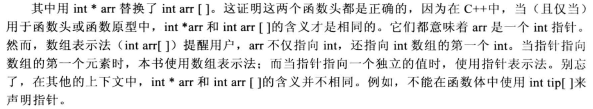

函数中，数组名就是指针，因此`sizeof(arrayname)/sizeof(datatype)` 不能确定数组大小，所以函数使用数组的时候都往往要往里传入数组大小，例如如下代码：

```c++
void func(int a[],int len);

int a[20];
func(a,sizeof(a)/sizeof(int)); 
```

### **用new**动态创建一维数组

普通数组在栈上分配内存，栈很小；如果需要存放更多的元素，必须在堆上分配内存。（100\_0000之内没有问题）

动态创建一维数组的语法：`int *a = new int[20]`

释放一维数组的语法：`delete [] a;`

仍然地，动态创建的数组没有数组名，不能用`sizeof`运算符。仍然可以用数组表示法和指针表示法两种方式使用动态创建的数组。

l 必须使用`delete[]`来释放动态数组的内存（不能只用delete）。

l 不要用`delete[]`来释放不是`new[]`分配的内存。

l 不要用`delete[]`释放同一个内存块两次（否则等同于操作野指针）。

对空指针用`delete[]`是安全的（释放内存后，应该把指针置空`nullptr`）。

好习惯：

```c++
int *a = new (std::nothrow) int [100000000]
if (a == nullptr) std::cout<<"内存分配失败"<<endl;
```

### 1.17.2 字符串操作函数

**清空字符串**

`memset(name,0,sizeof(name));  ` // 把全部的元素置为0。

name\[0]=0;       // 不规范，有隐患，不推荐。

**字符串复制或赋值strcpy()**

`char* strcpy(char * dest, const char* src);`

功 能: 将参数src字符串拷贝至参数dest所指的地址。

返回值: 返回参数dest的字符串起始地址。

复制完字符串后，会在dest后追加0。

**如果参数dest所指的内存空间不够大，****会导致数组的越界。** ​

**字符串复制或赋值strncpy**()

`char * strncpy(char* dest,const char* src, const size_t n);`

功能：把src前n个字符的内容复制到dest中。

返回值：dest字符串起始地址。

如果src字符串长度小于n，则拷贝完字符串后，在dest后追加0，直到n个。

如果src的长度大于等于n，就截取src的前n个字符，不会在dest后追加0。

**获取字符串的长度strlen**()

`size_t  strlen( const char*  str);`

功能：计算字符串的有效长度，不包含0。

返回值：返回字符串的字符数。

strlen()函数计算的是字符串的实际长度，遇到0结束。

**字符串拼接strcat(）**

`char *strcat(char *dest,const char* src);`

功能：将src字符串拼接到dest所指的字符串尾部。

返回值：返回dest字符串起始地址。

dest最后原有的结尾字符0会被覆盖掉，并在连接后的字符串的尾部再增加一个0。

**如果参数dest所指的内存空间不够大，****会导致数组的越界。** ​

**字符串拼接strncat()**

`char *strncat (char *dest,const char* src, const size_t n);`

功能：将src字符串的前n个字符拼接到dest所指的字符串尾部。

返回值：返回dest字符串的起始地址。

如果n大于等于字符串src的长度，那么将src全部追加到dest的尾部，如果n小于字符串src的长度，只追加src的前n个字符。

strncat会将dest字符串最后的0覆盖掉，字符追加完成后，再追加0。

dest所指的内存空间不够大会导致数组的越界。

**字符串比较strcmp()和strncmp()**

`int strcmp(const char *str1, const char *str2 );`

功能：比较str1和str2的大小。

返回值：相等返回0，str1大于str2返回1，str1小于str2返回-1；

`int strncmp(const char *str1,const char *str2 ,const size_t n);`

功能：比较str1和str2前n个字符的大小。

返回值：相等返回0，str1大于str2返回1，str1小于str2返回-1；

**查找字符strchr**\*\*()****和****strrchr()\*\*

`const char *strchr(const char *s, int c);`

返回在字符串s中第一次出现c的位置，如果找不到，返回0。

`const char *strrchr(const char *s, int c);`

返回在字符串s中最后一次出现c的位置，如果找不到，返回0。

**查找字符串****strstr****()**

`char *strstr(const char *str,const char* substr);`

功能：检索子串在字符串中首次出现的位置。

返回值：返回字符串str中第一次出现子串substr的地址；如果没有检索到子串，则返回0。

可以把C风格的字符串用于包含了string类型的06赋值拼接等表达式中。

a）字符串的结尾标志是0，按照约定，在处理字符串的时候，会从起始位置开始搜索0，一直找下去，找到为止（不会判断数组是否越界）。

b）结尾标志0后面的都是垃圾内容。

c）**字符串在每次使用前都要初始化**，减少入坑的可能，**是每次，不是第一次**。

d）不要在子函数中对字符指针用sizeof运算，所以，不能在子函数中对传入的字符串进行初始化，除非字符串的长度也作为参数传入到了子函数中。

e）在VS中，如果要使用C标准的字符串操作函数，要在源代码文件的**最上面**加

`#define _CRT_SECURE_NO_WARNINGS`

### 1.17.3 二维数组 数组指针 指针数组

```c++
int* p[3];   // 一维整型指针数组，元素是3个整型指针（p[0]、p[1]、p[2]）
int (*p1)[3]; // p1是行指针，用于指向数组长度为3的int型数组

int a[4][3];
p1 = a;  //p1所指含有3个int，*(p1+1)会跳3个int的值
```

二维数组名实际上就是一个行地址。（行列只是假设的说法，实际在内存中是连续的，“行指针”的名字能够方便理解。）

上面p1所指含有3个int， \*(p1+1)会跳3个int的值，

*(p+1),* p都是列指针，**行指针寻址即为一个列指针**。

`&a[0]` and `a`所代表的不是同一个东西，但是他们的值相同。`a[0]`实际上等于`&a[0][0]`内含1个int，而 a 等于 `&a[0]`含有两个int。

a是地址的地址，必须解引用两次才能获得原始值。

三维的例子：

int bh\[4]\[2]\[3];

bh是三维数组名，该数组有4元素，每一个元素本身又是一个2行3列的二维数组。

bh被解释为2行3列的二维数组类型的二维地址。

如果存放bh的值，要用2行3列的二维数组类型的二维指针。

`int (*p)[2][3]=bh;`

如果要把bh传给函数，函数的声明如下：

```c++
void func(int (*p)[3],int len);
void func(int p[][3],int len);
```

# 2 复合类型

## 2.1 结构体

C++中`struct structname inf`中的struct可以省略。

`指针名->成员变量名`是更直观更常用的引入形式。

给字符串赋可能还得strcpy才行

```c++
#include <iostream>  // 包含头文件。
#include <cstring>
using namespace std; // 指定缺省的命名空间。
struct information
{
        char name[21];
        int age;
        float score;
};
int main()
{
        struct information a = {"a", 20, 98};
        struct information b = {"ll", 21, 99.6};
        information lovers[2] = {a,b};
        information *p_lovers = lovers;
        (p_lovers+1)->age = 12;
        strcpy(lovers[1].name,"han");
        strcpy((p_lovers+1) -> name,"wan");
        cout << lovers[1].age<<endl;
        cout << lovers[1].name;
}
```

## 2.2 简单链表

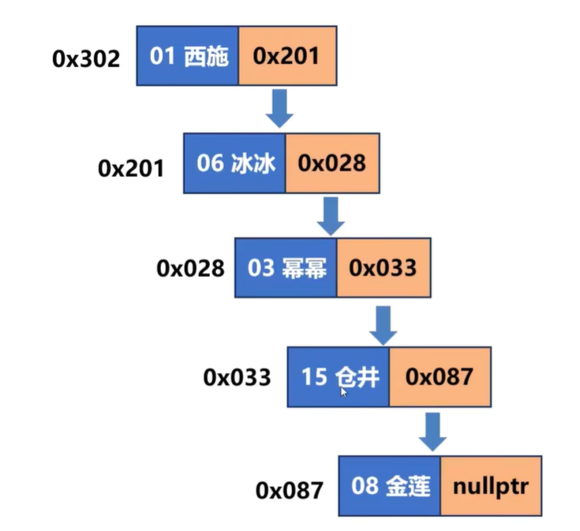

```c++
struct node{
  //data
  int a;
  struct node *next;
  }

```

```c++
#include <iostream>
using namespace std;

struct node
{
    string name;
    node *next;
};

int main()
{
    node *head, *tail, *tmp = nullptr; // 头指针，尾指针，临时指针

    // 分配第一个节点

    tmp = new node({"alark",nullptr});
    // tmp = new node;
    // *(tmp) = {20,nullptr};
    head = tail = tmp;

    tmp = new node({"amy",nullptr});
    tail->next = tmp;
    tail =tmp;

    //.....


    //遍历
    tmp = head;
    while (tmp!=nullptr)
    {
        cout << tmp->name <<endl;
        tmp = tmp->next;
    }
    
    //释放链表
    while (head != nullptr)
    {
        tmp = head;
        head = head->next;
        delete tmp;
    }
    
}

```

## 2.3 共同体

用途：嵌入式系统和网络编程回调函数

联合体所占的内存长度等于其最长成员的长度倍数，同一内存段可以用来存放几种不同类型的成员，但每一瞬时只有一种起作用。   起作用的成员是最后一次存放的成员，在存入一个新的成员后原有的成员的值会被覆盖

```c++
struct abs       // 定义超女结构体。
{
  int no;             // 超女编号。

  union              // 定义匿名共同体udata。
  {
    int        a;
    double b;
    char     c[21];
  };
};

abs->b
```

## 2.4 枚举

```c++
enum colors {red=10,yellow,blue};

colors cc = yellow; //创建枚举变量


```

## 2.5 引用

引用是已定义的变量的别名。它们值和内存单元是相同的。天然地，他禁止了指针的部分不安全的操作。

必须在声明引用的时候初始化，初始化后不可改变。

> **引用是伪装的指针常量**

引入引用的直接原因是操作符重载，以操作符+为例，如果使用指针

```c++
void f1(const complex* x, const complex* y)
 {
  complex z = *x+*y;  // 丑陋
}
void f2(const complex& x, const complex& y) 
{
  complex z = x+y;    // 符合直观
}
```

更重要地，这样使得的类和内置类型能使用相同的代码。往后学，代码一致性的必要性会更凸显。

向函数传递参数的时候。假设函数传参分两种，只读和读写。那么只需要传递const引用和引用即可。
对引用来说，`const`有其特别之处。`const int& ra = 8;` C++自动创建了一个临时变量。

作为函数的返回值的引用，是不能返回函数的局部变量的。因为生命周期结束后才被赋值，成了野指针。引用可以返回引用形参，类成员，全局和静态变量

```c++
int &function() // 返回静态变量
{
        static int fre = 3;
        return fre;
}

int &function2(int &ra) // 返回引用形參
{
        ra++;
        return ra;
}
int main()
{
        int a = 3;
        int &b = function2(a);
        //ra,b都是a的別名
}
```

返回引用的**函数是**被引用的变量的**别名**(函数也成了变量的别名）。

返回引用时，返回const引用是安全的，因为返回引用是左值。这是不安全的。返回const引用禁止了这种不安全的操作。（只有返回引用才可能需要返回const）

# 3 数据结构

**线性表**：线性表是具有相同特性的n个数据元素集合。可以有一个数据项（字段，列，数据域）也可以有多个。
用于区别不同元素的数据项称之为**关键字（主键）**。如：身份证号码

## 3.1 顺序表

**顺序表**：采用顺序存储的方式实现的线性表。
静态顺序表：数组              动态顺序表：变长数组
优点：存储密度高 缺点：要求连续的内存空间，修改内存效率低

```c++
#include <iostream>
#include <new>
#include <string.h>

using namespace std;

typedef int ElemType;

struct Stack {
    ElemType data;
    struct Stack *next;
};
// 初始化链表
Stack *InitList() {
    Stack *head = new (std::nothrow) Stack;
    if (head == nullptr) return nullptr;
    head->next = nullptr;
    return head;
}
// 销毁链表
void DestroyList(Stack *head) {
    Stack *tmp;
    while (head != nullptr) {
        tmp = head->next;
        delete head;
        head = tmp;
    }
}

// 头插法
bool PushFront(Stack *head, const ElemType &ee) {
    if (head == nullptr) return false;
    Stack *tmp = new (std::nothrow) Stack;
    if (tmp == nullptr) return false;
    tmp->data = ee;
    tmp->next = head->next;
    head->next = tmp;
    return true;
}
// 尾插法
bool PushBack(Stack *head, const ElemType &ee) {
    if (head == nullptr) return false;
    Stack *tmp = new (std::nothrow) Stack;
    if (tmp == nullptr) return false;
    tmp->data = ee;
    Stack *pp = head;
    while (pp->next != nullptr) pp = pp->next;
    pp->next = tmp;
    tmp->next = nullptr;
    return true;
}
// 显示链表中全部的元素
void PrintList(const Stack *head) {
    if (head == nullptr) cout << "链表不存在！" << endl;
    Stack *tmp = head->next;
    while (tmp != nullptr) {
        cout << "元素：" << tmp->data << endl;
        tmp = tmp->next;
    }
    cout << "" << endl;
}
// 求链表的表长
size_t ListLength(Stack *head) {
    // if (head == nullptr)
    //   cout << "链表不存在！" << endl;
    // Node *pp = head->next; // 头节点不算
    // size_t length = 0;
    // while (pp != nullptr) {
    //   pp = pp->next;
    //   length++;
    // }
    // return length+1; // 丑陋的代码
    return (head == nullptr) ? 0 : ListLength(head->next) + 1; // 优雅的代码
}
// 删除链表的第一个节点
bool PopFront(Stack *head) {
    if (head == nullptr) {
        cout << "链表不存在！" << endl;
        return false;
    }
    if (head->next == nullptr) {
        cout << "链表为空！" << endl;
        return false;
    }
    Stack *tmp = head->next;
    head->next = head->next->next;
    delete tmp;
    return true;
}
// 删除链表的最后一个节点
bool PopBack(Stack *head) {
    Stack *pp = head;
    if (head == nullptr || head->next == nullptr) return false;
    while (pp->next->next != nullptr) { pp = pp->next; }
    delete pp->next;
    pp->next = nullptr;
    return true;
}
// 清空链表（显然，不释放头结点）
void ClearList(Stack *head) {
    if (head == nullptr) { cout << "链表不存在！" << endl; }
    Stack *pp = head->next;
    Stack *tmp = nullptr;
    while (pp != nullptr) {
        tmp = pp;
        pp = pp->next;
        delete tmp;
    }
    head->next = nullptr;
}
// 查找元素
Stack *LocateElem(const Stack *head, const ElemType &ee) {
    Stack *pp = head->next;
    while (pp != nullptr) {
        if (pp->data == ee) return pp;
        pp = pp->next;
    }
    return pp;
}
// 获取链表的第n个结点
Stack *LocateNote(Stack *head, size_t n) {
    if (head == nullptr) return nullptr;
    Stack *pp = head;
    size_t ii = 0;
    while (pp != nullptr && ii < n) {
        pp = pp->next;
        ii++;
    }
    if (pp == nullptr) {
        cout << "位置不合法，超过了表长" << endl;
        return nullptr;
    }
    return pp;
}
// 在节点pp后插入元素
bool InsertNextNode(Stack *pp, const ElemType &ee) {
    if (pp == nullptr) return false;
    Stack *tmp = new Stack;
    tmp->data = ee;
    tmp->next = pp->next;
    pp->next = tmp;
    return true;
}
// 在节点pp前插入元素
bool InsertPriorNode(Stack *pp, const ElemType &ee) {
    if (pp == nullptr) return false;
    Stack *tmp = new Stack;
    tmp->data = pp->data;
    tmp->next = pp->next;
    pp->data = ee;
    pp->next = tmp;
    return true;
}
// 删除指定节点
bool DeleteNode(Stack *pp) {
    if (pp == nullptr) return false;
    if (pp->next != nullptr) {
        Stack *tmp = pp->next;
        pp->data = tmp->data;
        pp->next = tmp->next;
        delete pp;
        return true;
    }
    else
        return false;
}
int main() {
    Stack *LL = InitList(); // 初始化链表LL。

    cout << "用头插法向链表中插入元素（1、2、3）。\n";
    PushFront(LL, 1);
    PushFront(LL, 2);
    PushFront(LL, 3);
    PrintList(LL); // 把链表中全部的元素显示出来。
    cout << "用尾插法向链表中插入元素（4、5、6）。\n";
    PushBack(LL, 4);
    PushBack(LL, 5);
    PushBack(LL, 6);
    PrintList(LL); // 把链表中全部的元素显示出来。

    cout << "链表的表长（包括头结点）：" << ListLength(LL) << endl;

    // PopFront(LL); PopFront(LL); PopFront(LL); PopFront(LL); PopFront(LL);
    // PopFront(LL); PopFront(LL); PrintList(LL);      //
    // 把链表中全部的元素显示出来。 PopBack(LL); PopBack(LL); PopBack(LL);
    // PopBack(LL); PopBack(LL); PopBack(LL); PopBack(LL); PrintList(LL);
    // // 把链表中全部的元素显示出来。 ClearList(LL);
    // PrintList(LL);      // 把链表中全部的元素显示出来。

    Stack *p1 = LocateElem(LL, 4);
    cout << "元素为4的结点的地址是：" << p1 << "，值是：" << p1->data << endl;

    Stack *p2 = LocateNote(LL, 3);
    cout << "位序为3的结点的地址是：" << p2 << "，值是：" << p2->data << endl;

    cout << "在" << p2->data << "之后插入元素8。" << endl;
    InsertNextNode(p2, 8);
    PrintList(LL); // 把链表中全部的元素显示出来。
    cout << "在" << p2->data << "之前插入元素7。" << endl;
    InsertPriorNode(p2, 7);
    PrintList(LL); // 把链表中全部的元素显示出来。

    DestroyList(LL); // 销毁链表LL。
}

```

```c++
#include <iostream>
#include <new>
#include <string.h>

using namespace std;

typedef int ElemType;

struct Stack {
    ElemType data;
    struct Stack *next;
};
// 初始化链表
Stack *InitList() {
    Stack *head = new (std::nothrow) Stack;
    if (head == nullptr) return nullptr;
    head->next = nullptr;
    return head;
}
// 销毁链表
void DestroyList(Stack *head) {
    Stack *tmp;
    while (head != nullptr) {
        tmp = head->next;
        delete head;
        head = tmp;
    }
}

// 头插法
bool PushFront(Stack *head, const ElemType &ee) {
    if (head == nullptr) return false;
    Stack *tmp = new (std::nothrow) Stack;
    if (tmp == nullptr) return false;
    tmp->data = ee;
    tmp->next = head->next;
    head->next = tmp;
    return true;
}
// 尾插法
bool PushBack(Stack *head, const ElemType &ee) {
    if (head == nullptr) return false;
    Stack *tmp = new (std::nothrow) Stack;
    if (tmp == nullptr) return false;
    tmp->data = ee;
    Stack *pp = head;
    while (pp->next != nullptr) pp = pp->next;
    pp->next = tmp;
    tmp->next = nullptr;
    return true;
}
// 显示链表中全部的元素
void PrintList(const Stack *head) {
    if (head == nullptr) cout << "链表不存在！" << endl;
    Stack *tmp = head->next;
    while (tmp != nullptr) {
        cout << "元素：" << tmp->data << endl;
        tmp = tmp->next;
    }
    cout << "" << endl;
}
// 求链表的表长
size_t ListLength(Stack *head) {
    // if (head == nullptr)
    //   cout << "链表不存在！" << endl;
    // Node *pp = head->next; // 头节点不算
    // size_t length = 0;
    // while (pp != nullptr) {
    //   pp = pp->next;
    //   length++;
    // }
    // return length+1; // 丑陋的代码
    return (head == nullptr) ? 0 : ListLength(head->next) + 1; // 优雅的代码
}
// 删除链表的第一个节点
bool PopFront(Stack *head) {
    if (head == nullptr) {
        cout << "链表不存在！" << endl;
        return false;
    }
    if (head->next == nullptr) {
        cout << "链表为空！" << endl;
        return false;
    }
    Stack *tmp = head->next;
    head->next = head->next->next;
    delete tmp;
    return true;
}
// 删除链表的最后一个节点
bool PopBack(Stack *head) {
    Stack *pp = head;
    if (head == nullptr || head->next == nullptr) return false;
    while (pp->next->next != nullptr) { pp = pp->next; }
    delete pp->next;
    pp->next = nullptr;
    return true;
}
// 清空链表（显然，不释放头结点）
void ClearList(Stack *head) {
    if (head == nullptr) { cout << "链表不存在！" << endl; }
    Stack *pp = head->next;
    Stack *tmp = nullptr;
    while (pp != nullptr) {
        tmp = pp;
        pp = pp->next;
        delete tmp;
    }
    head->next = nullptr;
}
// 查找元素
Stack *LocateElem(const Stack *head, const ElemType &ee) {
    Stack *pp = head->next;
    while (pp != nullptr) {
        if (pp->data == ee) return pp;
        pp = pp->next;
    }
    return pp;
}
// 获取链表的第n个结点
Stack *LocateNote(Stack *head, size_t n) {
    if (head == nullptr) return nullptr;
    Stack *pp = head;
    size_t ii = 0;
    while (pp != nullptr && ii < n) {
        pp = pp->next;
        ii++;
    }
    if (pp == nullptr) {
        cout << "位置不合法，超过了表长" << endl;
        return nullptr;
    }
    return pp;
}
// 在节点pp后插入元素
bool InsertNextNode(Stack *pp, const ElemType &ee) {
    if (pp == nullptr) return false;
    Stack *tmp = new Stack;
    tmp->data = ee;
    tmp->next = pp->next;
    pp->next = tmp;
    return true;
}
// 在节点pp前插入元素
bool InsertPriorNode(Stack *pp, const ElemType &ee) {
    if (pp == nullptr) return false;
    Stack *tmp = new Stack;
    tmp->data = pp->data;
    tmp->next = pp->next;
    pp->data = ee;
    pp->next = tmp;
    return true;
}
// 删除指定节点
bool DeleteNode(Stack *pp) {
    if (pp == nullptr) return false;
    if (pp->next != nullptr) {
        Stack *tmp = pp->next;
        pp->data = tmp->data;
        pp->next = tmp->next;
        delete pp;
        return true;
    }
    else
        return false;
}
int main() {
    Stack *LL = InitList(); // 初始化链表LL。

    cout << "用头插法向链表中插入元素（1、2、3）。\n";
    PushFront(LL, 1);
    PushFront(LL, 2);
    PushFront(LL, 3);
    PrintList(LL); // 把链表中全部的元素显示出来。
    cout << "用尾插法向链表中插入元素（4、5、6）。\n";
    PushBack(LL, 4);
    PushBack(LL, 5);
    PushBack(LL, 6);
    PrintList(LL); // 把链表中全部的元素显示出来。

    cout << "链表的表长（包括头结点）：" << ListLength(LL) << endl;

    // PopFront(LL); PopFront(LL); PopFront(LL); PopFront(LL); PopFront(LL);
    // PopFront(LL); PopFront(LL); PrintList(LL);      //
    // 把链表中全部的元素显示出来。 PopBack(LL); PopBack(LL); PopBack(LL);
    // PopBack(LL); PopBack(LL); PopBack(LL); PopBack(LL); PrintList(LL);
    // // 把链表中全部的元素显示出来。 ClearList(LL);
    // PrintList(LL);      // 把链表中全部的元素显示出来。

    Stack *p1 = LocateElem(LL, 4);
    cout << "元素为4的结点的地址是：" << p1 << "，值是：" << p1->data << endl;

    Stack *p2 = LocateNote(LL, 3);
    cout << "位序为3的结点的地址是：" << p2 << "，值是：" << p2->data << endl;

    cout << "在" << p2->data << "之后插入元素8。" << endl;
    InsertNextNode(p2, 8);
    PrintList(LL); // 把链表中全部的元素显示出来。
    cout << "在" << p2->data << "之前插入元素7。" << endl;
    InsertPriorNode(p2, 7);
    PrintList(LL); // 把链表中全部的元素显示出来。

    DestroyList(LL); // 销毁链表LL。
}

```

## 3.2 链表

**链表**：扩容方便，插入删除不需要移动元素。不能随机存取，指针也需要消耗空间。

### 3.2.1 单链表：

```c++
#include <iostream>
#include <new>
#include <string.h>

using namespace std;

typedef int ElemType;

struct Stack {
    ElemType data;
    struct Stack *next;
};
// 初始化链表
Stack *InitList() {
    Stack *head = new (std::nothrow) Stack;
    if (head == nullptr) return nullptr;
    head->next = nullptr;
    return head;
}
// 销毁链表
void DestroyList(Stack *head) {
    Stack *tmp;
    while (head != nullptr) {
        tmp = head->next;
        delete head;
        head = tmp;
    }
}

// 头插法
bool PushFront(Stack *head, const ElemType &ee) {
    if (head == nullptr) return false;
    Stack *tmp = new (std::nothrow) Stack;
    if (tmp == nullptr) return false;
    tmp->data = ee;
    tmp->next = head->next;
    head->next = tmp;
    return true;
}
// 尾插法
bool PushBack(Stack *head, const ElemType &ee) {
    if (head == nullptr) return false;
    Stack *tmp = new (std::nothrow) Stack;
    if (tmp == nullptr) return false;
    tmp->data = ee;
    Stack *pp = head;
    while (pp->next != nullptr) pp = pp->next;
    pp->next = tmp;
    tmp->next = nullptr;
    return true;
}
// 显示链表中全部的元素
void PrintList(const Stack *head) {
    if (head == nullptr) cout << "链表不存在！" << endl;
    Stack *tmp = head->next;
    while (tmp != nullptr) {
        cout << "元素：" << tmp->data << endl;
        tmp = tmp->next;
    }
    cout << "" << endl;
}
// 求链表的表长
size_t ListLength(Stack *head) {
    // if (head == nullptr)
    //   cout << "链表不存在！" << endl;
    // Node *pp = head->next; // 头节点不算
    // size_t length = 0;
    // while (pp != nullptr) {
    //   pp = pp->next;
    //   length++;
    // }
    // return length+1; // 丑陋的代码
    return (head == nullptr) ? 0 : ListLength(head->next) + 1; // 优雅的代码
}
// 删除链表的第一个节点
bool PopFront(Stack *head) {
    if (head == nullptr) {
        cout << "链表不存在！" << endl;
        return false;
    }
    if (head->next == nullptr) {
        cout << "链表为空！" << endl;
        return false;
    }
    Stack *tmp = head->next;
    head->next = head->next->next;
    delete tmp;
    return true;
}
// 删除链表的最后一个节点
bool PopBack(Stack *head) {
    Stack *pp = head;
    if (head == nullptr || head->next == nullptr) return false;
    while (pp->next->next != nullptr) { pp = pp->next; }
    delete pp->next;
    pp->next = nullptr;
    return true;
}
// 清空链表（显然，不释放头结点）
void ClearList(Stack *head) {
    if (head == nullptr) { cout << "链表不存在！" << endl; }
    Stack *pp = head->next;
    Stack *tmp = nullptr;
    while (pp != nullptr) {
        tmp = pp;
        pp = pp->next;
        delete tmp;
    }
    head->next = nullptr;
}
// 查找元素
Stack *LocateElem(const Stack *head, const ElemType &ee) {
    Stack *pp = head->next;
    while (pp != nullptr) {
        if (pp->data == ee) return pp;
        pp = pp->next;
    }
    return pp;
}
// 获取链表的第n个结点
Stack *LocateNote(Stack *head, size_t n) {
    if (head == nullptr) return nullptr;
    Stack *pp = head;
    size_t ii = 0;
    while (pp != nullptr && ii < n) {
        pp = pp->next;
        ii++;
    }
    if (pp == nullptr) {
        cout << "位置不合法，超过了表长" << endl;
        return nullptr;
    }
    return pp;
}
// 在节点pp后插入元素
bool InsertNextNode(Stack *pp, const ElemType &ee) {
    if (pp == nullptr) return false;
    Stack *tmp = new Stack;
    tmp->data = ee;
    tmp->next = pp->next;
    pp->next = tmp;
    return true;
}
// 在节点pp前插入元素
bool InsertPriorNode(Stack *pp, const ElemType &ee) {
    if (pp == nullptr) return false;
    Stack *tmp = new Stack;
    tmp->data = pp->data;
    tmp->next = pp->next;
    pp->data = ee;
    pp->next = tmp;
    return true;
}
// 删除指定节点
bool DeleteNode(Stack *pp) {
    if (pp == nullptr) return false;
    if (pp->next != nullptr) {
        Stack *tmp = pp->next;
        pp->data = tmp->data;
        pp->next = tmp->next;
        delete pp;
        return true;
    }
    else
        return false;
}
int main() {
    Stack *LL = InitList(); // 初始化链表LL。

    cout << "用头插法向链表中插入元素（1、2、3）。\n";
    PushFront(LL, 1);
    PushFront(LL, 2);
    PushFront(LL, 3);
    PrintList(LL); // 把链表中全部的元素显示出来。
    cout << "用尾插法向链表中插入元素（4、5、6）。\n";
    PushBack(LL, 4);
    PushBack(LL, 5);
    PushBack(LL, 6);
    PrintList(LL); // 把链表中全部的元素显示出来。

    cout << "链表的表长（包括头结点）：" << ListLength(LL) << endl;

    // PopFront(LL); PopFront(LL); PopFront(LL); PopFront(LL); PopFront(LL);
    // PopFront(LL); PopFront(LL); PrintList(LL);      //
    // 把链表中全部的元素显示出来。 PopBack(LL); PopBack(LL); PopBack(LL);
    // PopBack(LL); PopBack(LL); PopBack(LL); PopBack(LL); PrintList(LL);
    // // 把链表中全部的元素显示出来。 ClearList(LL);
    // PrintList(LL);      // 把链表中全部的元素显示出来。

    Stack *p1 = LocateElem(LL, 4);
    cout << "元素为4的结点的地址是：" << p1 << "，值是：" << p1->data << endl;

    Stack *p2 = LocateNote(LL, 3);
    cout << "位序为3的结点的地址是：" << p2 << "，值是：" << p2->data << endl;

    cout << "在" << p2->data << "之后插入元素8。" << endl;
    InsertNextNode(p2, 8);
    PrintList(LL); // 把链表中全部的元素显示出来。
    cout << "在" << p2->data << "之前插入元素7。" << endl;
    InsertPriorNode(p2, 7);
    PrintList(LL); // 把链表中全部的元素显示出来。

    DestroyList(LL); // 销毁链表LL。
}

```

### 3.2.2 双链表：

```c++
#include <iostream>
#include <new>

using namespace std;

typedef int ElemType;

struct Stack {
    ElemType data;
    struct Stack *next, *prior;
};
// 初始化链表
Stack *InitList() {
    Stack *head = new (std::nothrow) Stack;
    if (head == nullptr) return nullptr;
    head->prior = nullptr;
    head->next = nullptr;
    return head;
}
// 销毁链表
void DestroyList(Stack *head) {
    Stack *tmp;
    while (head != nullptr) {
        tmp = head->next;
        delete head;
        head = tmp;
    }
}
// 头插法
bool PushFront(Stack *head, const ElemType &ee) {
    if (head == nullptr) return false;
    Stack *tmp = new (std::nothrow) Stack;
    if (tmp == nullptr) return false;
    tmp->data = ee;
    tmp->next = head->next;
    tmp->prior = head;
    head->next = tmp;
    if (tmp->next != nullptr) tmp->next->prior = tmp;
    return true;
}
// 尾插法
bool PushBack(Stack *head, const ElemType &ee) {
    if (head == nullptr) return false;
    Stack *tmp = new (std::nothrow) Stack;
    if (tmp == nullptr) return false;
    tmp->data = ee;
    Stack *pp = head;
    while (pp->next != nullptr) pp = pp->next;
    pp->next = tmp;
    tmp->next = nullptr;
    tmp->prior = pp;
    return true;
}
// 显示链表中全部的元素
void PrintList(const Stack *head) {
    if (head == nullptr) cout << "链表不存在！" << endl;
    Stack *tmp = head->next;
    while (tmp != nullptr) {
        cout << "元素：" << tmp->data << endl;
        tmp = tmp->next;
    }
    cout << "" << endl;
}
// 求链表的表长
size_t ListLength(Stack *head) {
    // if (head == nullptr)
    //   cout << "链表不存在！" << endl;
    // Node *pp = head->next; // 头节点不算
    // size_t length = 0;
    // while (pp != nullptr) {
    //   pp = pp->next;
    //   length++;
    // }
    // return length+1; // 丑陋的代码
    return (head == nullptr) ? 0 : ListLength(head->next) + 1; // 优雅的代码
}
// 删除链表的第一个节点
bool PopFront(Stack *head) {
    if (head == nullptr) {
        cout << "链表不存在！" << endl;
        return false;
    }
    if (head->next == nullptr) {
        cout << "链表为空！" << endl;
        return false;
    }
    Stack *tmp = head->next;
    head->next = head->next->next;
    if (head->next != nullptr) head->next->prior = head;
    delete tmp;
    return true;
}
// 删除链表的最后一个节点
bool PopBack(Stack *head) {
    Stack *pp = head;
    if (head == nullptr) return false;
    if (head->next == nullptr) {
        cout << "链表本来就为空" << endl;
        return true;
    }
    while (pp->next->next != nullptr) { pp = pp->next; }
    delete pp->next;
    pp->next = nullptr;
    return true;
}
// 清空链表（显然，不释放头结点）
void ClearList(Stack *head) {
    if (head == nullptr) { cout << "链表不存在！" << endl; }
    Stack *pp = head->next;
    Stack *tmp = nullptr;
    while (pp != nullptr) {
        tmp = pp;
        pp = pp->next;
        delete tmp;
    }
    head->next = nullptr;
}
// 查找元素
Stack *LocateElem(const Stack *head, const ElemType &ee) {
    Stack *pp = head->next;
    while (pp != nullptr) {
        if (pp->data == ee) return pp;
        pp = pp->next;
    }
    return pp;
}
// 获取链表的第n个结点
Stack *LocateNote(Stack *head, size_t n) {
    if (head == nullptr) return nullptr;
    Stack *pp = head;
    size_t ii = 0;
    while (pp != nullptr && ii < n) {
        pp = pp->next;
        ii++;
    }
    if (pp == nullptr) {
        cout << "位置不合法，超过了表长" << endl;
        return nullptr;
    }
    return pp;
}
// 在节点pp后插入元素
bool InsertNextNode(Stack *pp, const ElemType &ee) {
    if (pp == nullptr) return false;
    Stack *tmp = new Stack;
    tmp->data = ee;
    tmp->next = pp->next;
    tmp->prior = pp;
    pp->next = tmp;
    if (tmp->next != nullptr) tmp->next->prior = tmp;
    return true;
}
// 在节点pp前插入元素
bool InsertPriorNode(Stack *pp, const ElemType &ee) {
    if (pp == nullptr) return false;
    Stack *tmp = new Stack;
    tmp->data = ee;
    tmp->next = pp;
    tmp->prior = pp->prior;
    tmp->prior->next = tmp;
    tmp->next->prior = tmp;
    return true;
}
// 删除指定节点
bool DeleteNode(Stack *pp) {
    if (pp == nullptr) return false;
    if (pp->next != nullptr) {
        Stack *tmp = pp->next;
        pp->data = tmp->data;
        pp->next = tmp->next;
        delete pp;
        return true;
    }
    else
        return false;
}
int main() {
    Stack *LL = InitList(); // 初始化链表LL。

    cout << "用头插法向链表中插入元素（1、2、3）。\n";
    PushFront(LL, 1);
    PushFront(LL, 2);
    PushFront(LL, 3);
    PrintList(LL); // 把链表中全部的元素显示出来。
    cout << "用尾插法向链表中插入元素（4、5、6）。\n";
    PushBack(LL, 4);
    PushBack(LL, 5);
    PushBack(LL, 6);
    PrintList(LL); // 把链表中全部的元素显示出来。
    cout << "链表的表长（包括头结点）：" << ListLength(LL) << endl;
    Stack *p1 = LocateElem(LL, 4);
    cout << "元素为4的结点的地址是：" << p1 << "，值是：" << p1->data << endl;
    Stack *p2 = LocateNote(LL, 3);
    cout << "位序为3的结点的地址是：" << p2 << "，值是：" << p2->data << endl;
    cout << "在" << p2->data << "之后插入元素8。" << endl;
    InsertNextNode(p2, 8);
    PrintList(LL); // 把链表中全部的元素显示出来。
    cout << "在" << p2->data << "之前插入元素7。" << endl;
    InsertPriorNode(p2, 7);
    PrintList(LL);   // 把链表中全部的元素显示出来。
    DestroyList(LL); // 销毁链表LL。
}

```

## 3.3 栈

**栈**：一种操作受限的线性表，只能在表的同一端进行插入和删除
实现：顺序栈 链栈
插入元素：入栈，进
删除元素：出，退栈
栈顶，栈底

```c++
#include <iostream>
using namespace std;

typedef int ElemType; // 自定义链栈的数据元素为整数。

struct SNode // 链栈的结点。
{
    ElemType data;      // 存放结点的数据元素。
    struct SNode* next; // 指向下一个结点的指针。
};

// 初始化链栈，返回值：失败返回nullptr，成功返回头结点的地址。
SNode* InitStack() {
    SNode* head = new (std::nothrow) SNode; // 分配头结点。

    if (head == nullptr) return nullptr; // 内存不足，返回失败。

    head->next = nullptr; // 头结点的下一结点暂时不存在，置空。

    return head; // 返回头结点。
}

// 销毁链栈。
void DestroyStack(SNode* head) {
    // 销毁链栈是指释放链栈全部的结点，包括头结点。
    SNode* tmp;

    while (head != nullptr) {
        tmp = head->next; // tmp保存下一结点的地址。
        delete head;      // 释放当前结点。
        head = tmp;       // 指针移动到下一结点。
    }
}

// 元素入栈，返回值：false-失败；true-成功。
bool Push(SNode* head, const ElemType& ee) {
    if (head == nullptr) {
        cout << "链栈不存在。\n";
        return false;
    }

    SNode* tmp = new (std::nothrow) SNode; // 分配一个新结点。
    if (tmp == nullptr) return false;

    tmp->data = ee; // 把元素的值存入新结点。

    // 处理next指针。
    tmp->next = head->next;
    head->next = tmp;

    return true;
}

// 显示链栈中全部的元素。
void PrintStack(const SNode* head) {
    if (head == nullptr) {
        cout << "链栈不存在。\n";
        return;
    }

    SNode* pp = head->next; // 从第1个结点开始。

    while (pp != nullptr) {
        cout << pp->data << " "; // 如果元素为结构体，这行代码要修改。
        pp = pp->next;           // 指针往后移动一个结点。
    }

    cout << endl;
}

// 求链栈的长度，返回值：>=0-栈SS结点的个数。
size_t StackLength(SNode* head) {
    if (head == nullptr) {
        cout << "链栈不存在。\n";
        return 0;
    }

    SNode* pp = head->next; // 头结点不算，从第1个结点开始。

    size_t length = 0;

    while (pp != nullptr) {
        pp = pp->next;
        length++;
    }

    return length;
}

// 元素出栈。
bool Pop(SNode* head, ElemType& ee) {
    if (head == nullptr) {
        cout << "链栈不存在。\n";
        return false;
    }

    if (head->next == nullptr) {
        cout << "链栈为空，没有结点。\n";
        return false;
    }

    SNode* pp = head->next;        // pp指向第一个节点。
    head->next = head->next->next; // 修改头结点的next指针。
    ee = pp->data;
    delete pp; // 删除第一个节点。

    return true;
}

int main() {
    SNode* SS = InitStack(); // 初始化链栈SS。

    cout << "入栈三个元素（1、2、3）。\n";
    Push(SS, 1);
    Push(SS, 2);
    Push(SS, 3);
    PrintStack(SS); // 把链栈中全部的元素显示出来。

    cout << "链栈的长度：" << StackLength(SS) << endl;

    // 元素出栈。
    ElemType ee;
    Pop(SS, ee);
    cout << "出栈的元素的值是：" << ee << endl;

    DestroyStack(SS); // 销毁链栈SS。
}
```

## 3.4 队列

**队列**：也是一种操作受限的线性表，只能在表的一端进行插入，在另一端进行删除。与栈的先进后出相反，队列是先进先出（FIFO First in first out）的
队列的物理实现：顺序队列（数组实现）**链式队列**（链表实现）

```c++
#include <iostream>
#include <string.h>
using namespace std;
typedef int ElemType;
struct Node {
    ElemType data;
    Node *next;
};
struct LinkQueue {
    Node *head, *tail;
};
//
bool InitQueue(LinkQueue &Q) {
    Q.head = new (std::nothrow) Node;
    if (Q.head == nullptr) return false;
    Q.head->next = nullptr;
    Q.tail = Q.head;
    return true;
}
// 销毁队列
bool DestroyQueue(LinkQueue &Q) {
    if (Q.head == nullptr) { cout << "不存在队列！" << endl; }
    Node *tmp = Q.head;
    while (tmp != nullptr) {
        tmp = Q.head->next;
        delete Q.head;
        Q.head = tmp;
    }
    Q.head = Q.tail = nullptr;
    return true;
}
// 求队列长度
size_t LengthQueue(const LinkQueue &Q) {
    size_t count = 0;
    if (Q.head == nullptr) {
        cout << "队列不存在" << endl;
        return 0;
    }
    Node *tmp = Q.head->next;
    while (tmp != nullptr) {
        count++;
        tmp = tmp->next;
    }
    return count;
}
// 元素入队
bool Push(LinkQueue &Q, const ElemType &ee) {
    if (Q.head == nullptr) return false;
    Node *tmp = new (std::nothrow) Node;
    tmp->data = ee;
    tmp->next = nullptr;
    Q.tail->next = tmp;
    Q.tail = tmp;
    return true;
}
// 元素出队
bool Pop(LinkQueue &Q, ElemType &ee) {
    if (Q.head == nullptr) {
        cout << "队列不存在" << endl;
        return false;
    }
    if (Q.head->next == nullptr) {
        cout << "队列中没有元素！" << endl;
        return false;
    }
    Node *tmp = Q.head->next;
    ee = tmp->data;
    Q.head->next = tmp->next;
    // 如果出队的是最后一个结点。
    if (tmp == Q.tail) Q.tail = Q.head;
    delete tmp;
    return true;
}
// 显示队列中全部元素
void PrintQueue(const LinkQueue &Q) {
    if (Q.head == nullptr) {
        cout << "队列不存在" << endl;
        return;
    }
    Node *tmp = Q.head->next;
    while (tmp != nullptr) {
        cout << " " << tmp->data << endl;
        tmp = tmp->next;
    }
    cout << "" << endl;
}
// 清空队列
void Clear(LinkQueue &QQ) {
    if (QQ.head == nullptr) {
        cout << "队列未初始化。\n";
        return;
    }

    // 清空队列是指释放链表全部的数据结点，但保留头结点。
    Node *tmp = QQ.head->next, *pp;

    while (tmp != nullptr) {
        pp = tmp->next; //
        delete tmp;     // 释放当前结点。
        tmp = pp;       // tmp指针移动到下一结点。
    }

    QQ.head->next = nullptr;
    QQ.tail = QQ.head; // 尾指针指向头结点。
}
int main() {
    LinkQueue QQ; // 创建队列。
    memset(&QQ, 0, sizeof(QQ));

    InitQueue(QQ); // 初始化队列。

    cout << "元素（1、2、3、4、5）入队。\n";
    Push(QQ, 1);
    Push(QQ, 2);
    Push(QQ, 3);
    Push(QQ, 4);
    Push(QQ, 5);

    cout << "队列的长度是：" << LengthQueue(QQ) << "。\n";

    cout << "队列中的元素是：";
    PrintQueue(QQ);

    ElemType ee; // 创建一个数据元素。

    while (Pop(QQ, ee)) cout << "出队的元素值为" << ee << endl;

    cout << "元素（11、12、13、14、15）入队。\n";
    Push(QQ, 11);
    Push(QQ, 12);
    Push(QQ, 13);
    Push(QQ, 14);
    Push(QQ, 15);

    cout << "队列的长度是：" << LengthQueue(QQ) << "。\n";

    cout << "队列中的元素是：";
    PrintQueue(QQ);

    while (Pop(QQ, ee)) cout << "出队的元素值为" << ee << endl;

    DestroyQueue(QQ); // 销毁队列QQ。
}
```

## 3.5 红黑树

树的深度为$h$，那么结点数为$2^h-1$。

性质：

每个结点不是红色就是黑色

根节点是黑色的

如果一个节点是红色的，则它的两个孩子结点是黑色的（不会出现连在一起的红色节点）

对于每个结点，从该结点到其所有后代叶结点的[简单路径](https://www.zhihu.com/search?q=简单路径\&search_source=Entity\&hybrid_search_source=Entity\&hybrid_search_extra={"sourceType":"answer","sourceId":"2989663108"} "简单路径")上，均包含相同数目的黑色结点（在计算一条路径中黑色节点个数的时候要带上叶子节点，因为叶子节点也是黑色的，也就是空节点）。

每个[叶子结点](https://www.zhihu.com/search?q=叶子结点\&search_source=Entity\&hybrid_search_source=Entity\&hybrid_search_extra={"sourceType":"answer","sourceId":"2989663108"} "叶子结点")都是黑色的(此处的叶子结点指的是空结点)（为了保证空树也是红黑树）

红黑树确保没有一条路径会比其他路径长出俩倍（红黑树前面的性质保证了当前的性质）

## 3.6 哈希表（散列）

哈希表长（桶的个数）：数组长度

哈希函数

装填因子

# 4 面向对象编程

## 4.1 类和对象

对面向对象编程来说，一切都是对象，对象用类来描述。类把对象的数据和操作数据的方法作为一个整体考虑。

```c++
class classname{
public:
成员一的数据类型 成员名一;
成员二的数据类型 成员名二;
成员三的数据类型 成员名三;
......
成员n的数据类型 成员名n;
};
```

注意：

l 类的成员可以是变量，也可以是函数。

l 类的成员变量也叫属性。

l 类的成员函数也叫**方法**/行为，类的成员函数可以定义在类的外面。

```c++
void Classname::function(){};
```

l 用类定义一个类的变量叫创建（或实例化）一个对象。

l 对象的成员变量和成员函数的作用域和生命周期与对象的作用域和生命周期相同。

1）类的成员函数可以直接访问该类其它的成员函数（可以递归）

4）类的成员可以是任意数据类型（类中枚举）

5）可以为类的成员指定缺省值（C++11标准）

7）对象可以作为实参传递给函数，一般传引用。

8）可以用new动态创建对象，用delete释放对象

9）在类的外部，一般不直接访问（读和写）对象的成员，而是用成员函数。**数据隐藏是面向对象编程的思想之一。**

10）对象一般不用memset()清空成员变量，可以写一个专用于清空成员变量的成员函数。对类和对象用sizeof运算意义不大，一般不用。(字节对齐等）

<https://www.cnblogs.com/ZY-Dream/p/10016731.html>

12）用结构体描述纯粹的数据，用类描述对象。

13）在类的声明中定义的函数都将自动成为内联函数；在类的声明之外定义的函数如果使用了inline限定符，也是内联函数。

14）为了区分类的成员变量和成员函数的形参，把成员变量名加m\_前缀或\_后缀，如m\_name或name\_。

15）类的分文件编写。

```c++
注意事项的代码练习

class CAR{
public:
        string name;
        int number = 20;
        enum colors
        {
                red = 0,
                blue = 1,
                yellow = 2
        };
        float speed;
        colors color;
        void clear(){
                name.clear();
                number = 0;
                speed = 0;
                color = red;
                cout << endl << "清空了成员变量！" << endl;
        }
        // 类的外部一般不直接去访问内部对象，而是用成员函数，这是面
        //向对象的编程思想所决定的，而不是不能用
        int get_number()
        {
                return number;
        }
        void set_number(int number_get)
        {
                number = number_get;
        }
        void setspeed(float speed_want)
        {
                speed = speed_want;
        }
        void set_car_number(int num);
        CAR(){
                name.clear();
                number = 0;
                speed = 0;
                color = red;
                std::cout << "调用了一次构造函数" << std::endl;
        }
        CAR(string name1, int number1, float speed1, colors color1)
        {
                name = name1;
                number = number1;
                speed = speed1;
                color = color1;
                std::cout << "调用了一次构造函数" << std::endl;
        }
        ~CAR()
        {
                cout << "调用了一次析构函数" << endl;
        }

private:
        bool if_special;
};

void CAR::set_car_number(int num){
        number = num;
}
void func_citepar_change_carcolor(CAR &rcar);

int main()
{
        int num_set = 2;
        CAR car("White", 2, 12.4, CAR::blue); // 调用构造函数将类实例化
        car.clear();                          //不用memset，而是写一个清零函数
        CAR *ptr = &car;                      // 类指针
        // 对象数组
        CAR car_set[num_set] = {CAR("White", 2, 12.4, CAR::blue),CAR()}; 
        for (int i = 0; i < num_set; i++)
        {
                car_set[i].clear();
        }
        
        ptr->name = "Bentz";
        car.color = car.red; // 使用枚举使得代码更加清晰

        // 对象可以作为实参传递给函数，一般传引用
        CAR &rcar = car;
        func_citepar_change_carcolor(rcar);
        // 使用new和delete动态创建对象
        CAR *car_buildbynew = new CAR("White", 2, 12.4, CAR::blue);
        delete car_buildbynew;
}


void func_citepar_change_carcolor(CAR &rcar){
        rcar.color = CAR::blue;
        cout << "函数参数传引用" << endl;
}
```

### 4.1.1 类的访问权限

| 成员访问权限    | 描述                  |
| --------- | ------------------- |
| public    | 公有的，可以从类的外部访问       |
| private   | 私有的，只能在类的内部访问       |
| protected | 受保护的，可以在类的内部和派生类中访问 |

### 4.1.2 构造函数和析构函数

构造函数：语法为`classname(){}` 可以有参数，可以重载，可以有默认参数，创建时自动调用一次，不能手动调用。

析构函数：语法为`~classneme(){}` 没有参数，不可重载，销毁前会自动调用一次，可以手工调用

```c++
CGirl girl("西施",20); //隐式创建对象
CGirl girl = CGirl("西施"20);  // 显式创建对象。
CGirl girl;                   // 创建对象。
girl = CGirl();        // 创建匿名对象，然后给现有的对象赋值。
//上述两行代码意义完全不同
CGirl girl2();   //这是声明一个函数
CGirl girl2;   //这才是声明对象
CGirl();       //这是创建匿名对象，会立即销毁
```

#### 4.1.2.1 拷贝构造函数

*拷贝构造函数，又称复制构造函数，是一种特殊的构造函数*，它由编译器调用来完成一些基于同一类的其他对象的构建及初始化。

```c++
 CAR(const CAR &gg)
        {
                name.clear();
                number = gg.number;
                color = gg.color;
                speed = 0;
                cout << "运行了一次拷贝构造函数" << endl;
        }
 CAR g1;
 CAR g2(g1);
```

函数以值的方式返回对象时，可能会调用拷贝构造函数（看编译器是否做这个优化）

#### 4.1.2.2 深拷贝和浅拷贝

浅拷贝，直接把对象的地址设为被拷贝对象的地址。这是不安全的做法。

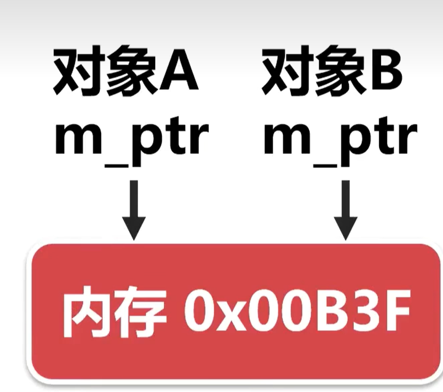

当对象A释放内存后，对象B的指针就成了野指针。

为此，改用深拷贝，两个对象各自使用一块内存空间。

```c++
CAR的数据类型：
string name;
int number = 20;
int *ptr;

CAR(const CAR &gg)
        {
                name = gg.name;
                number = gg.number;
                ptr = new int;
                *ptr = *gg.ptr;
                // memcpy(ptr,gg.ptr,sizeof(int));   复杂类型的拷贝可以用memcpy
                cout << "运行了一次拷贝构造函数" << endl;
        }

```

## 4.2 使用类

### **初始化列表**

初始化列表与赋值有本质的区别，如果成员是类，使用初始化列表调用的是成员类的拷贝构造函数，而赋值则是先创建成员类的对象（将调用成员类的普通构造函数），然后再赋值。

**如果成员是常量和引用，必须使用初始列表，因为常量和引用只能在定义的时候初始化。**
语法：

```c++
类名(形参列表):成员一(值一), 成员二(值二),..., 成员n(值n)
{......}
```

### **const修饰成员函数**

`mutable`可以突破const的限制，被mutable修饰的成员变量，将永远处于可变的状态，在const修饰的函数中，mutable成员也可以被修改。

一般非const可以调用const和非const，而const只能调用const

### **this指针**

\*this可以表示对象。如果在成员函数的括号后面使用const，那么将不能通过this指针修改成员变量。

```c++
 const CGirl& pk(const CGirl& g) const
    {
        if (g.m_yz < m_yz) return g;
        return *this;
    }
};

int main()
{
    CGirl g1("西施",5), g2("西瓜",3), g3("冰冰", 4), g4("幂幂", 5), g5("防水", 2);
    const CGirl& g = g1.pk(g2).pk(g3).pk(g4).pk(g5);
```

### **静态成员**

用 static 关键字把类的成员变量声明为静态，表示它在程序中（不仅是对象）是共享的。

静态成员变量不会在创建对象的时候初始化，必须在程序的全局区用代码清晰的初始化（用范围解析运算符 ::）。

静态成员使用类名加范围解析运算符 :: 就可以访问，不需要创建对象。

**如果把类的**成员声明为静态的，就可以**把它**与类的对象独立开来（静态成员不属于对象）。

**私有静态成员在类外无法访问。**

const静态成员变量可以在定义类的时候初始化。

`int CGirl::m_age=8;  ` 全局区写

### 4.2.5 友元

使用友元要特别小心，是不是非得用？

有时需要定义一些函数，这些函数不是类的一部分，但又需要频繁访问类的私有（private）成员和保护（protected）成员，这时可以将这些函数定义为友元函数。

友元全局函数     友元类     友元局部函数
`friend void func1();      friend class CAR;`

```c++
class CGirl {
            friend void CBoy::func(CGirl &g);
 }; 
  void CBoy::func(CGirl &g) { ...... }
  //友元函数
```

```c++
class CGirl; 
class CBoy { ...... }; 
class CGirl {
  friend class CBoy;
  };

```

```c++

#include <iostream>
#include <string.h>
using namespace std;
class CAR; 
class Engine
{
public:
    void read_keymessage_1(const CAR &g);
};
class CAR
{
    friend void Engine::read_keymessage_1(const CAR &g);

public:
    string name;
    int number;
    CAR() : name("默认品牌"), number(0), keymessage_1(1)
    {
        cout << "调用了一次构造函数" << endl;
    };
    ~CAR(){};

private:
    int keymessage_1;
};

void Engine::read_keymessage_1(const CAR &g)
{
    cout << "获取到的信息为：" << g.keymessage_1 << endl;
}

int main()
{
    CAR car;
    Engine car_engine;
    car_engine.read_keymessage_1(car);
    return 0;
}
```

### 4.2.6 重载运算符

运算符重载函数的语法：`返回值 operator运算符(参数列表);`

运算符重载函数的返回值类型要与运算符本身的含义一致。

```c++
class CAR
{
public:
    string m_name;
    int m_number;
    CAR() : m_name("默认品牌"), m_number(0), keymessage_1(1)
    {
        cout << "调用了一次构造函数" << endl;
    };
    ~CAR(){};
    CAR& operator+(int number){
        m_number = m_number + number;
        return *this;
    }
private:
    int keymessage_1;
};
int main()
{
    CAR car;
    car+2+5+8+4;
    return 0;
}
```

**重载关系运算符**（==、!=、>、>=、<、<=）用于比较两个自定义数据类型的大小。

可以使用非成员函数和成员函数两种版本，建议采用成员函数版本。

**重载左移运算符**只能采用非成员函数版本，因为作为ostream \&operator<<操作符重载，成员所在的类作为第一隐式参数传递

```c++
ostream &operator<<(ostream &cout, const CAR &g)
{
    cout << "品牌名：" << g.m_name << "，编号：" << g.m_number << endl;
    return cout;
}
```

**重载下标运算符**只能以成员函数的形式重载。

下标运算符重载函数的语法：

`返回值类型 &perator[](参数);`   `const 返回值类型 &operator[](参数) const;`

使用第一种声明方式，\[]不仅可以访问数组元素，还可以修改数组元素。

使用第二种声明方式，\[]只能访问而不能修改数组元素。

在实际开发中，我们应该同时提供以上两种形式，这样做是为了适应const对象，因为[通过const 对象只能调用const成员函数](http://c.biancheng.net/view/2232.html "通过const 对象只能调用const成员函数")，如果不提供第二种形式，那么将无法访问const对象的任何数组元素。

在重载函数中，可以对下标做合法性检查，防止数组越界。

**重载赋值运算符**的语法：`类名 & operator=(const 类名 & 源对象);`

```c++
CGirl& operator=(const CGirl& g)
    {
        if (this == &g) return *this;          // 如果是自己给自己赋值。
        
        if (g.m_ptr == nullptr)    // 如果源对象的指针为空，则清空目标对象的内存和指针。
        {
            if (m_ptr != nullptr) { delete m_ptr; m_ptr = nullptr; }
        }
        else    // 如果源对象的指针不为空。
        {
            // 如果目标对象的指针为空，先分配内存。
            if (m_ptr == nullptr) m_ptr = new int;
            // 然后，把源对象内存中的数据复制到目标对象的内存中。
            memcpy(m_ptr, g.m_ptr, sizeof(int));
        }
                  
        m_bh = g.m_bh; m_name = g.m_name;
        cout << "调用了重载赋值函数。\n" << endl; 
        return *this;
    }
```

**重载delete和new**

```c++
void* operator new(size_t size) {
    void* ptr = malloc(size);
    return ptr;
  } //他们不论是否被声明，都被创建为static，不能访问类的非静态成员
  void operator delete(void* ptr) {
    if (ptr == nullptr) return; //对空指针delete是安全的
    free(ptr);
  }
```

主要用于内存池。预先分配一大块的内存空间。

设计一个18字节的内存池，两个标志位，存放两个占用8字节，2个int的对象。

```c++
#include <iostream>
#include <string.h>
using namespace std;

class test
{
private:
    /* data */
public:
    int a;
    int b;
    static char *m_pool; // 内存池的起始地址，这里什么类型的地址都可以

    static bool init_pool() // 初始化内存池
    {
        m_pool = (char *)malloc(18);
        if (m_pool == nullptr)
            return false;
        memset(m_pool, 0, 18);
        cout << "内存池的起始地址是：" << (void *)m_pool << endl;
        return true;
    }
    static void free_pool() // 释放内存池
    {
        if (m_pool == 0)
            return;
        free(m_pool);
        cout << "内存池已经释放";
    }
    void *operator new(size_t size) // new只能访问静态变量
    {
        if (m_pool[0] == 0) // 第11个位置是否空闲
        {
            cout << "分配第一块内存" << (void *)(m_pool + 1) << endl;
            m_pool[0] = 1;
            return m_pool + 1;
        }
        if (m_pool[9] == 0) // 第9个位置是否空闲
        {
            cout << "分配第二块内存" << (void *)(m_pool + 10) << endl;
            m_pool[9] = 1;
            return m_pool + 10;
        }
        void *ptr = malloc(size);
        cout << "申请到的内存地址是：" << ptr << endl;
        return ptr;
    }
    void operator delete(void *ptr)
    {
        if (ptr == 0)
            return;
        if (ptr == m_pool + 1){
            m_pool[0] = 0;
            return;
        }
            
        if (ptr == m_pool + 10){
            m_pool[9] = 0;  //bug r：你不可能在此处free一部分malloc的内存
            return;
        }
        free(ptr);
    }
    test(int aa, int bb)
    {
        a = aa;
        b = bb;
        cout << "\ta=" << a << "\tb=" << b <<endl;
    };
    ~test(){};

};

char *test::m_pool = 0; // 静态成员变量在main外面初始化

int main()
{
    // 初始化内存池
    if (test::init_pool() == false)
    {
        cout << "初始化失败退出" << endl;
        return -1;
    }
    test*p1=new test(13,26);
    test*p2=new test(18,6);
    test*p3=new test(17,6);
    delete p1;
    delete p2;
    test::free_pool();
}

```

**重载括号运算符**`返回值类型 operator()(parameter list)` 重载之后，对象名可以当做函数来使用，因此也称为**函数对象**或**仿函数**
note：必须以成员函数的形式重载，具备普通函数的全部特征，部分场景可以替代函数，在STL中有广泛应用，有自己的数据类型，可提供继承体系。

```c++
#include <iostream>
#include <string.h>
using namespace std;

void rea(string str)
{
    cout << "普通函数：" << str << endl;
}

class Reload
{
public:
    void operator()(string str)
    {
        cout << "重载函数：" << str << endl;
    }
};
int main()
{
    Reload rea;
    ::rea("jiang xy");   //普通函数
    rea("你是谁");        //重载函数
}
```

**重载一元运算符**

成员函数版：CGirl \&operator++();             // ++前置

成员函数版：CGirl operator++(int);            // 后置++

非成员函数版：CGirl \&operator++(CGirl &); // ++前置

非成员函数版：CGirl operator++(CGirl &,int);  // 后置++

```c++
 CGirl & operator++()         // ++前置的重载函数。
    {
        m_ranking++; return *this;
    }
    CGirl operator++(int)     // ++后置的重载函数。
    {
        CGirl tmp = *this;
        m_ranking++; 
        return tmp;
    } 
```

### 4.2.7 自动类型转换

对于内置类型，如果两种数据类型是兼容的，C++可以自动转换，如果从更大的数转换为更小的数，可能会被截断或损失精度。如：int转换成double**如果某种类型与类相关，从某种类型转换为类类型是有意义的。**
隐式转换： `Class g1 = 8;`    &#x20;
显式转换： `Class g1;g1 = (Class)8;`      &#x20;

一个类可以有多个转换函数。

Classname(int)的隐式转换的场景：

将Classname对象初始化为int值时。 `Classname g1 = 8;`

将int值赋给Classname对象时。 `Classname g1; g1 = 8; `

将int值传递给接受Classname参数的函数时。`viod func(Classname); func();`

返回值被声明为Classname的函数试图返回int值时。`Classname func(){return int;}`

`explicit`关键字用于**关闭**  构造函数用作自动类型转换函数 的特性，但**仍允许显式转换**。
在实际开发中，如果强调的是构造，建议使用explicit，如果强调的是类型转换，则不使用explicit。

### 4.2.8 转换函数

转换函数是类的成员函数，没有返回值类型，没有参数。**转换函数意义不大**，一般实际开发使用成员函数的写法。因为隐式转换容易搞错，普通成员函数的功能也更强大。

```c++
class CAR{
public:
    int number;
    float price;
    string type;
    operator int() { return number; }
    operator float() { return price; }
    operator string() { return type; }
    int to_int(){ return number; } 
};
int main()
{
    CAR object_test;
    float b = object_test;cout << "b的值是" << b << endl;  //隐式转换
    int d = int(object_test);
    int e = (int)object_test;                           //显式转换
    short f = (int)object_test;
    int g = object_test.to_int();                       //成员函数版本
}

```

## 4.3 类继承

语法：

```c++
class 派生类名:［继承方式］基类名{
    派生类新增加的成员
}; 
```

### 4.3.1 继承方式

public（公有的）、protected（受保护的）和[private](https://so.csdn.net/so/search?q=private\&spm=1001.2101.3001.7020 "private")（私有的）。它是可选的，如果不写，那么默认为private。**基类中的protected成员可以在派生类中访问，而基类中的 private成员无论如何不能在派生类中访问**。

基类成员在派生类中的访问权限不会高于继承方式中指定的权限。**继承方式是用来指明基类成员在派生类中的最高访问权限的**。一般地，如果希望基类的成员既不向外暴露（不能通过对象访问），还能在派生类中使用，那么只能声明为 protected。实际开发一般使用public。
**在派生类中，可以通过基类的公有成员函数间接访问基类的私有成员。****使用** **using 关键字可以改变基类public\&protected成员成员在派生类中的访问权限。**

```c++
public:
    using A::m_b;         // 把m_b的权限修改为公有的。
private:
    using A::m_a;         // 把m_a的权限修改为私有的。
```

### 4.3.2 继承的对象模型

1.创建派生类对象时，先初始化基类对象，先调用基类的构造函数。销毁派生类对象时，先调用派生类的析构函数，再调用基类的析构函数。
2.创建派生类对象时只会申请一次内存，派生类对象包含了基类对象的内存空间（包括私有成员），因此this指针相同，成员变量的地址也相同。
3.不同继承方式的访问权限只是语法上的处理，对派生类对象用memset()会清空基类私有成员。指针可以访问到基类中的私有成员。
&#x20; 以下例证很好地说明了这点，指针无视了访问权限。后面的修改属于奇巧淫技，几乎没啥用，实际中还得考虑内存对齐之类的东西，太麻烦而且多此一举。

```c++
  Derived *ptr = new Derived;
    memset(ptr,0,sizeof(Derived));
    ptr->func();ptr->func1();  //基类对象的private也被清零了

    Derived *change_private = new Derived;
    *((int*)change_private+2) = 666;   //跳过了private限制修改了private的值
    change_private->func();change_private->func1();  
    delete ptr;
```

### 4.3.3 派生类构造函数的注意事项

-   可以用初始化列表指明要使用的基类构造函数。如不指定，则采用基类的默认构造函数
-   基类构造函数负责初始化被继承的数据成员；派生类构造函数主要用于初始化新增的数据成员
-   派生类的构造函数总会调用一个基类构造函数，这个函数可以是拷贝构造函数。

例如：基类有拷贝构造函数base(const base& a)，派生类有一公有成员int c,那么派生类构造函数可以是

```c++
derived(const base& a,int c):base(a),c(c)
```

### 4.3.4 类作用域

通过派生类对象或者在派生类的成员函数中使用基类-派生类重名成员时，将使用派生类新增的成员，而不是基类的。基类成员被遮蔽了。函数同理，并不会构成重载。

**类也是一种作用域。** 普通的成员只能通过对象（对象本身，对象指针或对象引用）访问，静态成员可以通过对象或通过类访问。

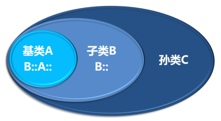

出现作用域重复冲突等问题时，在成员名前面加类名和域解析符。如果不存在继承关系，类名和域解析符可以省略不写。
对于函数而言，显然，写出对象即可。如：`base.show();`

### 4.3.5 特殊的继承关系

可以把派生类对象赋值给基类对象（包括私有成员），但是，会舍弃非基类的成员.

基类指针可以直接（在不进行显式转换的情况下）指向派生类对象，但不能调用派生类的方法。反之不能。因为派生类对象的方法包含了基类对象的方法，用基类方法操作派生类是安全的。引用也行。

函数的形参是基类时，实参也可以用派生类。

### 4.3.6 多继承和虚继承

**不提倡使用多继承**

语法：

```c++
class 派生类名 : [继承方式1] 基类名1, [继承方式2] 基类名2,......
{
    派生类新增加的成员
};
```

菱形继承：

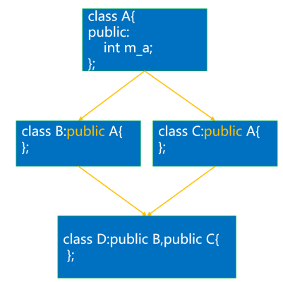

class D的m\_a具有二义性（可以通过作用域解析解决）和数据冗余的问题。

**虚继承**：

class B : virtual public A { };
class C : virtual public A { };   解决了菱形继承的问题

## 4.4 类多态

```c++
#include <iostream>
using namespace std;
class Hero {
public:
    int attack = 0;
    int MP = 0;
    int HP = 0;
    virtual void skillQ() { cout << "英雄释放了Q技能。\n"; }
    virtual void skillR() { cout << "英雄释放了R绝招。\n"; }
};

class BlindMonk : public Hero // 盲僧的派生类
{
public:
    void skillQ() { cout << "盲僧释放了天音波。\n"; }
    void skillR() { cout << "盲僧释放了猛龙摆尾。\n"; }
};

class Catalina : public Hero // 卡特琳娜的派生类
{
public:
    void skillQ() { cout << "卡特琳娜释放了弹射之刃。\n"; }
    void skillR() { cout << "卡特琳娜释放了死亡莲华。\n"; }
};
int main() {
    // 根据用户选择的英雄，施展技能。
    int id = 0;
    cin >> id;
    Hero *ptr_hero = nullptr;
    switch (id) {
        case 1: ptr_hero = new BlindMonk; break;
        case 2: ptr_hero = new Catalina; break;
        default: cout << "输入错误" << endl; break;
    }
    if (ptr_hero != nullptr) {
        ptr_hero->skillQ();
        ptr_hero->skillR();
        delete ptr_hero;
    }
    ptr_hero = nullptr;
    while (1)
        ;
}
```

### 4.4.1 类多态的概念

如果在基类的成员函数前加virtual 关键字，把它声明为虚函数，基类指针就可以调用派生类中同名的成员函数，通过派生类中同名的成员函数，就可以访问派生对象的成员变量。
有了虚函数，**基类指针指向基类对象时就使用基类的成员函数和数据，指向派生类对象时就使用派生类的成员函数和数据，基类指针表现出了多种形式，这种现象称为多态**。基类引用也有多态。

> 📌1. 函数声明和定义分离时，定义处不需也不能有virtual关键字
> 2\. 派生类对虚函数重定义时，函数特征要相同
> 3\. 派生类不对虚函数重定义时，虚函数等价于普通函数，但资源开销相对更大。因此，不必重定义时不要乱加虚函数标识，这也是对编程者的一种提醒。

### 4.4.2 类多态的内存模型

类的普通成员函数的地址是静态的，在编译阶段已指定。

含有虚函数的类会自带一个隐藏的虚函数指针vfptr指向虚函数表vftable。虚函数表存放了基类虚函数的地址。派生类的vftable中，用派生类成员函数取代了基类成员函数的地址。
因此，用基类指针指向派生类并调用重定义的虚函数时，实际上仍然按照调用基类的虚函数进行调用，但地址已经换成派生类的成员函数了，因此实际是调用的派生类的成员函数。
函数重载和模板实际上是静态多态的情况，类中这种是动态多态。

### 4.4.3 多态场景下派生类的析构

构造函数和析构函数,友元函数，赋值运算符函数都不能继承。（派生类继承的函数的特征标与基类完全相同，但赋值运算符函数的特征标随类而异，它包含了一个类型为其所属类的形参。）

析构派生类对象时，会自动调用基类的析构函数。派生类的析构函数定义不用显式地调用基类的析构函数，因为每个类只有一个析构函数，编译器会处理，无需编程者干涉。

析构函数可以手工调用，如果对象中有堆内存，析构函数中以下代码是必要的：
delete ptr;   ptr=nulllptr;                           在多态场景，基类指针指向派生类，调用delete显然会调用基类的析构函数。如果希望调用派生类的，就要把基类的析构函数设为虚函数。（析构函数名称不一样，但是没关系，编译器会处理（{dcot})  )通常，基类的析构函数应该设置为虚的。

对于基类，即使它不需要析构函数，也应该提供一个空虚析构函数。

**要点**：
1\. 析构派生类对象时，会自动调用基类的析构函数
2\. 如果希望多态场景基类指针进行delete调用派生类的析构函数，就要把基类的析构函数设为虚函数。
&#x20;   通常，基类的析构函数应是虚的。
3.不需要析构函数的基类也应当提供一个空虚析构函数。（也可能为纯虚析构函数，视具体情况而定）

### 4.4.4 纯虚函数和抽象类

语法：

```c++
virtual 返回值类型 函数名 (参数列表)=0;
```

含有纯虚函数的类被称为抽象类，**不能实例化对象**，可以创建类指针和类引用。

纯虚函数也可以有实现；纯虚析构函数必须有代码实现，实际也会被调用。

声明一个纯虚析构函数是声明一个抽象类的可行方法。

> 定义纯虚函数是可以是为了实现一个接口，起到一个规范的作用，规范继承这个类的程序员必须实现这个函数。

### 4.4.5 运行阶段类型识别dynamic\_cast

运行阶段类型识别（RTTI)为程序在运行阶段确定对象的类型，**只适用于包含虚函数的类**（dynamic\_cast只适用于多态场景）。dynamic\_cast运算符用指向基类的指针来生成派生类的指针。因为失败会返回nullptr，因此用于引用时失败会出bad\_cast错误.

语法：

```c++
派生类指针 = dynamic_cast<派生类类型 *>(基类指针);
成功：返回对象地址，失败：返回nullptr；
```

```c++
XS* xsptr = dynamic_cast<XS*>(ptr);         // 把基类指针转换为派生类。
if (xsptr != nullptr) xsptr->show();        // 如果转换成功，调用派生类西施的非虚函数。
```

### 4.4.6 typeid和type\_info类

```c++
typeid(数据类型、变量名、表达式）
cout << "typeid(AA *)=" << typeid(AA*).name() << endl;

```

上述代码实际意义不大。typeid返回\<typeinfo>中定义的type\_info类，该类的构造函数是private的，不能被用户实例化。

typeid意义在于，type\_info重载了==和!=运算符，用于对类型进行比较（可用于多态场景）

typeid(\***ptr**)，当ptr是空指针时，如果\*ptr是多态的类型，将引发bad\_typeid异常。

# 5 泛编程

## 5.1 自动推导类型auto

不要滥用auto，auto在编程时真正的用途如下：

1）代替冗长复杂的变量声明。

2）在模板中，用于声明依赖模板参数的变量。

## 5.2 函数模板

函数模板是通用的函数描述。使用泛型来描述函数。基于模板进行函数定义的过程成为实例化。

```c++
template <typename T,typename T2>
T2 Swap(T a, T2 b){
    return a + b;
}
main:
float c = Swap<int,float>(a, b);

```

注意事项：
1\. 类的成员函数也能创建模板，但虚函数和析构函数不能
2\. 数据类型必须明确，推导出的数据类型也得符合代码要求
3\. 显式地指定模板数据类型`func<int>(a,b)`就可以发生隐式的转换
4\. 模版支持多个通用数据类型的参数，也支持非通用参数出现，也支持重载
5 **.普通函数 > 具体化模板 > 模板  （当模板匹配得更好时，不使用普通函数）  空模板参数可以强行使用函数模板**
6\. 分文件编写：函数模板全放在.h头文件中，函数模板具体化和普通函数一样声明在头文件而定义在.cpp源文件

函数模板具体化

```c++
template<> 
void 函数模板名 (参数列表)
{
  // 函数体。
}
```

### 5.2.1 函数模板的现代特性

decltype关键字

用于查询表达式的数据类型，语法：

```c++
decltype(expression) var;
```

1）如果expression是一个没有用括号括起来的标识符，则var的类型与该标识符的类型相同，包括const等限定符。

2）如果expression是一个函数调用，则var的类型与函数的返回值类型相同（函数不能返回void，但可以返回void \*）。

3）如果expression是一个左值（能取地址）(要排除第一种情况)、或者用括号括起来的标识符，那么var的类型是expression的引用。

4）如果上面的条件都不满足，则var的类型与expression的类型相同。

函数后置返回类型：（C++14之后，auto即可，不必尾随后置）

```c++
auto func(T1 x, T2 y) -> decltype(x + y)
{
    decltype(x + y) tmp x y;
    cout < "tmp=" < tmp < endl;
    return tmp;
}
```

## 5.3 类模板

语法：

```c++
template <class T>
class 类模版名
{
类定义
}
```

简单例子：

```c++
#include <iostream>
#include <string.h>
using namespace std;

template <class T1, class T2=string>
class A
{
public:
    T1 a;
    T2 b;
    A(){}
    A(T1 a, T2 b) : a(a), b(b) { cout << "调用了构造函数" << endl; }
    ~A() { cout << "调用了析构函数" << endl; }
    T1 get_a()
    {
        T1 a = 2;
        return this->a + a;
    }
    T2 get_b()
    {
        T2 b = 2;
        return this->b + b;
    }
    T1 outclass();
};

template <class T1, class T2>
T1 A<T1,T2>::outclass(){
    cout << "调用一下" << endl;
    return this->a;
}

int main()
{
    A<int,double> a(20,1.3);
    cout << "geta" <<a.get_a()<< endl;
    cout << "getb" <<a.get_b()<< endl;
    decltype(a.outclass()) C = a.outclass();
    cout << C << endl;
    A<int,long> *ptr_A_int_long = new A<int,long>;
}
```

注意点：

1）在创建对象的时候，必须指明具体的数据类型。

2）使用类模板时，数据类型必须适应类模板中的代码。

3）类模板可以为通用数据类型指定缺省的数据类型（C++11标准的函数模板也可以）。

4）模板类的成员函数可以在类外实现。

5）可以用new创建模板类对象。上面在代码中都有体现

6）在程序中，模板类的成员函数使用了才会创建。

类模板可以有非通用类型参数：1）通常是整型（C++20标准可以用其它）；2）实例化模板时必须用常量表达式；3）模板中不能修改参数的值；4）可以为非通用类型参数提供默认值。

嵌套使用的例子

```c++

#include <iostream>
#include <string.h>
using namespace std;
template <class Datatype>
class Stack
{
private:
    Datatype *items; // 栈数组
    int stack_size;  // 栈的大小
    int top;         // 栈顶位置指针
public:
    Stack(int size = 3) : stack_size(size), top(0){ items = new Datatype[stack_size];
    }
    ~Stack()
    {
        delete[] items;
        items = nullptr;
        cout << "调用了析构函数" << endl;
    }
    bool is_empty() const
    {
        return top == 0;
    }
    bool is_full() const
    {
        return top == stack_size;
    }
    bool push(const Datatype &item)
    {
        if (top < stack_size)
        {
            items[top++] = item;
            return true;
        }
        return false;
    }
    bool pop(Datatype &item)
    {
        if (top > 0)
        {
            item = items[--top];
            return true;
        }
        return false;
    }
    Stack &operator=(const Stack &a)
    {
        delete[] items;
        stack_size = a.stack_size;
        top = a.top;
        items = new Datatype[stack_size];
        for (int ii = 0; ii < stack_size; ii++)
            items[ii] = a.items[ii];
        return *this;
    }
};

template <class T>
class Vector
{
private:
    int array_size;
    T *items;

public:
    Vector(int array_size = 2) : array_size(array_size)
    {
        items = new T[this->array_size];
    }
    ~Vector()
    {
        delete[] items;
        items = nullptr;
    }
    T &operator[](int ii)
    {
        if (ii >= array_size)
        {
            resize(ii + 1);
        }
        return items[ii];
    }
    const T &operator[](int ii) const
    {
        return items[ii];
    }
    void resize(int size)
    {
        if (size <= array_size)
            return;
        T *tmp = new T[size];
        for (int i = 0; i < array_size; i++)
        {
            tmp[i] = items[i];
        }
        delete[] items;
        items = tmp;
        array_size = size;
    }
    int len() const { return array_size; }
    Vector &operator=(const Vector &Vector_copy)
    {
        delete[] items;
        array_size = Vector_copy.array_size;
        items = new T[array_size];
        for (int ii = 0; ii < array_size; ii++)
            items[ii] = Vector_copy.items[ii];
        return *this;
    }
};

int main()
{
    Vector<Stack<string>> vs;
    vs[0].push("a");vs[0].push("b");vs[0].push("c");vs[1].push("bb");
    for (int ii = 0; ii < vs.len(); ii++)
    {
        while (!vs[ii].is_empty())
        {
            string item;
            vs[ii].pop(item);
            cout << "item==" << item << endl;
        }
    }
    cout << endl;
    Stack<Vector<int>> a;
    Vector<int> tmp;
    for (int ii = 0; ii < 3; ii++)
        tmp[ii] = ii;
    a.push(tmp);
    for (int ii = 0; ii < 5; ii++)
        tmp[ii] = ii * 10;
    a.push(tmp);
    while (!a.is_empty())
    {
        a.pop(tmp);
        for (int ii = 0; ii < tmp.len(); ii++)
        {
            cout << "pop_item= "
                << "\t " << tmp[ii] << endl;
        }
        cout << endl;
    }
    cout << endl;
}
```

### 5.3.1 模版类具体化

具体化程度高的类优先于具体化程度低的类，具体化的类优先于没有具体化的类。

具体化的模板类，成员函数类外实现的代码应该放在源文件中。

```c++
// 普通模版类
template <class T, class T2> class A {
public:
  T a;
  T2 b;
  A(T aa, T2 bb) : a(aa), b(bb) { cout << "调用了普通类的构造函数\n" << endl; }
  ~A(){};
};
// 部分具体化
template <class T> class A<T, int> {
public:
  T a;
  int b;
  A(T aa, int bb) : a(aa), b(bb) {
    cout << "调用了部分具体化类的构造函数\n" << endl;
  }
  ~A(){};
};
// 具体化
template <> class A<float, int> {
public:
  float a;
  int b;
  A(float aa, int bb) : a(aa), b(bb) {
    cout << "调用了具体化类的构造函数\n" << endl;
  }
  ~A(){};
};
int main() {
  A<float, int> Aa(2.5, 3);
  A<float, string> Aa2(2.5, "woshiyizz");
  A<string, int> Aa3("asfasf", 3);
}
```

### 5.3.2 模版类的继承

最常用的是模版类继承普通类和普通类继承模版类。此外，还有普通类继承模版类的实例，模版类继承模版类，模版类继承模版参数给出的基类

模版类继承普通类：

```c++
template<class T1, class T2>
class BB:public normalClass{
  public: BB(......,int a):normalClass(a),b(bb)
};
```

普通类继承模版类的实例化：没有什么特殊，注意BB\<int,string>是一个整体，表示该类

```c++
class AA:public BB<int,string>     // 普通类AA。
{
public:
  int m_a;
  AA(int a,int x,string y) : BB(x,y),m_a(a) { cout << "调用了AA的构造函数。\n"; }
};
```

普通类继承模版类：为了继承模版特性，需要                    BB\<T1,T2>是一个整体

```c++
template<T1,T2> //这是基模版类的模版变量名
class AA:public BB<T1,T2>
{
public: AA(....):BB<T1,T2>(X,Y)
}
```

模版类继承模版类：没啥特殊的，和普通类继承模版类差不多

```c++
template<class T, class T1, class T2>
class CC :public BB<T1, T2>   // 模板类继承模板类。
{
public:
  T m_a;
  CC(const T a, const T1 x, const T2 y) : BB<T1, T2>(x, y), m_a(a) { cout << "调用了CC的构造函数。\n"; }
```

还有一种特殊用法，模板类继承模板参数给出的基类

```c++
class DD {
public:
    DD()         { cout << "调用了DD的构造函数DD()。\n"; }
    DD(int a) { cout << "调用了DD的构造函数DD(int a)。\n"; }
};

template<class T>
class EE : public T {          // 模板类继承模板参数给出的基类。
public:
    EE() :T()           { cout << "调用了EE的构造函数EE()。\n"; }
    EE(int a) :T(a) { cout << "调用了EE的构造函数EE(int a)。\n"; }
};

int main()
{
    EE<DD<int>> ed1(2);      // EE<int>作为基类。

```

### 5.3.3 模版类与函数

模板类可以用于函数的参数和返回值，有三种形式：

1）普通函数，参数和返回值是模板类的实例化版本。

2）函数模板，参数和返回值是某种的模板类。

3）函数模板，参数和返回值是任意类型（支持普通类和模板类和其它类型） 精髓所在，其实和上面最后的继承殊途同归

```c++
template<class T1, class T2>
class AA{}；

// 采用普通函数，参数和返回值是模板类AA的实例化版本。
AA<int, string> func(AA<int, string>& aa)
// 函数模板，参数和返回值是的模板类AA。
template <typename T1,typename T2>
AA<T1, T2> func(AA<T1, T2>& aa)
//这里是一个函数模版，typename有T1T2,传给模版类作参数，但这个方法没有体现出模版的精髓

// 函数模板，参数和返回值是任意类型。
template <typename T>
T func(T &aa)

```

### 5.3.4 模版类与友元

1）非模板友元：友元函数不是模板函数，而是利用模板类参数生成的函数。

2）约束模板友元：模板类实例化时，每个实例化的类对应一个友元函数。

3）非约束模板友元：模板类实例化时，如果实例化了n个类，也会实例化n个友元函数，每个实例化的类都拥有n个友元函数。

非模板友元:   放在class里面

```c++
friend void show(const A<T> &a){def;}

```

`friend void show(const A<int> &a){def;}`是不可以的！也就是说实例化版本是做不到的

约束模版友元是最好用的。

```c++
template <typename T>
void show(T& a);                   // 第一步：在模板类的定义前面，声明友元函数模板。
template<class T1, class T2>
class AA    // 模板类AA。
{
    friend void show<>(AA<T1, T2>& a);  // 第二步：在模板类中，再次声明友元函数模板。
}

template <typename T>                                 // 第三步：友元函数模板的定义。
void show(T& a)

template <>                                                    // 第三步：具体化版本。
void show(AA<int, string>& a)

```

非约束

```c++
template<class T1, class T2>
class AA    
{
    template <typename T> friend void show(T& a);     // 把函数模板设置为友元。
    }
template <typename T> void show(T& a)                     // 通用的函数模板。

```

### 5.3.5 模版类的成员模版

在类外定义成员模版函数和模版类：

```c++
template<class T1, class T2>
class AA              // 类模板AA。
{
public:
    T1 m_x;
    T2 m_y;
    AA(const T1 x, const T2 y) : m_x(x), m_y(y) {}
    void show() { cout << "m_x=" << m_x << "，m_y=" << m_y << endl; }
    
    template<class T>
    class BB{public:T m_a;T1 m_b;BB() {}void show();};
    BB<string> m_bb;
    
    template<typename T>
    void show(T tt);
};

template<class T1, class T2>
template<class T>
void AA<T1,T2>::BB<T>::show() { 
cout << "m_a=" << m_a << "，m_b=" << m_b << endl;
 }

template<class T1, class T2>
template<typename T>
void AA<T1,T2>::show(T tt) {
    cout << "tt=" << tt << endl;
    cout << "m_x=" << m_x << "，m_y=" << m_y << endl;
    m_bb.show();
}
```

### 5.3.6 模版类用作参数

C++支持模版名当做一种特殊的数据类型，实例化对象时，可以将模版名作为参数传给模版。

可以存放各种类型数据的模版类习惯上成为**容器**。

一般这种设计仅仅用于数据结构中，其他地方很少做如此复杂的设计。

```c++
#include <iostream>
using namespace std;

template <class T, int len>
class LinkList // 链表类模板。
{
public:
    T* m_head;       // 链表头结点。
    int m_len = len; // 表长。
    void insert() { cout << "向链表中插入了一条记录。\n"; }
    void Delete() { cout << "向链表中删除了一条记录。\n"; }
    void update() { cout << "向链表中更新了一条记录。\n"; }
};

template <class T, int len>
class Array // 数组类模板。
{
public:
    T* m_data;       // 数组指针。
    int m_len = len; // 表长。
    void insert() { cout << "向数组中插入了一条记录。\n"; }
    void Delete() { cout << "向数组中删除了一条记录。\n"; }
    void update() { cout << "向数组中更新了一条记录。\n"; }
};

// 线性表模板类：      tableType-线性表类型       dataType-线性表的数据类型。
template <template <class, int> class tableType, class dataType, int len>
class LinearList {
public:
    tableType<dataType, len> m_table; // 创建线性表对象。

    void insert() { m_table.insert(); } // 线性表插入操作。
    void Delete() { m_table.Delete(); } // 线性表删除操作。
    void update() { m_table.update(); } // 线性表更新操作。

    void oper() // 按业务要求操作线性表。
    {
        cout << "len=" << m_table.m_len << endl;
        m_table.insert();
        m_table.update();
    }
};
int main() {
    // 创建线性表对象，容器类型为链表，链表的数据类型为int，表长为20。
    LinearList<LinkList, int, 20> a;
    a.insert();
    a.Delete();
    a.update();

    // 创建线性表对象，容器类型为数组，数组的数据类型为string，表长为20。
    LinearList<Array, string, 20> b;
    b.insert();
    b.Delete();
    b.update();
}
```

## 5.4 typename用于嵌套从属类型

来自[https://zhuanlan.zhihu.com/p/596090777](https://zhuanlan.zhihu.com/p/596090777 "https://zhuanlan.zhihu.com/p/596090777")

### **typename与class**

在声明template参数时，无论使用关键字class或者typename，意义完全相同，然而有时候必须要使用typename

先看一个例子

```c++
template<typename C>
void print2nd(const C& container){
  if(container.size()>=2){
  
    C::const_iterator iter = container.cbegin();
    iter++;
    int value = *iter;
    std::cout << "second value: " << value << "\n";
  }
}
```

在上述例子中，`C::const_iterator`被称为 ***从属嵌套类型***，其类型依赖于`C`。`value`，其类型是int，与`C`类型无关，被称为[非从属名称](https://www.zhihu.com/search?q=非从属名称\&search_source=Entity\&hybrid_search_source=Entity\&hybrid_search_extra={"sourceType":"article","sourceId":"596090777"} "非从属名称")(non-dependent names)。

上述代码是不能通过编译的，因为如果编译器在template中遭遇一个嵌套从属名称，他便假设这个名称不是个类型，除非你告诉它是。所以在缺省的情况下，嵌套从属名称(`C::const_iterator`)不是类型。

### **一般性规则**

对上述代码，我们需要在嵌套从属名称前添加typename，告诉编译器它是一个类型，即可通过编译

```c++
template<typename C>
void print2nd(const C& container){
  if(container.size()>=2){
    typename C::const_iterator iter = container.cbegin();
    iter++;
    int value = *iter;
    std::cout << "second value: " << value << "\n";
  }
}
```

typename仅仅用来表示嵌套从属类型名称，其他名称不该有它的存在：

```c++
template<typename C>
void f(const C& container, typename C::const_iterator iter){
  std::cout << "iter's index: " << iter-container.cbegin() << "\n";
}
```

# 6 STL

## 6.1 STL算法

### 6.1.1 怎么理解？

实现如下这样的函数回调可以通过如下两种方式，一是函数指针，一是封装在一个类中通过访问对象调用

```c++
#include <iostream>
#include <string>
#include <list>
using namespace std;

void MyShow(const string &no) {
    cout << "尊敬的" << no << endl;
    cout << "这是函数指针的版本" << endl;
}
template <typename T>
void ShowForeach(const T first, const T last, void (*pf)(const string &)) {
    for (auto it = first; it != last; it++) { pf(*it); }
}
class PersonalShow {
public:
    void show(const string &no) {
        cout << "尊敬的" << no << endl;
        cout << "这是类的版本" << endl;
    }
};
template <typename T>
void ShowForeach(const T first, const T last, PersonalShow pf) {
    for (auto it = first; it != last; it++) { pf.show(*it); }
}

int main() {
    list<string> bh = {"03", "04"};

    ShowForeach(bh.begin(), bh.end(), MyShow);
    PersonalShow zs;
    ShowForeach(bh.begin(), bh.end(), zs);
}
```

两个函数模版还可以更相近，通过重载括号运算符，实现**仿函数**。（用struct实现更简洁，不需要struct，但没那么强大）就可以用对象名直接调用函数

```c++
template <typename T>
void ShowForeach2(const T first, const T last, PersonalShow pf) {
    for (auto it = first; it != last; it++) { pf(*it); }
}
```

都一模一样了，直接一个函数模板一次性搞定

```c++
template <typename T, typename P>
void ShowForeach2(const T first, const T last, P pf) {
    for (auto it = first; it != last; it++) { pf(*it); }
}

int main(){
ShowForeach2(bh.begin(), bh.end(), MyShow);
ShowForeach2(bh.begin(), bh.end(), KhShow());//匿名对象
}
```

既然如此，string留着？，也模板化了调用的时候要注意：

```c++
ShowForeach2(bh.begin(), bh.end(), MyShow<string>);
ShowForeach2(bh.begin(), bh.end(), KhShow<string>());
```

仿函数是有优势的，普通函数变更内容可能需要改框架，例如问候函数中需要变更逻辑，此时需要朋友的年龄作为函数的参数传入。这么一改，`ShowForeach2`函数也得再传一个参数进去。仿函数就没有这种麻烦。编程者在定义类时，加一个成员变量，用初始化列表传入匿名对象的话，完全不用动框架。例如：

```c++
template <typename T>
class zss {
public:
    bool operator()(const T &no) {.....};
};
main：
    auto it1 = findIf(bh.begin(), bh.end(), zss<int>());
    
//变更为：
template <typename T>
class zss {
public:
    T age;
    long int KEY;
    zss(T _age, long int _KEY) : age(_age), KEY(_KEY) {}
    bool operator()(const T &no) {
        if (no != 3) return false;
        if (KEY != 12165165) return false;
        cout << "good" << endl;
        return true;
    };
};
    
auto it1 = findIf(bh.begin(), bh.end(), zss<int>(30, 1265165));
```

### 6.1.2 设计风格

提供了很多处理容器的函数模板，它们的设计是相同的，有以下特点：

1）用迭代器表示需要处理数据的区间。

2）返回迭代器放置处理数据的结果（如果有结果）。

3）接受一个函数对象参数（结构体模板），用于处理数据（如果需要）。

很多STL算法都使用函数对象，也叫**函数符**（functor），包括函数名、函数指针和仿函数。

函数符的概念：

**生成器**（generator）：不用参数就可以调用的函数符。

**一元函数**（unary function）：用一个参数可以调用的函数符。

**二元函数**（binary function）：用两个参数可以调用的函数符。

改进的概念：

**一元谓词**（predicate）：返回bool值的一元函数。

**二元谓词**（binary predicate）：返回bool值的二元函数。

预定义的函数对象   #include\<functional> &#x20;

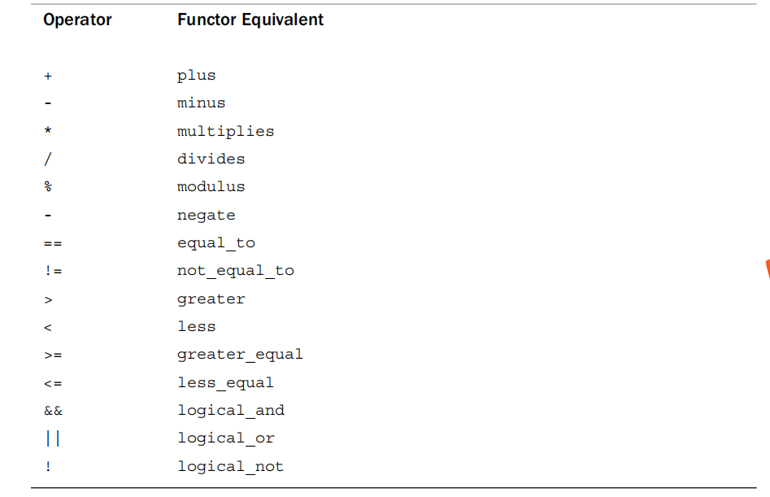

```c++
template <typename T>
struct Ifme {
public:
    T label;
    T count;
    void operator()(const T &a) {
        if (a == label) count++;
    }
    Ifme(T YZ) : label(YZ), count(0) {}
    ~Ifme() {}
};

int main() {
    vector<int> a = {1, 2, 3, 4, 5, 6, 7, 8, 9};
    Ifme<int> g = for_each(a.begin(), a.end(), Ifme<int>(1));
    cout << "count " << g.count << endl;
}
```

STL将算法函数分成四组：

1）非修改式序列操作：对区间中的每个元素进行操作，这些操作不修改容器的内容。

2）修改式序列操作：对区间中的每个元素进行操作，这些操作可以容器的内容（可以修改值，也可以修改排列顺序）。

3）排序和相关操作：包括多个排序函数和其它各种函数，如集合操作。

4）通用数字运算：包括将区间的内容累积、计算两个容器的内部乘积、计算小计、计算相邻对象差的函数。通常，这些都是数组的操作特性，因此vector是最有可能使用这些操作的容器。

前三组在头文件#include \<algorithm>中，第四组专用于数值数据，在#include \<numeric>中。

详见《C++ Primer plus》，第六版，从886页开始。

**如果容器有成员函数，则使用成员函数，如果没有才考虑用STL的算法函数。**

把全部的STL算法函数过一遍，知道大概有些什么东西。如果打算采用某算法函数，一定要搞清楚它的原理，关注它的效率。不是因为简单，而是因为不常用。

### 6.1.3 常用函数

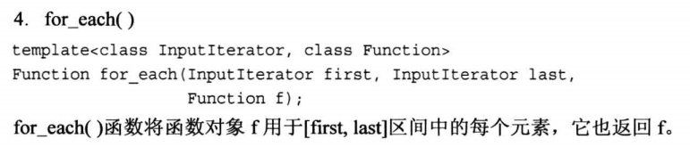

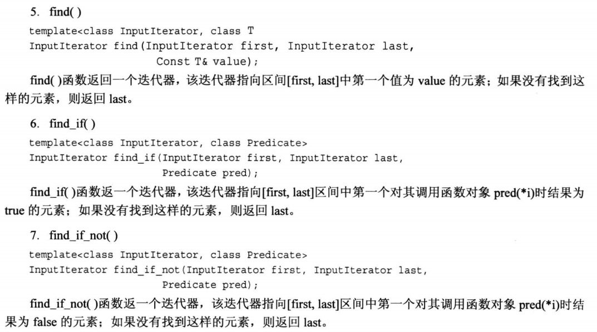

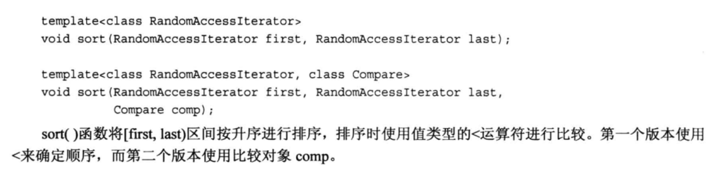

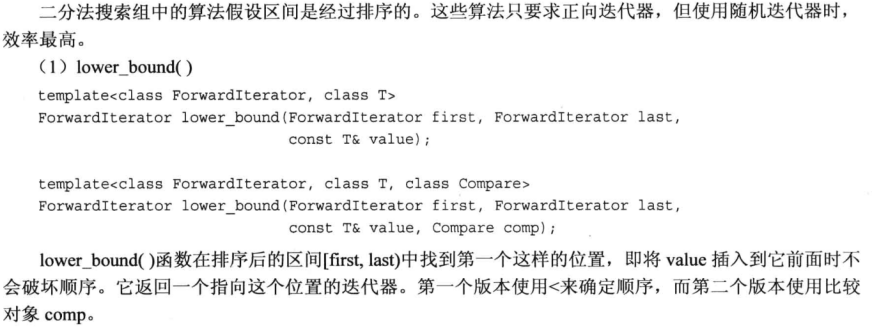

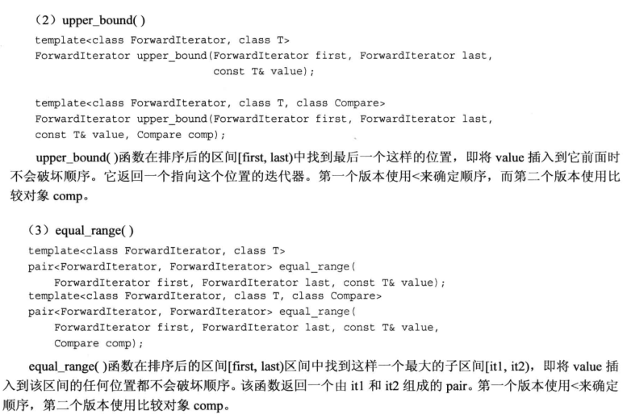

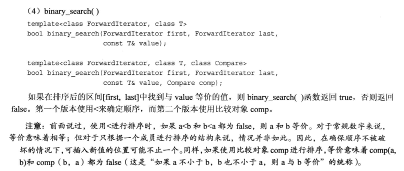

## 6.2 迭代器

迭代器是访问容器中元素的通用方法。能支持：赋值（=）、解引用（ \*）、比较（==和!=）、从左向右遍历（++）五个操作的是迭代器（正向迭代器）。还支持- -的为双向迭代器，进一步支持\[]，+= + <是随机访问迭代器。

**1）正向迭代器**

只能使用++运算符从左向右遍历容器，每次沿容器向右移动一个元素。

容器名<元素类型>::iterator 迭代器名;  // 正向迭代器。

容器名<元素类型>::const\_iterator 迭代器名; // 常正向迭代器。

相关的成员函数：

```c++
iterator begin();
const_iterator begin();
const_iterator cbegin();  // 配合auto使用。
for(std::vector<int>::const_iterator it2 = vv.cbegin();it2!=vv.cend();it2++){}
for(auto it2 = vv.cbegin()......)
iterator end();
const_iterator end();
const_iterator cend();
```

**2）双向迭代器**&#x20;

具备正向迭代器的功能，还可以反向（从右到左）遍历容器（也是用++），不管是正向还是反向遍历，都可以用--让迭代器后退一个元素。

容器名<元素类型>:: reverse\_iterator 迭代器名;  // 反向迭代器。

容器名<元素类型>:: const\_reverse\_iterator 迭代器名; // 常反向迭代器。

注意：反向迭代器的rend的++是从右向左遍历

相关的成员函数：

```c++
reverse_iterator rbegin();
const_reverse_iterator crbegin();
reverse_iterator rend();
const_reverse_iterator crend();
```

**3）随机访问迭代器**  &#x20;

具备双向迭代器的功能，还支持以下操作：

l 用于比较两个迭代器相对位置的关系运算（<、<=、>、>=）。

l 迭代器和一个整数值的加减法运算（+、+=、-、-=）。

l 支持下标运算（iter\[n]）。

数组的指针是纯天然的随机访问迭代器。**但是不支持迭代器的函数**。

## 6.3 string

string容器有三个优点：1）使用的时候，不必考虑内存分配和释放的问题；2）动态管理内存（可扩展）；3）提供了大量操作容器的API，不过效率不高，占用资源也多 &#x20;

string类是`std::basic_string`类模板的一个具体化版本的别名
`string::npos`为字符数组的最大长度
NBTS（null-terminated string）：C风格的字符串（以空字符0结束的字符串）

string的构造函数主要有7个&#x20;

```c++
1）string(); // 创建一个长度为0的string对象（默认构造函数）。
2）string(const char *s); // 将string对象初始化为s指向的NBTS（转换函数）。
3）string(const string &str); // 将string对象初始化为str（拷贝构造函数）。
4）string(const char *s,size_t n); // 将string对象初始化为s指向的地址后n字节的内容。
5）string(const string &str,size_t pos=0,size_t n=npos); // 将sring对象初始化为str从位置pos开始到结尾的字符（或从位置pos开始的n个字符）。
6）template<class T> string(T begin,T end); // 将string对象初始化为区间[begin,end]内的字符，其中begin和end的行为就像指针，用于指定位置，范围包括begin在内，但不包括end。
7）string(size_t n,char c); // 创建一个由n个字符c组成的string对象。
```

string的主要操作有：\[]  c\_str() capacity()  size() empty() clear() shrink\_to\_fit() reserve( size\_t size=0)   =   append()   swap()     substr() (截取操作)  compare（） find rfind find\_first\_of find\_last\_not\_of等  replace  insert  erase

## 6.4 vector

**分配器**

各种STL容器模板都接受一个可选的模板参数，该参数指定使用哪个分配器对象来管理内存

如果省略该模板参数的值，将默认使用allocator\<T>，用new和delete分配和释放内存。

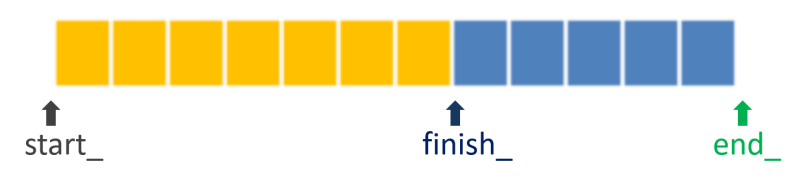

```c++
template<class T, class Alloc = allocator<T>>
class vector{
private:
  T *start_; 
  T *finish_;
  T *end_;
  ……
}
```

```c++
//构造函数
1）vector();  // 创建一个空的vector容器。
2）vector(initializer_list<T> il); // 使用统一初始化列表。
3）vector(const vector<T>& v);  // 拷贝构造函数。
4）vector(Iterator first, Iterator last);  // 用迭代器创建vector容器。
5）vector(vector<T>&& v);  // 移动构造函数（C++11标准）。
//6）explicit vector(const size_t n);   // 创建vector容器，元素个数为n（容量和实际大小都是n）。
//7）vector(const size_t n, const T& value);  // 创建vector容器，元素个数为n，值均为value。

//特性操作
size_t capacity() const;      // 返回容器的容量。
size_t size() const;          // 返回容器的实际大小（已使用的空间）。
bool empty() const;        // 判断容器是否为空。
void clear();               // 清空容器。
void reserve(size_t size);   // 将容器的容量设置为至少size。
void shrink_to_fit();         // 将容器的容量降到实际大小（需要重新分配内存）。
void resize(size_t size);    // 把容器的实际大小置为size。

//元素操作
T &operator[](size_t n); 
const T &operator[](size_t n) const;  // 只读。
T &at(size_t n); 
const T &at(size_t n) const;          // 只读。
T *data();            // 返回容器中动态数组的首地址。
const T *data() const; // 返回容器中动态数组的首地址。
T &front();        // 第一个元素。
const T &front();  // 第一个元素，只读。
const T &back();  // 最后一个元素，只读。
T &back();        // 最后一个元素。


//赋值操作
1）vector &operator=(const vector<T> &v);    // 把容器v赋值给当前容器。
2）vector &operator=(initializer_list<T> il); // 用统一初始化列表给当前容器赋值。
3）void assign(initializer_list<T> il);        // 使用统一初始化列表赋值。
4）void assign(Iterator first, Iterator last);  // 用迭代器赋值。
//5）void assign(const size_t n, const T& value);  // 把n个value给容器赋值。

//交换
void swap(vector<T> &v);    // 把当前容器与v交换。

//比较
bool operator == (const vector<T> & v) const;
bool operator != (const vector<T> & v) const;

//插入和删除
1）void push_back(const T& value);  // 在容器的尾部追加一个元素。
2）void emplace_back(…);           // 在容器的尾部追加一个元素，…用于构造元素。C++11
3）iterator insert(iterator pos, const T& value);  // 在指定位置插入一个元素，返回指向插入元素的迭代器。
4）iterator emplace (iterator pos, …);  // 在指定位置插入一个元素，…用于构造元素，返回指向插入元素的迭代器。C++11
5）iterator insert(iterator pos, iterator first, iterator last);  // 在指定位置插入一个区间的元素，返回指向第一个插入元素的迭代器。
6）void pop_back();                      // 从容器尾部删除一个元素。
7）iterator erase(iterator pos);             // 删除指定位置的元素，返回下一个有效的迭代器。
8）iterator erase(iterator first, iterator last); // 删除指定区间的元素，返回下一个有效的迭代器。

```

注意：resize()、reserve()、assign()、push\_back()、pop\_back()、insert()、erase()等函数会引起vector容器的动态数组发生变化，可能导致vector迭代器失效！
遍历容器的时候，一般不要插入和删除元素

```c++
for (auto it= v1.begin(); it!=v1.end(); it++) {cout << "*it=" << *it << endl;}

//等效于
for (auto it= v1.begin(); it!=v1.end(); ) {
        cout << "*it=" << *it << endl;
        it = v1.erase(it);
}

```

## 6.5 list

不支持随机访问迭代器。

操作上，不同点：

```c++
void swap(list<T> &l);   // 把当前容器与l交换，交换的是链表结点的地址。
void reverse();           // 反转链表。
void sort();              // 对容器中的元素进行升序排序。
void sort(_Pr2 _Pred);    // 对容器中的元素进行排序，排序的方法由_Pred决定（二元函数）。
void merge(list<T> &l);  // 采用归并法合并两个已排序的list容器，合并后的list容器仍是有序的。

//插入和删除
push_front(const T& value);  // 在链表的头部插入一个元素。
emplace_front(…);          // 在链表的头部插入一个元素，…用于构造元素。C++11
splice(iterator pos, const vector<T> & l);    // 把另一个链表连接到当前链表。
splice(iterator pos, const vector<T> & l, iterator first, iterator last);
                                 // 把另一个链表指定的区间连接到当前链表。
splice(iterator pos, const vector<T> & l, iterator first);  // 把另一个链表从first开始的结点连接到当前链表。
void remove(const T& value);   // 删除链表中所有值等于value的元素。
void remove_if(_Pr1 _Pred);    // 删除链表中满足条件的元素，参数_Pred是一元函数。
void unique();                 // 删除链表中相邻的重复元素，只保留一个。
void pop_front();              // 从链表头部删除一个元素。

```

## 6.6 pair键值对

类似于py中的字典。实现：

```c++
template <class T1, class T2>
struct pair 
{ 
    T1 first;     // 第一个成员，一般表示key。
    T2 second;  // 第二个成员，一般表示value。
  pair();       // 默认构造函数。
  pair(const T1 &val1,const T2 &val2);   // 有两个参数的构造函数。
  pair(const pair<T1,T2> &p);           // 拷贝构造函数。
  void swap(pair<T1,T2> &p);           // 交换两个pair。
};
make_pair函数模板的定义如下：
template <class T1, class T2>
make_pair(const T1 &first,const T2 &second)
{
  return pair<T1,T2>(first, second);
}
```

## 6.7 map

map容器封装了红黑树

map类模板的声明：

```c++
template <class K, class V, class P = less<K>, class _Alloc = allocator<pair<const K, V >>>

class map : public _Tree<_Tmap_traits< K, V, P, _Alloc, false>>
```

第一个模板参数K：key的数据类型（pair.first）。

第二个模板参数V：value的数据类型（pair.second）。

第三个模板参数P：排序方法，缺省按key升序。

第四个模板参数\_Alloc：分配器，缺省用new和delete。

map提供了双向迭代器。

主要要掌握操作：

```c++
//查找
//1）查找键值为key的键值对
//在map容器中查找键值为key的键值对，如果成功找到，则返回指向该键值对的迭代器；失败返回end()。
iterator find(const K &key); 
const_iterator find(const K &key) const;  // 只读。
//2）查找键值>=key的键值对
//在map容器中查找第一个键值>=key的键值对，成功返回迭代器；失败返回end()。
iterator lower_bound(const K &key); 
const_iterator lower_bound(const K &key) const;  // 只读。
//3）查找键>key的键值对
//在map容器中查找第一个键值>key的键值对，成功返回迭代器；失败返回end()。
iterator upper_bound(const K &key); 
const_iterator upper_bound(const K &key) const;  // 只读。
//4）统计键值对的个数
//统计map容器中键值为key的键值对的个数。
size_t count(const K &key) const;

//插入和删除
1）void insert(initializer_list<pair<K,V>> il);  // 用统一初始化列表在容器中插入多个元素。
2）pair<iterator,bool> insert(const pair<K,V> &value);  // 在容器中插入一个元素，返回值pair：first是已插入元素的迭代器，second是插入结果。
3）void insert(iterator first,iterator last);  // 用迭代器插入一个区间的元素。
4）pair<iterator,bool> emplace (...);  // 将创建新键值对所需的数据作为参数直接传入，map容器将直接构造元素。返回值pair：first是已插入元素的迭代器，second是插入结果。
例：mm.emplace(piecewise_construct, forward_as_tuple(8), forward_as_tuple("冰冰", 18));
5）iterator emplace_hint (const_iterator pos,...); // 功能与第4）个函数相同，第一个参数提示插入位置，该参数只有参考意义，如果提示的位置是正确的，对性能有提升，如果提示的位置不正确，性能反而略有下降，但是，插入是否成功与该参数元关。该参数常用end()和begin()。成功返回新插入元素的迭代器；如果元素已经存在，则插入失败，返回现有元素的迭代器。
6）size_t erase(const K & key);  // 从容器中删除指定key的元素，返回已删除元素的个数。
7）iterator erase(iterator pos);  // 用迭代器删除元素，返回下一个有效的迭代器。
8）iterator erase(iterator first,iterator last);  // 用迭代器删除一个区间的元素，返回下一个有效的迭代器。

```

```c++
   map<string, string> m({{"08", "car"}, {"03", "star"}, {"01", "f"}, {"07", "imp"}, {"05", "rar"}});
    cout << "m[08]=" << m["08"] << endl; // 显示key为08的元素的value。
    cout << "m[09]=" << m["09"] << endl; // 显示key为09的元素的value。key为09的元素不存在，将添加新的键值对。
    m["07"] = "zip";                     // 把key为07的元素的value修改为花花。
    m["12"] = "doc";                     // 将添加新的键值对。
    for (const auto& val : m) cout << " " << val.first << " " << val.second << endl;

    map<string, string> m1 = m;
    cout << "\n" << endl;
    for (const auto& val : m1) cout << " " << val.first << " " << val.second << "\t";
    
    map<float, Num> m2 = {{2.3, {1, 2}}, {2.4, {21, 23}}};
    cout << "\n" << endl;
    for (const auto& val : m2) cout << " " << val.first << "\t" << val.second.a;
}
```

```c++
#include <iostream>
#include <map>
using  namespace std;

class CGirl        // 超女类。
{
public:
  string m_name;   // 超女姓名。
  int      m_age;       // 超女年龄。

  /*CGirl() : m_age(0) {
    cout << "默认构造函数。\n";
  }*/
  CGirl(const string name, const int age) : m_name(name), m_age(age) {
    cout << "两个参数的构造函数。\n";
  }
  CGirl(const CGirl & g) : m_name(g.m_name), m_age(g.m_age) {
    cout << "拷贝构造函数。\n";
  }
};

int main()
{
  //map<int, CGirl> mm;
  //mm.insert     (pair<int, CGirl>(8, CGirl("冰冰", 18)));                // 一次构造函数，两次拷贝构造函数。
  //mm.insert     (make_pair<int, CGirl>(8, CGirl("冰冰", 18)));     // 一次构造函数，两次拷贝构造函数。
  //mm.emplace(pair<int, CGirl>(8, CGirl("冰冰", 18)));                // 一次构造函数，两次拷贝构造函数。
  //mm.emplace(make_pair<int, CGirl>(8, CGirl("冰冰", 18)));     // 一次构造函数，两次拷贝构造函数。
  //mm.emplace(8, CGirl("冰冰", 18));                                             // 一次构造函数，一次拷贝构造函数。
  //mm.emplace(8, "冰冰", 18);                                                        // 错误。
  //mm.emplace(piecewise_construct, forward_as_tuple(8), forward_as_tuple("冰冰", 18));  // 一次构造函数。

  //for (const auto& val : mm)
  //  cout << val.first << "," << val.second.m_name << "," << val.second.m_name << "  ";
  //cout << endl;

  //return 0;

  map<int, string> m;

  // 1）void insert(initializer_list<pair<K,V>> il);  // 用统一初始化列表在容器中插入多个元素。
  m.insert({ { 8,"冰冰" }, { 3,"西施" }});
  m.insert({ pair<int,string>(1,"幂幂"), make_pair<int,string>(7,"金莲"), {5,"西瓜"}});
  m.insert({ { 18,"冰冰" }, { 3,"西施" } });

  // 2）pair<iterator,bool> insert(const pair<K,V> &value);  
  // 在容器中插入一个元素，返回值pair：first是已插入元素的迭代器，second是插入结果。
  auto ret = m.insert(pair<int, string>(18, "花花"));
  if (ret.second == true) cout << "插入成功：" << ret.first->first << "," << ret.first->second << endl;
  else cout << "插入失败。\n";

  // 3）void insert(iterator first, iterator last);  // 用迭代器插入一个区间的元素。

  // 4）pair<iterator, bool> emplace(...);  
  // 将创建新键值对所需的数据作为参数直接传入，map容器将直接构造元素。
  // 返回值pair：first是已插入元素的迭代器，second是插入结果。
  auto ret1 = m.emplace(20, "花花");
  if (ret1.second == true) cout << "插入成功：" << ret1.first->first << "," << ret1.first->second << endl;
  else cout << "插入失败。\n";

  // 5）iterator emplace_hint(const_iterator pos, ...); 
  // 功能与第4）个函数相同，第一个参数提示插入位置，该参数只有参考意义，如果提示的位置是正确的，
  // 对性能有提升，如果提示的位置不正确，性能反而略有下降，但是，插入是否成功与该参数元关。
  // 该参数常用end()和begin()。成功返回新插入元素的迭代器；如果元素已经存在，则插入失败，返回现
  // 有元素的迭代器。
  m.emplace_hint(m.begin(), piecewise_construct, forward_as_tuple(23), forward_as_tuple("冰棒")); 

  for (auto& val : m)
    cout << val.first << "," << val.second << "  ";
  cout << endl;
}
```

## 6.8  unorderd\_map

umap封装了hash表

包含头文件： #include\<unordered\_map>

元素是pair键值对。

```c++
template <class K, class V, class _Hasher = hash<K>, class _Keyeq = equal_to<K>,
    class _Alloc = allocator<pair<const K, V>>>
class unordered_map : public _Hash
<_Umap_traits<K, V, _Uhash_compare<K, _Hasher, _Keyeq>, _Alloc, false>>
```

第一个模板参数K：key的数据类型（pair.first）。

第二个模板参数V：value的数据类型（pair.second）。

第三个模板参数\_Hasher：哈希函数，默认值为std::hash\<K>

第四个模板参数\_Keyeq：比较函数，用于判断两个key是否相等，默认值是std::equal\_to\<K>。

第五个模板参数\_Alloc：分配器，缺省用new和delete。

创建std::unordered\_map类模板的别名：

```c++
template<class K,class V>
using umap = std::unordered_map<K, V>;
```

umap的查找只能找键值等于key的，不能>

特性操作：

```c++
size_t bucket_count();          // 返回容器桶的数量，空容器有8个桶。
float load_factor();   // 返回容器当前的装填因子，load_factor() = size() / bucket_count()。
float max_load_factor();        // 返回容器的最大装填因子，达到该值后，容器将扩充，缺省为1。
void max_load_factor (float z ); // 设置容器的最大装填因子。
iterator begin(size_t n);        // 返回第n个桶中第一个元素的迭代器。
iterator end(size_t n);          // 返回第n个桶中最后一个元素尾后的迭代器。
void reserve(size_t n);          // 将容器设置为至少n个桶。
void rehash(size_t n);           // 将桶的数量调整为>=n。如果n大于当前容器的桶数，该方法会将容器重新哈希；如果n的值小于当前容器的桶数，该方法可能没有任何作用。
size_t bucket_size(size_t n);     // 返回第n个桶中元素的个数，0 <= n < bucket_count()。
size_t bucket(K &key);          // 返回值为key的元素对应的桶的编号。

```

## 6.9 queue

```c++
template <class T, class _Container = deque<T>>
class queue{
  ……
}

```

第一个模板参数`T`：元素的数据类型。
第二个模板参数`_Container`：底层容器的类型，缺省是std::deque，可以用std::list，还可以用自定义的类模板。

```c++
void push(const T& value);  // 元素入队。
void emplace(…);           // 元素入队，用于构造元素。C++11
size_t size() const;       // 返回队列中元素的个数。
bool empty() const;        // 判断队列是否为空。
T &front();                // 返回队头元素。
const T &front();          // 返回队头元素，只读。
T &back();                 // 返回队尾元素。
const T &back();           // 返回队头元素，只读。
void pop();                // 出队，删除队头的元素。
```

## 6.10 array

```c++
fill();    //清零
T &front(); 
T &back();
// void func(const array < array<int, 5>, 10 >& arr)
//{
//  for (int ii = 0; ii < arr.size(); ii++)
//  {
//    for (int jj = 0; jj < arr[ii].size(); jj++)
//      cout << arr[ii][jj] << " ";
//    cout << endl;
//  }
// }

template <typename T>
void func(const T& arr) {
    for (int ii = 0; ii < arr.size(); ii++) {
        for (int jj = 0; jj < arr[ii].size(); jj++) cout << arr[ii][jj] << " ";
        cout << endl;
    }
} 

```

**deque**（双端队列）

**1）物理结构**

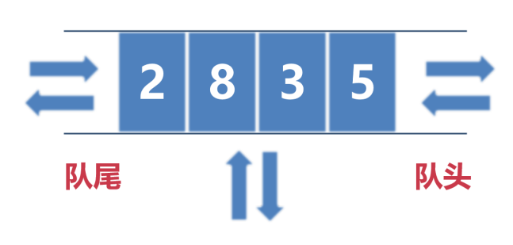

deque容器存储数据的空间是多段等长的连续空间构成，各段空间之间并不一定是连续的。

为了管理这些连续空间的分段，deque容器用一个数组存放着各分段的首地址。

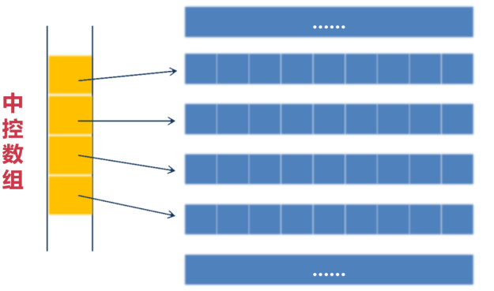

通过建立数组，deque容器的分段的连续空间能实现整体连续的效果。

当deque容器在头部或尾部增加元素时，会申请一段新的连续空间，同时在数组中添加指向该空间的指针。

**2）迭代器**

随机访问迭代器。

**3）特点**

l 提高了在**两端**插入和删除元素的效率，扩展空间的时候，不需要拷贝以前的元素。

l 在中间插入和删除元素的效率比vector更糟糕。

l 随机访问的效率比vector容器略低。

**4）各种操作**

与vector容器相同。

**forward\_list**（单链表）

**1）物理结构**

单链表。

**2）迭代器**

正向迭代器。

**3）特点**

比双链表少了一个指针，可节省一丢丢内存，减少了两次对指针的赋值操作。

如果单链表能满足业务需求，建议使用单链表而不是双链表。

**4）各种操作**

与list容器相同。

## **multimap**

底层是红黑树。

multimap和map的区别在：multimap允许关键字重复，而map不允许重复。

各种操作与map容器相同。

## **set\&multiset**

底层是红黑树。

set和map的区别在：map中存储的是键值对，而set只保存关键字。

multiset和set的区别在：multiset允许关键字重复，而set不允许重复。

各种操作与map容器相同。

## 6.13 unordered\_multimap

底层是哈希表。

unordered\_multimap和unordered\_map的区别在：unordered\_multimap允许关键字重复，而unordered\_map不允许重复。

各种操作与unordered\_map容器相同。

## **unordered**\_**set\&unordered**\_**multiset**

底层是哈希表。

unordered\_set和unordered\_map的区别在：unordered\_map中存储的是键值对，而unordered\_set只保存关键字。

unordered\_multiset和unordered\_set的区别在：unordered\_multiset允许关键字重复，而unordered\_set不允许重复。

各种操作与unordered\_map容器相同。

## **priority\_queue（优先队列）**

优先级队列相当于一个有权值的单向队列queue，在这个队列中，所有元素是按照优先级排列的。

底层容器可以用deque和list。

各种操作与queue容器相同。

## **stack**（栈）

底层容器可以用deque和list。

# 7 C++11

## 7.1 简要说明

新增了类型long long和unsigned long long，以支持64位（或更宽）的整型。
在VS中，int和long都是4字节，long long是8字节。
在Linux中，int是4字节，long和long long是8字节。

新增了类型char16\_t和char32\_t，以支持16位和32位的字符。意义不大

新增了原始字面量R()

新增了统一的初始化列表。STL容器提供了将initializer\_list模板类作为参数的构造函数。头文件\<initializer\_list>提供了对模板类initializer\_list的支持，这个类包含成员函数begin()和end()。除了用于构造函数外，还可以将**initializer\_list**用于常规函数的参数。例如

```c++
#include <iostream>
#include <initializer_list>

double sum(std::initializer_list<double> il)
{
    double total = 0;
    for (auto it = il.begin(); it != il.end(); it++)
        total = total + *it;
    return total;
}
int main()
{
    // double total = sum(  3.14, 5.20, 8  );    // 错误，如果没有大括号，这是三个参数。
    double total = sum({ 3.14, 5.20, 8 });        // 正确，有大括号，这是一个参数。
    std::cout << "total=" << total << std::endl;
}

```

新增了自动类型推导auto

新增了decltype关键字用于类型推导

新增了函数后置返回类型

修改了异常规范

新增了explicit关键字用于禁止自动转换

新增了定义模版别名的方法`using ittype=std::vector<std::string>::iterator`typedef不能用于模版具体化，using可以，例如：

```c++
template<typename T>
using arr12 = std::array<T,12>;

arr12<double>
arr12<std::string>
```

新增了空指针nullptr。使用nullptr提供了更高的类型安全。

新增了智能指针 **神器1**

新增了强枚举类型，强类型枚举默认的类型为int，也可以显式地指定类型，具体做法是在枚举名后面加上:type，type可以是除wchar\_t以外的任何整型。例如

```c++
enum class e2 { red, green, blue };
enum class e3::char { red, green, blue, yellow };

e2::red
e3::green
```

新增了类内成员初始化的方法

新增了基于范围的for循环的方法

新增了array， forward\_list， unordered\_map、unordered\_multimap、unordered\_set、unordered\_multiset几个STL容器

新增了STL方法：
1.cbegin()、cend()、crbegin()、crend()&#x20;
2.iterator emplace (iterator pos, …); 方法，原地构造相比于拷贝构造效率极大提升
3.新增移动构造函数和移动赋值函数

摒弃了export关键字

嵌套模板尖括号之间不必再加空格

自己新增了final关键字，用于限制某个类不能被继承，或者某个虚函数不能被继承类重写。final关键字放在类名或虚函数名的后面。

新增override关键字表示重写基类的虚函数，提高代码的可读性，没实际语义。

新增数值类型和字符串转换的方法

新增静态断言

新增常量表达式constexpr。const关键字从功能上来说有双重语义：只读变量和修饰常量。
C++11保留了const表示“只读”的语义，而将“常量”的语义划分给了新添加的constexpr关键字。

新增类默认成员函数的=default和=delete进行启用和禁用

新增委托构造和继承构造的方法

新增lambda函数（匿名函数，lambda表达式）一个语法糖

新增右值引用，**移动语义**和完美转发   **神器2**

新增可变参数模版。可变参数模版是C++11新增的最强大的特性之一，它对参数进行了泛化，能支持任意个数、任意数据类型的参数。 \*\* 神器3\*\*

对线程提供语言级别的支持

## **数值类型和字符串之间的转换**

传统方法用sprintf()和snprintf()函数把数值转换为char\*字符串；用atoi()、atol()、atof()把char\*字符串转换为数值。
使用to\_string()函数可以将各种数值类型转换为string字符串类型，这是一个重载函数，在头文件 \<string>中声明

字符转换为串数值：

int                 stoi( const string& str, size\_t\* pos = nullptr, int base = 10 );

long               stol( const string& str, size\_t\* pos = nullptr, int base = 10 );

long long          stoll( const string& str, size\_t\* pos = nullptr, int base = 10 );

unsigned long      stoul( const string& str, size\_t\* pos = nullptr, int base = 10 );

unsigned long long stoull( const string& str, size\_t\* pos = nullptr, int base = 10 );

float               stof( const string& str, size\_t\* pos = nullptr );

double             stod( const string& str, size\_t\* pos = nullptr );

long double        stold( const string& str, size\_t\* pos = nullptr );

形参说明：

*str：需要要转换的string字符串。
pos：传出参数，存放从哪个字符开始无法继续解析的位置，例如：123a45, 传出的位置将为3。
base：若base为0，则自动检测数值进制：若前缀为0，则为八进制，若前缀为0x或0X，则为十六进制，否则为十进制。*

**注意：string字符**串**转换为数值**的函数可能会抛出异常

## 7.3 基于范围的for循环

语法：

```c++
for (迭代的变量 : 迭代的范围)
{
  // 循环体。
}
```

1）迭代的范围可以是数组名、容器名、初始化列表或者可迭代的对象（支持begin()、end()、++、==）。

2）数组名传入函数后，已退化成指针，不能作为容器名。

3）如果容器中的元素是结构体和类，迭代器变量应该**申明为引用**，加const约束表示只读。

```c++
for(const auto &val:vector1)
```

4）注意迭代器失效的问题。

## 7.4 智能指针

### 7.4.1 unique\_ptr

总结：
1.初始化一般用unique\_ptr<> variname (new xxx); C++14之后 make\_unique<>()
2.不支持赋值和引用，可以赋临时右值。支持转移，使用`std::move()`转移指针控制权。
3.常用`get()`，`release()`，`reset()`，`swap()`和`std::move()`方法。
4.注意不能一个裸指针初始化多个unique\_ptr对象

```c++
#include <memory>
template <typename T, typename D = default_delete<T>>
class unique_ptr
{
public:
  explicit unique_ptr(pointer p) noexcept;  // 不可用于转换函数。
  ~unique_ptr() noexcept;    
  T& operator*() const;            // 重载*操作符。
  T* operator->() const noexcept;  // 重载->操作符。
  unique_ptr(const unique_ptr &) = delete;   // 禁用拷贝构造函数。
  unique_ptr& operator=(const unique_ptr &) = delete;  // 禁用赋值函数。
  unique_ptr(unique_ptr &&) noexcept;    // 右值引用。
  unique_ptr& operator=(unique_ptr &&) noexcept;  // 右值引用。
  // ...
private:
  pointer ptr;  // 内置的指针。
};
```

初始化：

```c++
    unique_ptr<Test> ptr(new Test(1));            // 方法1，最常使用
    unique_ptr<Test> ptr2 = make_unique<Test>(2); // 方法2，C++14
    Test* p = new Test(3);                        //  方法3，不要这么用
    unique_ptr<Test> p0(p);
```

unique\_ptr重载了\*和→，不支持赋值和引用，只支持转移

**万万不可用一个裸指针初始化多个unique\_ptr对象**

不要用unique\_ptr管理不是new分配的内存

如果源unique\_ptr是一个临时右值，允许使用=赋值。因此，其实手动释放对象可以把智能指针直接指向空。

```c++
unique_ptr<AA> p0;
p0 = unique_ptr<AA>(new AA ("西瓜"));

```

`get()`返回对应裸指针

`release()`释放对原始指针的控制权，将unique\_ptr置为空，返回裸指针。（可用于把unique\_ptr传递给子函数，子函数将负责释放对象）

`std::move()`可以转移对原始指针的控制权。（可用于把unique\_ptr传递给子函数，子函数形参也是unique\_ptr）

reset()释放对象。

```c++
void reset(T * _ptr= (T *) nullptr);
pp.reset();        // 释放pp对象指向的资源对象。
pp.reset(nullptr);  // 释放pp对象指向的资源对象
pp.reset(new AA("bbb"));  // 释放pp指向的资源对象，同时指向新的对象。
```

swap()交换两个unique\_ptr的控制权。

```c++
a.swap(b);
```

unique\_ptr也可象普通指针那样，当指向一个类继承体系的基类对象时，也具有多态性质，如同使用裸指针管理基类对象和派生类对象那样。

unique\_ptr不是绝对安全，如果程序中调用exit()退出，全局的unique\_ptr可以自动释放，但局部的unique\_ptr无法释放。

unique\_ptr提供了支持数组的具体化版本。

数组版本的unique\_ptr，重载了操作符\[]，操作符\[]返回的是引用，可以作为左值使用。

```c++
unique_ptr<AA[]> parr2(new AA[3]{string("西施"), string("冰冰"), string("幂幂")});

cout << "parr2[0].m_name=" << parr2[0].m_name << endl;

cout << "parr2[1].m_name=" << parr2[1].m_name << endl;

cout << "parr2[2].m_name=" << parr2[2].m_name << endl;
```

对不同需求的传参：

```c++

// 函数func1()需要一个指针，但不对这个指针负责。
void func1(const AA* a) { cout << a->m_name << endl; }
// 函数func2()需要一个指针，并且会对这个指针负责。
void func2(AA* a) {cout << a->m_name << endl;delete a;}
// 函数func3()需要一个unique_ptr，不会对这个unique_ptr负责。
void func3(const unique_ptr<AA>& a) { cout << a->m_name << endl; }
// 函数func4()需要一个unique_ptr，并且会对这个unique_ptr负责。
void func4(unique_ptr<AA> a) { cout << a->m_name << endl; }
int main() {
    unique_ptr<AA> pu(new AA("西施"));
    cout << "开始调用函数。\n";
    func1(pu.get());     // 函数func1()需要一个指针，但不对这个指针负责。
    func2(pu.release()); // 函数func2()需要一个指针，并且会对这个指针负责。
    func3(pu);           // 最常用 函数func3()需要一个unique_ptr，不会对这个unique_ptr负责。
    func4(move(pu));     // 函数func4()需要一个unique_ptr，并且会对这个unique_ptr负责。
    // 这里是创建一个临时对象赋给函数，pu本身被销毁了
    cout << "调用函数完成。\n";

    if (pu == nullptr) cout << "pu是空指针。\n";
}
```

### 7.4.2 shared\_ptr

shared\_ptr可指向相同的对象。shared\_ptr支持赋值，左值的shared\_ptr的计数器将减1，右值shared\_ptr的计算器将加1。unique\_ptr的效率更高。

`use_count()`方法返回引用计数器的值，`std::move()`可以转移对原始指针的控制权。还可以将unique\_ptr转移成shared\_ptr
没有`release()`方法
`reset()`用法如下：

```c++
pp.reset();        // 解除与资源的关系，资源的引用计数减1。
pp.reset(new AA("bbb"));  // 解除与资源的关系，资源的引用计数减1。关联新资源。
```

线程安全性：

l shared\_ptr的引用计数本身是线程安全（引用计数是原子操作）。

l 多个线程同时读同一个shared\_ptr对象是线程安全的。

l 如果是多个线程对同一个shared\_ptr对象进行读和写，则需要加锁。

多线程读写shared\_ptr所指向的同一个对象，不管是相同的shared\_ptr对象，还是不同的shared\_ptr对象，也需要加锁保护

### 7.4.3 智能指针删除器

删除器可以是全局函数、仿函数和Lambda表达式，形参为原始指针。默认为delete。

## 7.5 weak\_ptr

## 7.6 委托构造和继承构造

**委托构造**就是在一个构造函数的初始化列表中调用另一个构造函数。不要生成环状的构造过程。一旦使用委托构造，就不能在初始化列表中初始化其它的成员变量。

C++11推出了**继承构造**（Inheriting Constructor），一个语法糖，在派生类中使用using来声明继承基类的构造函数。与此前不同的是，现在可以直接调用基类的构造方法构造派生类对象而不用再写多余的字了。

语法：

```c++
using AA::AA
```

## 7.7 lambda函数

lambda函数也是一个语法糖。格式为：

```c++
[capture list] (parameters) mutable?noexcept?(可选) -> return type {statement}

```

**捕获方式**：

| 捕获列表                   | 说明                                                                     |
| ---------------------- | ---------------------------------------------------------------------- |
| `[]`                   | 不可访问函数内的局部变量，只可访问全局变量                                                  |
| `[=]`                  | 函数局部作用域里的所有变量都按值捕获                                                     |
| `[&]`                  | 函数局部作用域里的所有变量都按引用捕获                                                    |
| `[=, reference_list]`  | reference list里的变量按引用捕获，其余的变量按值捕获，比如 `[=, &a, &b]` 表示 a 和 b 按引用，其余按值捕获 |
| `[&, identifier_list]` | identifier list里的变量按值捕获，其余的变量按引用捕获，比如 `[&, a, b]` 表示 a 和 b 按值，其余按引用捕获  |

值捕获与传递参数不同，变量的值是在lambda函数创建时拷贝，而不是调用时拷贝。默认情况下，如果以传值方式捕获变量，则在lambda函数中不能修改变量的值。mutable关键字，使得以值捕获方式进入的参数能被暂时修改，但函数结束后修改消失。

**lambda函数执行时，程序必须保证引用的对象有效。**

```c++
auto f = [=, &ii](const string &no) {
        cout << ii << endl;
        ii = 3;
        delete &ii;
    };
```

lambda函数的实质是重载()的类，是一个const方法。采用值捕获时，lambda函数生成的类用捕获变量的值初始化自己的成员变量。也因此采用mutable跳出const的限制。

## 7.8 移动语义和完美转发

### 7.8.1 右值引用

C++11拓展了右值的概念，右值分为纯右值和将亡值。将亡值是与右值引用相关的表达式。引入右值引用是为了实现移动语义。

一种个人认可的见解：区分左右值的依据应该是**是否能在语言层面上修改数据**，能修改的数据就是左值，不能修改的数据就是右值，而是否能修改的本质是我们对地址空间的权限，对正文代码区只有读权限，对栈区，堆区以及静态区我们有读写权限。

曾经的那种引用统称**左值引用**（lvalue reference）。

右值引用语法：

```c++
dataType && variname = rvalue;
```

**右值引用是左值**。

左值只能绑定左值引用，右值只能绑定右值引用。除非是常量引用：可以绑定非常量左值、常量左值、右值，而且在绑定右值的时候，常量左值引用还可以像右值引用一样将右值的生命期延长，缺点是，只能读不能改。

```c++
int a = 1;        
const int& ra = a;   // a是非常量左值。

const int b = 1;  
const int& rb = b;  // b是常量左值。

const int& rc = 1;   // 1是右值。
```

### 7.8.2 移动语义

拷贝操作叫拷贝语义，转移资源操作叫**移动语义**。

移动构造函数的语法：`类名(类名&& 源对象){......}`

移动赋值函数的语法：`类名& operator=(类名&& 源对象){……}`

```c++
class AA
{
public:
    int* m_data = nullptr;  // 数据成员，指向堆区资源的指针。

    AA() = default;             // 启用默认构造函数。

    void alloc() {                // 给数据成员m_data分配内存。
        m_data = new int;                       // 分配内存。
        memset(m_data, 0, sizeof(int));   // 初始化已分配的内存。
    }

    AA(const AA& a) {     // 拷贝构造函数。
        cout << "调用了拷贝构造函数。\n";            // 显示自己被调用的日志。
        if (m_data == nullptr) alloc();                     // 如果没有分配内存，就分配。
        memcpy(m_data, a.m_data, sizeof(int));     // 把数据从源对象中拷贝过来。
    }

    AA(AA&& a) {     // 移动构造函数。
        cout << "调用了移动构造函数。\n";            // 显示自己被调用的日志。
        if (m_data != nullptr) delete m_data;         // 如果已分配内存，先释放掉。
        m_data = a.m_data;                                   // 把资源从源对象中转移过来。
        a.m_data = nullptr;                                    // 把源对象中的指针置空。
    }

    AA& operator=(const AA& a) { // 赋值函数。
        cout << "调用了赋值函数。\n";                   // 显示自己被调用的日志。
        if (this == &a)   return *this;                      // 避免自我赋值。
        if (m_data == nullptr) alloc();                     // 如果没有分配内存，就分配。
        memcpy(m_data, a.m_data, sizeof(int));    // 把数据从源对象中拷贝过来。
        return *this;
    }

    AA& operator=(AA&& a) { // 移动赋值函数。
        cout << "调用了移动赋值函数。\n";            // 显示自己被调用的日志。
        if (this == &a)   return *this;                      // 避免自我赋值。
        if (m_data != nullptr) delete m_data;         // 如果已分配内存，先释放掉。
        m_data = a.m_data;                                   // 把资源从源对象中转移过来。
        a.m_data = nullptr;                                    // 把源对象中的指针置空。
        return *this;
    }

     ~AA() {                 // 析构函数。
         if (m_data != nullptr) {
             delete m_data; m_data = nullptr;
         }
    }
};
```

提供了std::move()方法来将左值转义为右值，从而方便使用移动语义。它其实就是告诉编译器，虽然我是一个左值，但不要对我用拷贝构造函数，用移动构造函数吧。左值对象被转移资源后，不会立刻析构，只有在离开自己的作用域的时候才会析构，**如果继续使用左值中的资源，可能会发生意想不到的错误**。

如果没有提供移动构造/赋值函数，只提供了拷贝构造/赋值函数，编译器找不到移动构造/赋值函数就去寻找拷贝构造/赋值函数。
C++11中的所有容器都实现了移动语义，避免对含有资源的对象发生无谓的拷贝。
移动语义对于拥有资源（如内存、文件句柄）的对象有效，如果是基本类型，使用移动语义没有意义。

***

学习时候的一个疑问：这玩意不就相当于浅拷贝+指针置0吗
知乎@Lancern的回答：

[(99+ 封私信 / 81 条消息) 浅拷贝＋原对象成员指针置零是否相当于移动语义？ - 知乎 (zhihu.com)](https://www.zhihu.com/question/628119509/answer/3275260343 "(99+ 封私信 / 81 条消息) 浅拷贝＋原对象成员指针置零是否相当于移动语义？ - 知乎 (zhihu.com)")

就抽象层次来说，C++ 至少包含三层抽象：

1.  在最底层是 memory ，在这一层 C++ 规定有 memory model 。简单来说，memory 被抽象为字节的集合，与真实硬件中的 memory 组织方式对应。
2.  基于 memory model，C++ 进一步构建出“对象”这一抽象，并规定了 object model 。一个对象就是 memory 中若干个连续字节的集合，这些字节中包含的数据表示了对象的内部状态。这一层抽象还提供了“对象的生命周期”这一概念，同时提供了相应的“生命周期管理”工具（构造、析构、etc.），供更上层抽象来使用。&#x20;
3.  基于 object model，C++ 开发者可以进一步构建出“资源管理”这一抽象层级。移动语义就是在这一抽象层级。这里的“资源”是广义的，程序中使用的一切外部设施都可以叫做资源，例如堆内存、文件、数据库连接等等。对象作为更底层的抽象为资源管理提供工具。具体来说，对象是资源的容器，掌握资源的所有权。资源的获取与释放可以通过 object model 所提供的生命周期管理工具管理起来，对资源的访问则封装于对象的操作中。所谓的移动就是将资源（的所有权）从一个容器（对象）中转移到另一个容器（对象）中的过程。作为资源的容器的对象本身是焊死在一个固定的内存位置上的，并没有发生移动，因此移动语义是在描述资源所有权的转移。

一个典型的例子就是 `std::list` 的移动。std::list 的移动构造没有 `noexcept`修饰，可能会抛异常。因为 `std::list` 的 `end()` 所指向的[链表节点](https://www.zhihu.com/search?q=链表节点\&search_source=Entity\&hybrid_search_source=Entity\&hybrid_search_extra={"sourceType":"answer","sourceId":3275260343} "链表节点")是一个由每个 `std::list` 自己管理的空节点，因此即使在移动构造时，`std::list` 的[移动构造函数](https://www.zhihu.com/search?q=移动构造函数\&search_source=Entity\&hybrid_search_source=Entity\&hybrid_search_extra={"sourceType":"answer","sourceId":3275260343} "移动构造函数")也需要额外分配并初始化这个节点，而不能直接将原对象中的尾节点占为己有。在分配和初始化这个节点时就可能会抛出异常。这个实现显然已经超出了简单地“浅拷贝”的范畴，但它仍然是如假包换的移动语义。移动语义的具体实现方法是五花八门的，只要能完成资源所有权的转移就是移动语义。

C++ Core Guidelines 指出，当类对象的内部状态蕴含某种不变量（invariant）时，类的[构造器](https://www.zhihu.com/search?q=构造器\&search_source=Entity\&hybrid_search_source=Entity\&hybrid_search_extra={"sourceType":"answer","sourceId":3275260343} "构造器")应该保证当对象初始化完成后这些不变量应该已经被合理地建立完毕。对于现实中绝大部分作为资源的容器的对象，除了资源管理的部分，它们内部是没有额外的不变量的。此时，使用“浅拷贝 + 将原对象中所有表示资源所有权的成员重置”这一方法，通常便可以实现移动语义。对于其他的情况，在实现移动语义时，移动构造中必须包含额外的代码来初始化对象中额外的不变量；这一部分是无法简单地用一句“浅拷贝+重置”就可以概括的，可能包含任意复杂的逻辑。`std::list` 中，这些额外的不变量就是每个 `std::list` 包含自己独有的[链表尾节点](https://www.zhihu.com/search?q=链表尾节点\&search_source=Entity\&hybrid_search_source=Entity\&hybrid_search_extra={"sourceType":"answer","sourceId":3275260343} "链表尾节点")

**“浅拷贝+重置原对象中所有表示资源所有权的成员”仅仅是移动语义最通用、最普遍的一种实现方法，直接将它与移动语义划等号是不合适的。**

### 7.8.3 完美转发

推导过程：

```c++
void func1(int &ii) // 左值版本
{
    cout << "参数是左值=" << ii << endl;
}
void func1(int &&ii) // 右值版本
{
    cout << "参数是右值=" << ii << endl;
}
void func2(int &ii) { func1(ii); }
void func2(int &&ii) { func1(ii); }
int main() {
    int a = 1;
    func1(a);//调用左值函数
    func1(8);//调用右值函数
    cout<<endl;
    func2(a); // 调用左值函数
    func2(8); // 调用右值函数
}
```

上面函数的func2()调用时无论传左值还是传右值进去都调用了左值版本

尝试：用move方法处理右值版本的形参，成功了。

能用函数模版解决吗？

```c++
template<typename T>
void func2(T ii) { func1(ii); }
```

全部成了左值。重载一个，成功了。

```c++
template <typename T>
void func2(T &ii) {
    func1(ii);
}
template <typename T>
void func2(T &&ii) {
    func1(std::move(ii));
}
```

C++11提供了更好的方法：完美转发。完美转发所谓完美，即不仅能准确的转发参数的值，还能保证被转发参数的左、右值属性不变。
C++的支持：
1）如果**模板中**（包括类模板和函数模板）（非模版参数是不行的）函数的参数书写成为`T&& 参数名`（语法，此处不是单纯右值引用！），那么，函数既可以接受左值引用，又可以接受右值引用。
2）提供了模板函数`std::forward<T>`(参数) ，用于转发参数，如果 参数是一个右值，转发之后仍是右值引用；如果参数是一个左值，转发之后仍是左值引用。

```c++
template <typename T>
void func2(T &&ii) { func1(std::forward<T> (ii)); }
```

成功了。

## 7.9 可变参数模版

可变参数模版是C++11最强大的特性之一。C语言就有，但C++98不支持。

sizeof...(args)

```c++
#include <iostream>
using namespace std;
void print() { cout << "递归终止" << endl; }
template <typename T, typename... Args>
void print(T arg, Args... args) {
    cout << "我是可变参数模版，本次展开的参数是：" << arg << endl;
    print(args...);
}
template <typename T, typename... Args>
void show(T& mine, Args... args) {
    cout << "展开前我要运行，先看一个参数：" << mine << endl;
    print(args...);
    cout << "函数完成" << endl;
}
int main() { show("我是第一", 20, 3, "hello world", 2, 'd'); }
```

## 7.10 时间操作库 chrono

头文件：#include\<chrono>    命名空间：std::chrono

```c++
#define _CRT_SECURE_NO_WARNINGS // localtime()需要这个宏。
#include <ctime>
#include <iomanip>
#include <sstream>
#include <chrono>
#include <iostream>
#include <ostream>
using namespace std;
int main() {
    // 1.时间长度
    //  using hours = duration<Rep, std::ratio<3600>>      // 小时
    //      using minutes = duration<Rep, std::ratio<60>>  // 分钟
    //      using seconds = duration<Rep>                  // 秒
    //      using milliseconds = duration<Rep, std::milli> // 毫秒
    //      using microseconds = duration<Rep, std::micro> // 微秒
    //      using nanoseconds = duration<Rep, std::nano>   // 纳秒
    std::chrono::hours t1(1);
    std::chrono::minutes t2(60);
    auto ifequal = [](auto t1, auto t2) -> std::string { return (t1 == t2) ? "相等" : "不相等"; };
    std::cout << ifequal(t1, t2) << std::endl;
    std::cout << std::chrono::milliseconds(10).count() << std::endl;

    // 2.系统时间
    // system_clock类支持了对系统时钟的访问，提供了三个静态成员函数：
    // 1）静态成员函数chrono::system_clock::now()用于获取系统时间。（C++时间）
    auto now = chrono::system_clock::now();

    // 2）静态成员函数chrono::system_clock::to_time_t()把系统时间转换为time_t。（UTC时间）
    auto t_now = chrono::system_clock::to_time_t(now);
    // t_now = t_now + 24*60*60;   // 把当前时间加1天。
    // t_now = t_now + -1*60*60;   // 把当前时间减1小时。
    // t_now = t_now + 120;           // 把当前时间加120秒。
    // 3）std::localtime()函数把time_t转换成本地时间。（北京时）
    // localtime()不是线程安全的，VS用localtime_s()代替，Linux用localtime_r()代替。
    auto tm_now = std::localtime(&t_now);
    // 4）格式化输出tm结构体中的成员。
    std::cout << "\n\n\n\n" << endl;
    std::cout << std::put_time(tm_now, "%Y-%m-%d %H:%M:%S") << std::endl;
    std::cout << std::put_time(tm_now, "%Y-%m-%d") << std::endl;
    std::cout << std::put_time(tm_now, "%H:%M:%S") << std::endl;
    std::cout << std::put_time(tm_now, "%Y%m%d%H%M%S") << std::endl;
    stringstream ss;                                  // 创建stringstream对象ss，需要包含<sstream>头文件。
    ss << std::put_time(tm_now, "%Y-%m-%d %H:%M:%S"); // 把时间输出到对象ss中。
    string timestr = ss.str();                        // 把ss转换成string的对象。
    cout << timestr << endl;

    // 3.计时器
    // 静态成员函数chrono::steady_clock::now()获取开始的时间点。
    auto start = chrono::steady_clock::now();

    // 执行一些代码，让它消耗一些时间。
    cout << "计时开始 ...... \n";
    for (int ii = 0; ii < 1000000; ii++) {
        // cout << "我是一只傻傻鸟。\n";
    }
    cout << "计时完成 ...... \n";

    // 静态成员函数chrono::steady_clock::now()获取结束的时间点。
    auto end = chrono::steady_clock::now();

    // 计算消耗的时间，单位是纳秒。
    auto dt = end - start;
    cout << "耗时: " << dt.count() << "纳秒（" << (double)dt.count() / (1000 * 1000 * 1000) << "秒）";
}

```

```c++
#define _CRT_SECURE_NO_WARNINGS // localtime()需要这个宏。
#include <ctime>
#include <iomanip>
#include <sstream>
#include <chrono>
#include <iostream>
#include <ostream>
using namespace std;
int main() {
    // 1.时间长度
    //  using hours = duration<Rep, std::ratio<3600>>      // 小时
    //      using minutes = duration<Rep, std::ratio<60>>  // 分钟
    //      using seconds = duration<Rep>                  // 秒
    //      using milliseconds = duration<Rep, std::milli> // 毫秒
    //      using microseconds = duration<Rep, std::micro> // 微秒
    //      using nanoseconds = duration<Rep, std::nano>   // 纳秒
    std::chrono::hours t1(1);
    std::chrono::minutes t2(60);
    auto ifequal = [](auto t1, auto t2) -> std::string { return (t1 == t2) ? "相等" : "不相等"; };
    std::cout << ifequal(t1, t2) << std::endl;
    std::cout << std::chrono::milliseconds(10).count() << std::endl;

    // 2.系统时间
    // system_clock类支持了对系统时钟的访问，提供了三个静态成员函数：
    // 1）静态成员函数chrono::system_clock::now()用于获取系统时间。（C++时间）
    auto now = chrono::system_clock::now();

    // 2）静态成员函数chrono::system_clock::to_time_t()把系统时间转换为time_t。（UTC时间）
    auto t_now = chrono::system_clock::to_time_t(now);
    // t_now = t_now + 24*60*60;   // 把当前时间加1天。
    // t_now = t_now + -1*60*60;   // 把当前时间减1小时。
    // t_now = t_now + 120;           // 把当前时间加120秒。
    // 3）std::localtime()函数把time_t转换成本地时间。（北京时）
    // localtime()不是线程安全的，VS用localtime_s()代替，Linux用localtime_r()代替。
    auto tm_now = std::localtime(&t_now);
    // 4）格式化输出tm结构体中的成员。
    std::cout << "\n\n\n\n" << endl;
    std::cout << std::put_time(tm_now, "%Y-%m-%d %H:%M:%S") << std::endl;
    std::cout << std::put_time(tm_now, "%Y-%m-%d") << std::endl;
    std::cout << std::put_time(tm_now, "%H:%M:%S") << std::endl;
    std::cout << std::put_time(tm_now, "%Y%m%d%H%M%S") << std::endl;
    stringstream ss;                                  // 创建stringstream对象ss，需要包含<sstream>头文件。
    ss << std::put_time(tm_now, "%Y-%m-%d %H:%M:%S"); // 把时间输出到对象ss中。
    string timestr = ss.str();                        // 把ss转换成string的对象。
    cout << timestr << endl;

    // 3.计时器
    // 静态成员函数chrono::steady_clock::now()获取开始的时间点。
    auto start = chrono::steady_clock::now();

    // 执行一些代码，让它消耗一些时间。
    cout << "计时开始 ...... \n";
    for (int ii = 0; ii < 1000000; ii++) {
        // cout << "我是一只傻傻鸟。\n";
    }
    cout << "计时完成 ...... \n";

    // 静态成员函数chrono::steady_clock::now()获取结束的时间点。
    auto end = chrono::steady_clock::now();

    // 计算消耗的时间，单位是纳秒。
    auto dt = end - start;
    cout << "耗时: " << dt.count() << "纳秒（" << (double)dt.count() / (1000 * 1000 * 1000) << "秒）";
}

```

## 7.11 可调用对象的包装器和绑定器

### 7.11.1 可调用对象

在C++中，可以像函数一样调用的有：普通函数、类的静态成员函数、仿函数、lambda函数、类的非静态成员函数、可被转换为函数的类的对象，统称**可调用对象**或**函数对象**。

可调用对象有类型，可以用指针存储它们的地址，可以被引用（类的成员函数除外）

普通函数：

```c++
#include <iostream>
using namespace std;
using Fun = void(int, const string&); // 普通函数类型的别名。
Fun show;                             // 声明普通函数。
int main() {
    show(1, "我是一只傻傻鸟。");            // 直接调用普通函数。
    void (*fp1)(int, const string&) = show; // 声明函数指针，指向普通函数。C风格
    void (&fr1)(int, const string&) = show; // 声明函数引用，引用普通函数。
    fp1(2, "我是一只傻傻鸟。");             // 用函数指针调用普通函数。
    fr1(3, "我是一只傻傻鸟。");             // 用函数引用调用普通函数。

    Fun* fp2 = show;            // 声明函数指针，指向普通函数。C++风格
    Fun& fr2 = show;            // 声明函数引用，引用普通函数。
    fp2(4, "我是一只傻傻鸟。"); // 用函数指针调用普通函数。
     fr2 (5, "我是一只傻傻鸟。"); // 用函数引用调用普通函数。
}
// 定义普通函数
void show(int bh, const string& message) { cout << "亲爱的" << bh << "，" << message << endl; }
// 以下代码是错误的，不能用函数类型定义函数的实体。
// Func show1 {
//  cout << "亲爱的" << bh << "，" << message << endl;
//}
```

类的静态成员函数如 static void show()，一样，改成AA::show就行

仿函数的本质是类，调用的代码像函数。仿函数的类型就是类的类型。

```c++
struct BB  // 仿函数。
{
void operator()(int bh, const string& message){}
};
  BB bb;
  bb(11, "我是一只傻傻鸟。");    // 用对象调用仿函数。
  BB()(12, "我是一只傻傻鸟。");    // 用匿名对象调用仿函数。

  BB& br = bb;               // 引用函数
   br (13, "我是一只傻傻鸟。");    // 用对象的引用调用仿函数。
}
```

lambda函数的本质是仿函数，仿函数的本质是类。

类的非静态成员函数有地址，但是，只能通过类的对象才能调用它，所以，C++对它做了特别处理。类的非静态成员函数只有指针类型，没有引用类型，不能引用。

```c++
void (CC::* fp11)(int, const string&) = &CC::show;    // 定义类的成员函数的指针。
  (cc.*fp11)(15, "我是一只傻傻鸟。");                  // 用类的成员函数的指针调用成员函数。

  using pFun = void (CC::*)(int, const string&);    // 类成员函数的指针类型。
  pFun fp12 = &CC::show;                    // 让类成员函数的指针指向类的成员函数的地址。
   (cc.*fp12) (16, "我是一只傻傻鸟。");              // 用类成员函数的指针调用类的成员函数。
```

还有一种**可被转换为函数指针的类对象**，没什么意思。原理是：类可以重载类型转换运算符operator 数据类型() ，如果数据类型是函数指针或函数引用类型，那么该类实例也将成为可调用对象

```c++
void show(int bh, const string& message) {
  cout << "亲爱的" << bh << "，" << message << endl;
}

struct DD    // 可以被转换为函数指针的类。
{
  using Fun = void (*)(int, const string&);
  operator Fun() {
    return show;  // 返回普通函数。
  }
};

调用
DD dd;
dd();
```

### 7.11.2 包装器std::function

`std::function`模板类是一个通用的可调用对象的包装器，用简单的、统一的方式处理可调用对象。

包含头文件：`#include <functional>`

```c++
#include <functional>
#include <iostream>
#include <string>
using namespace std;
// 1 普通函数
void show(int ii, const string &no) { cout << ii << "，你好：我是" << no << endl; }
// 2 类中静态成员函数
struct ClassStatic_Show {
    static void show(int ii, const string &no) { cout << ii << "，你好：我是" << no << endl; }
};
// 3 仿函数
struct ParodyFunc {
    void operator()(int ii, const string &no) { cout << ii << "，你好：我是" << no << endl; }
};
// 4 lambda函数
auto Lambda_Show = [](int ii, const string &no) { cout << ii << "，你好：我是" << no << endl; };
// 5 类中普通函数
struct Class_Show {
    void show(int ii, const string &no) { cout << ii << "，你好：我是" << no << endl; }
};
// 6 可以被转换为普通函数指针的类   无太大实际意义
struct ExchangeToPtr {
    using Fun = void (*)(int, const string &);
    operator Fun() { return show; }
};
int main() {
    // 1 普通函数。
    void (*fp1)(int, const string &) = show;        // 声明函数指针，指向函数对象。
    function<void(int, const string &)> fn1 = show; // 包装普通全局函数show。
    fp1(1, "Mike");                                 // 用函数指针调用普通函数。
    fn1(1, "Mike");                                 // 用function对象调用普通全局函数show。
    // 2 类的静态成员函数
    void (*fp2)(int, const string &) = ClassStatic_Show::show;
    function<void(int, const string &)> fn2 = ClassStatic_Show::show;
    fp2(1, "Mike");
    fn2(1, "Mike");
    // 3 仿函数
    function<void(int, const string &)> fn3 = ParodyFunc();
    ParodyFunc()(1, "Mike");
    fn3(1, "Mike");
    // 4 lambda函数
    function<void(int, const string &)> fn4 = Lambda_Show;
    Lambda_Show(1, "Mike");
    fn4(1, "Mike");
    // 5 类的非静态成员函数
    Class_Show a;
    void (Class_Show::*fp5)(int, const string &) = &Class_Show::show; // 定义类成员函数的指针。
    function<void(Class_Show &, int, const string &)> fn5 = &Class_Show::show;
    (Class_Show().*fp5)(1, "Mike"); // (a.*fp5)(1, "Mike");
    fn5(a, 5, "Mike");
    // 6 可以被转换为普通函数指针的类   无太大实际意义
    ExchangeToPtr exchangeToPtr;
    function<void(int, const string &)> fn6 = exchangeToPtr;
    exchangeToPtr(6, "Lily");
    fn6(6, "Lily");
    // std::function重载了bool运算符
    function<void(int, const string &)> fn7;
    if (fn7) fn7(7, "Zhu");
}
```

### 7.11.3 绑定器 std::bind

std::bind()返回std::function的对象，因此赋值对象可以直接填auto

```c++
// 1 普通函数。
    void (*fp1)(int, const string &) = show;                        // 声明函数指针，指向函数对象。
    auto fn1 = std::bind(show, placeholders::_1, placeholders::_2); // 包装普通全局函数show。
```

```c++
// 情况一 交换
    std::function<void(const string &, int)> fn2 = std::bind(show, std::placeholders::_2, std::placeholders::_1);
    // 情况二 function少一参数
    std::function<void(const string &)> fn3 = std::bind(show, 3, std::placeholders::_1);
    int bh = 3;
    // 默认值传递，用std::ref处理可传引用
    std::function<void(const string &)> fn4 = std::bind(show, std::ref(bh), std::placeholders::_1);
    // 情况三 function多一参数
    std::function<void(int, const string &, int)> fn5 = std::bind(show, std::placeholders::_1, std::placeholders::_2);
    fn5(2, "答应", 0);
    //解决类的普通成员函数与其他类型调用不通用的办法
    //提前绑定类
    Class_Show cc;
    auto fn6 = bind(&Class_Show::show, &cc, std::placeholders::_1, std::placeholders::_2);
```

### 7.11.4 包装器和绑定器的应用场景

#### 7.11.4.1 实现可变函数和参数

```c++
#include <functional>
#include <iostream>
#include <utility>
using namespace std;
// 可变函数和参数
template <typename Fn, typename... Args>
auto show(Fn &&fn, Args &&...args) -> decltype(std::bind(std::forward<Fn>(fn), std::forward<Args>(args)...))
// C++14不必后置推导，auto完事
{
    cout << "show开始" << endl;
    auto f = std::bind(std::forward<Fn>(fn), std::forward<Args>(args)...); // 支持移动语义
    f();
    cout << "show结束" << endl;
    return f;
}
void show1() { cout << "我是show1" << endl; }
int main() { auto f = show(show1); } 
```

#### 7.11.4.2 回调函数

```c++
#include <chrono>
#include <deque>
#include <functional>
#include <iostream>
#include <mutex>
#include <condition_variable>
#include <queue>
#include <string>
#include <thread>
#include <utility>

// 业务处理函数1
void Processing(const std::string &message) { std::cout << "1 处理数据->" << message << std::endl; }
// 业务处理函数2
struct St_Processing {
    void Processing(const std::string &message) { std::cout << "2 处理数据->" << message << std::endl; }
};

class AA {
private:
    std::mutex mutex_;                                       // 互斥锁
    std::condition_variable_any m_cond_;                     // 条件变量
    std::queue<std::string, std::deque<std::string>> queue_; // 缓存队列
    std::function<void(const std::string &)> callback_;      // 回调函数对象，业务处理
public:
    template <typename Fn, typename... Args>
    void Callback(Fn &&fn, Args &&...args) {
        callback_ = std::bind(std::forward<Fn>(fn), std::forward<Args>(args)..., std::placeholders::_1);
    }
    void InCache(int num) {
        std::lock_guard<std::mutex> lock(mutex_); // 申请加锁
        for (int ii = 0; ii < num; ii++) {
            static int serialNum = 1;
            std::string message = std::to_string(serialNum++) + "号待处理数据"; // 数据生成
            queue_.push(message);                                               // 数据入队
        }
        m_cond_.notify_all(); // 唤醒被当前条件变量阻塞的线程
    }
    void OutCache() {
        while (true) {
            std::string message_out;
            { // 锁的作用域
                std::unique_lock<std::mutex> lock(mutex_);
                // while (queue_.empty()) { m_cond_.wait(lock); } // 防止虚假唤醒：消费者线程被唤醒后，缓存队列中没有数据
                m_cond_.wait(lock, [this] { return !queue_.empty(); }); // 和上一行是一样的效果
                message_out = queue_.front();
                queue_.pop(); // 数据出队
                std::cout << "线程" << std::this_thread::get_id() << "，" << message_out << std::endl;
            }
            // 消费数据
            std::this_thread::sleep_for(std::chrono::milliseconds(1)); // 假设数据处理需要1ms
            // 处理数据
            if (callback_) callback_(message_out);
        }
    }
};

int main() {
    AA aa;
    aa.Callback(Processing);            // 注册数据处理的回调函数
    std::thread t1(&AA::OutCache, &aa); // 创建消费者线程t1。
    std::thread t2(&AA::OutCache, &aa); // 创建消费者线程t2。
    std::thread t3(&AA::OutCache, &aa); // 创建消费者线程t3。

    std::this_thread::sleep_for(std::chrono::seconds(2)); // 休眠2秒。
    aa.InCache(3);                                        // 生产3个数据。
    std::this_thread::sleep_for(std::chrono::seconds(3)); // 休眠3秒。
    St_Processing ProcessString;
    aa.Callback(&St_Processing::Processing, &ProcessString); // 注册回调函数
                                                             // 现代C++中，回调函数事实上一般都采用类的成员函数，比普通函数强大
    aa.InCache(5);                                           // 生产5个数据。

    t1.join(); // 回收子线程的资源。
    t2.join();
    t3.join();
}

```

#### 7.11.4.3 取代虚函数

C++面向对象三大特性：继承，多态，封装。只有封装是共识。

C++虚函数在执行过程中会跳转两次（先查找对象的函数表，再次通过该函数表中的地址找到真正的执行地址），这样的话，CPU会跳转两次，预取指令要作废很多，所以效率会很低。

为了管理的方便（基类指针可指向派生类对象和自动析构派生类），保留类之间的继承关系。

```c++
#include <functional>
#include <iostream>
#include <utility>
using namespace std;
class Hero {
public:
    int attack_ = 0;
    int MP_ = 0;
    int HP_ = 0;
    // virtual void skillQ() { cout << "英雄释放了Q技能。\n"; }
    std::function<void()> callback_;
    // 注册子类成员函数
    template <typename Fn, typename... Args>
    void Callback(Fn &&fn, Args &&...args) {
        callback_ = std::bind(std::forward<Fn>(fn), std::forward<Args>(args)...);
    }
    void skillQ() { callback_(); }
};

class BlindMonk : public Hero // 盲僧的派生类
{
public:
    void skillQ() { cout << "盲僧释放了天音波。\n"; }
};

class Catalina : public Hero // 卡特琳娜的派生类
{
public:
    void skillQ() { cout << "卡特琳娜释放了弹射之刃。\n"; }
};
int main() {
    // 根据用户选择的英雄，施展技能。
    int id = 0;
    cin >> id;
    Hero *ptr_hero = nullptr; // 创建基类指针，将指向派生类对象，用基类指针调用派生类的成员函数
    switch (id) {
        case 1:
            ptr_hero = new BlindMonk;
            ptr_hero->Callback(&BlindMonk::skillQ, static_cast<BlindMonk *>(ptr_hero));
            break;
        case 2:
            ptr_hero = new Catalina;
            ptr_hero->Callback(&Catalina::skillQ, static_cast<Catalina *>(ptr_hero));
            break;
        default: cout << "输入错误" << endl; break;
    }
    if (ptr_hero != nullptr) {
        ptr_hero->skillQ();
        delete ptr_hero;
    }
    ptr_hero = nullptr;
}
```

# 8 文件

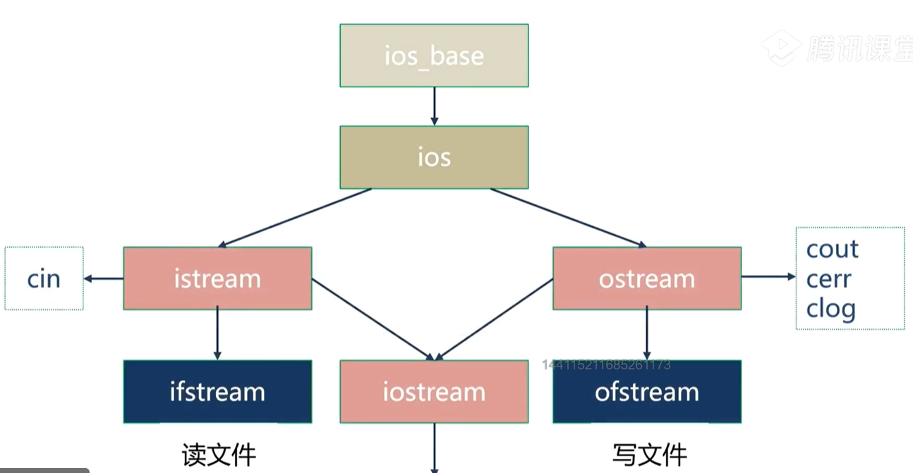

&#x20;                                                                     fstream

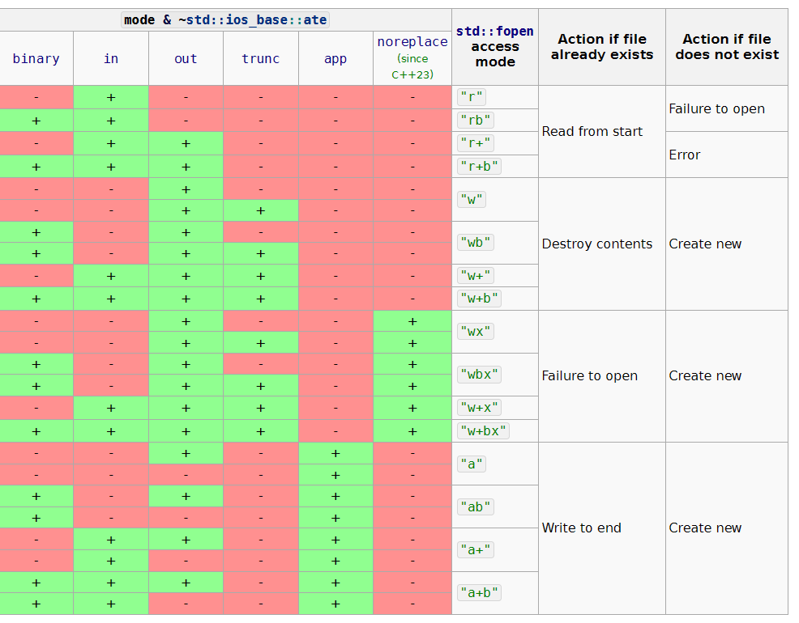

## 8.1 文本文件的读写&#x20;

写入应包含`#include <fstream>`头文件，规定了`ofstream`类

有`ios::out` `ios::trunc` `ios::app`三个模式  app意为追加，其他两个意为覆盖
文件名有如下写法

```c++
"D:\data\txt\test.txt"       // 错误。
R"(D:\data\txt\test.txt)"   // 原始字面量，C++11标准。
"D:\\data\\txt\\test.txt"   // 转义字符。
"D:/tata/txt/test.txt"        // 把斜线反着写。
```

```c++
string filename = R"(D:\test.txt)";
ofstream fout;
fout.open(filename, ios::trunc);
if (fout.is_open() == false) {cout << "打开文件" << filename << "失败。\n";return 0;}
fout << "我\n";
fout << "af\n";
fout.close();

```

读取文件定义ifstream类，仅有ios::in一种模式，不用写
getline是string头文件里的

三种读取方法：

```c++
 // 第一种方法。
    string buffer; // 用于存放从文件中读取的内容。
    // 文本文件一般以行的方式组织数据。
    while (getline(fin, buffer)) { cout << buffer << endl; }
    // 第二种方法。
    char buffer[16]; // 存放从文件中读取的内容。
    // 注意：如果采用ifstream.getline()，一定要保证缓冲区足够大。
    while (fin.getline(buffer, 15)) { cout << buffer << endl; }
    // // 第三种方法。
     string buffer;
    while (fin >> buffer) { cout << buffer << endl; }
```

## 8.2 二进制文件的读写

文本文件存放的是字符串，以行的方式组织数据。二进制文件以数据类型组织数据，内容作为整体考虑，单个的字节是没有意义的。

需要：

```c++
ios::app | ios::binary
//写：
fout.write((const char *)&Classi, sizeof(Classi)); 

//读：
Classi a; //用于临时存储
while (fin.read((char*)&a, sizeof(Classi)))
  {
    cout << a.name << "\t" << a.number << endl;
  }

```

在windows平台下，文本文件的换行标志是"\r\n"。在linux平台下，文本文件的换行标志是"\n"。

在windows平台下，如果以文本方式打开文件，写入数据的时候，系统会将"\n"转换成"\r\n"；读取数据的时候，系统会将"\r\n"转换成"\n"。 如果以二进制方式打开文件，写和读都不会进行转换。

在Linux平台下，以文本或二进制方式打开文件，系统不会做任何转换。以文本方式读取文件的时候，遇到换行符停止，读入的内容中没有换行符；以二制方式读取文件的时候，遇到换行符不会停止，读入的内容中会包含换行符（换行符被视为数据）。

在实际开发中，从兼容和语义考虑，一般：**a）以文本模式打开文本文件，用行的方法操作它；b）以二进制模式打开二进制文件，用数据块的方法操作它；c）以二进制模式打开文本文件和二进制文件，用数据块的方法操作它，这种情况表示不关心数据的内容。（例如复制文件和传输文件）** d）不要以文本模式打开二进制文件，也不要用行的方法操作二进制文件，可能会破坏二进制数据文件的格式，也没有必要。（因为二进制文件中的某字节的取值可能是换行符，但它的意义并不是换行，可能是整数n个字节中的某个字节）

## 8.3 fsteam类

fstream类完全可以替代ifstream和ofstream的功能。类的缺省模式是ios::in | ios::out，不同的是，如果文件不存在，则创建文件；**但是，不会清空文件原有的内容。**
但一般，如果只想写入数据，用ofstream；如果只想读取数据，用ifstream；如果想写和读数据，用fstream。一方面，希望代码有更清晰的语义，另一方面需要的权限越少越好。

## 8.4 随机存取和位置指针

获取位置指针：ofstream类的成员函数是tellp()；ifstream类的成员函数是tellg()；fstream类两个都有，效果相同。
移动位置指针：ofstream类的函数是seekp()；ifstream类的函数是seekg()；fstream类两个都有，效果相同。

ios::out  1）会截断文件；2）可以用seekp()移动文件指针。
ios:trunc  1）会截断文件；2）可以用seekp()移动文件指针。
ios::app  1）不会截断文件；2）文件指针始终在文件未尾，不能用seekp()移动文件指针。

ios::ate  打开文件时文件指针指向文件末尾，但是，可以在文件中的任何地方写数据。
ios::in  打开文件进行读操作，即读取文件中的数据。

在C++中，每打开一个文件，系统就会为它分配缓冲区。**不同的流，缓冲区是独立的**。
程序员只关心输出缓冲区，相关的操作有：

```c++
fout.flush();  //刷新缓冲区
endl            //换行，然后刷新缓冲区
fout << unitbuf; //设置fout输出流在每次操作之后自动刷新缓冲区
fout << nounitbuf; //设置fout输出流，让fout回到缺省的缓冲方式。

```

流有eofbit、badbit和failbit三个状态，全为0时表示一切正常，good()返回true
分别表示输入流操作到达文件未尾，无法诊断的失败破坏流，当输入流操作未能读取预期的字符时（如到了文件末尾，读整数得到了一个string）

clear()成员函数清理流状态。setstate()成员函数重置流状态。

# 9 异常与断言

## 9.1 异常

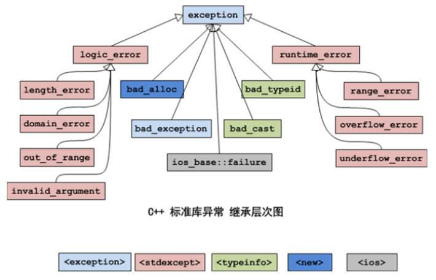

语法：

```c++
try{ .... throw } 
catch(...){}
```

异常被抛出后，从进入try语句块开始，到异常被抛出之前，这期间在栈上构造的所有对象，都会被自动析构。析构的顺序与构造的顺序相反。这一过程称为**栈的解旋**。也就是在执行throw前，在try执行期间构造的所有对象被自动析构后，才会进入catch匹配。

C++11标准弃用了异常规范，使用新增的关键字noexcept指出函数不会引发异常。

std::bad\_alloc 如果内存不足，调用new会产生异常
std::bad\_cast dynamic\_cast可以用于引用，但是，C++没有与空指针对应的引用值
std::bad\_typeid typeid(\*ptr) ptr是空多态指针。。。。。。。。。

## 9.2 断言

头文件\<cassert>断言就是判断(表达式)的值，如果为0（false），程序将调用abort()函数中止，如果为非0（true），程序继续执行。断言可以提高程序的可读性，帮助程序员定位违反了某些前提条件的错误。

断言处理的错误如传入一个指针，assert一下是否为空。

C++11新增：静态断言 static\_assert(常量表达式,提示信息);不用头文件

# 10 C++线程（C++11)

## 10.1 线程的基本概念

百度百科：

线程（英语：thread）是**操作系统能够进行运算调度的最小单位**。它被包含在进程之中，是**进程中的实际运作单位**。一条线程指的是进程中一个单一顺序的控制流，一个进程中可以并发多个线程，每条线程并行执行不同的任务。在Unix System V及SunOS中也被称为轻量进程（lightweight processes），但轻量进程更多指内核线程（kernel thread），而把用户线程（user thread）称为线程。**线程是独立调度和分派的基本单位**。线程可以为操作系统内核调度的**内核线程**，如Win32线程；由用户进程自行调度的**用户线程**，如Linux平台的POSIX Thread；或者由内核与用户进程，如\[Windows 7]的线程，进行混合调度。
同一进程中的多条线程将共享该进程中的全部系统资源，如虚拟地址空间，文件描述符和信号处理等等。但同一进程中的多个线程有各自的调用栈（call stack），自己的寄存器环境（register context），自己的线程本地存储（thread-local storage）。一个进程可以有很多线程，每条线程并行执行不同的任务。在多核或多CPU，或支持Hyper-threading的CPU上使用多线程程序设计的好处是显而易见，即提高了程序的执行吞吐率。在单CPU单核的计算机上，使用多线程技术，也可以把进程中负责I/O处理、人机交互而常被阻塞的部分与密集计算的部分分开来执行，编写专门的workhorse线程执行密集计算，从而提高了程序的执行效率。

在多线程OS中，通常是在一个进程中包括多个线程，每个线程都是作为利用CPU的基本单位，是花费最小开销的实体。线程具有以下属性。&#x20;
1）\*\*轻型实体 \*\*线程中的实体基本上不拥有系统资源，只是有一点必不可少的、能保证独立运行的资源。 线程的实体包括程序、数据和TCB。线程是动态概念，它的动态特性由线程控制块TCB（Thread Control Block）描述。TCB包括以下信息： （1）线程状态。 （2）当线程不运行时，被保存的现场资源。 （3）一组执行堆栈。 （4）存放每个线程的局部变量主存区。 （5）访问同一个进程中的主存和其它资源。 用于指示被执行指令序列的程序计数器、保留局部变量、少数状态参数和返回地址等的一组寄存器和堆栈。&#x20;
2）**独立调度和分派的基本单位**。 在多线程OS中，线程是能独立运行的基本单位，因而也是独立调度和分派的基本单位。由于线程很“轻”，故线程的切换非常迅速且开销小（在同一进程中的）。&#x20;
3）**可并发执行**。 在一个进程中的多个线程之间，可以并发执行，甚至允许在一个进程中所有线程都能并发执行；同样，不同进程中的线程也能并发执行，充分利用和发挥了处理机与外围设备并行工作的能力。
&#x20;4）**共享进程资源**。 在同一进程中的各个线程，都可以共享该进程所拥有的资源，这首先表现在：所有线程都具有相同的地址空间（进程的地址空间），这意味着，线程可以访问该地址空间的每一个虚地址；此外，还可以访问进程所拥有的已打开文件、定时器、信号量机构等。由于同一个进程内的线程共享内存和文件，所以线程之间互相通信不必调用内核。

[进程](https://baike.baidu.com/item/进程/0?fromModule=lemma_inlink "进程")是资源分配的基本单位。所有与该进程有关的资源，都被记录在[进程控制块](https://baike.baidu.com/item/进程控制块/0?fromModule=lemma_inlink "进程控制块")PCB中。以表示该进程拥有这些资源或正在使用它们。

另外，进程也是抢占处理机的调度单位，它拥有一个完整的虚拟地址空间。当进程发生调度时，不同的进程拥有不同的虚拟地址空间，而同一进程内的不同线程共享同一地址空间。

线程与进程相对应，线程与资源分配无关，它属于某一个进程，并与进程内的其他线程一起共享进程的资源。

线程只由相关[堆栈](https://baike.baidu.com/item/堆栈/0?fromModule=lemma_inlink "堆栈")（[系统](https://baike.baidu.com/item/系统/0?fromModule=lemma_inlink "系统")栈或[用户栈](https://baike.baidu.com/item/用户栈/0?fromModule=lemma_inlink "用户栈")）[寄存器](https://baike.baidu.com/item/寄存器/0?fromModule=lemma_inlink "寄存器")和线程控制表TCB组成。[寄存器](https://baike.baidu.com/item/寄存器/0?fromModule=lemma_inlink "寄存器")可被用来存储线程内的[局部变量](https://baike.baidu.com/item/局部变量/0?fromModule=lemma_inlink "局部变量")，但不能存储其他线程的相关变量。

通常在一个进程中可以包含若干个线程，它们可以利用进程所拥有的资源。在引入线程的操作系统中，通常都是把进程作为分配资源的基本单位，而把线程作为独立运行和独立调度的基本单位。由于线程比进程更小，基本上不拥有系统资源，故对它的调度所付出的开销就会小得多，能更高效的提高系统内多个程序间并发执行的程度，从而显著提高系统资源的利用率和吞吐量。因而近年来推出的[通用操作系统](https://baike.baidu.com/item/通用操作系统/0?fromModule=lemma_inlink "通用操作系统")都引入了线程，以便进一步提高系统的并发性，并把它视为现代操作系统的一个重要指标。

线程与进程的区别可以归纳为以下4点：

1）地址空间和其它资源（如打开文件）：进程间相互独立，同一进程的各线程间共享。某进程内的线程在其它进程不可见。

2）通信：[进程间通信](https://baike.baidu.com/item/进程间通信/0?fromModule=lemma_inlink "进程间通信")[IPC](https://baike.baidu.com/item/IPC/0?fromModule=lemma_inlink "IPC")，线程间可以直接读写进程数据段（如全局变量）来进行通信——需要[进程同步](https://baike.baidu.com/item/进程同步/0?fromModule=lemma_inlink "进程同步")和互斥手段的辅助，以保证数据的一致性。

3）调度和切换：线程上下文切换比进程上下文切换要快得多。

4）在多线程OS中，进程不是一个可执行的实体。

## 10.2 线程安全的基本概念

百度百科：

在拥有共享数据的多条线程并行执行的程序中，**线程安全**的代码会通过同步机制保证各个线程都可以正常且正确的执行，不会出现数据污染等意外情况。

多个线程访问同一个对象时，如果不用考虑这些线程在运行时环境下的调度和交替执行，也不需要进行额外的同步，或者在调用方进行任何其他操作，调用这个对象的行为都可以获得正确的结果，那么这个对象就是线程安全的。或者说：一个类或者程序所提供的接口对于线程来说是[原子操作](https://baike.baidu.com/item/原子操作/0?fromModule=lemma_inlink "原子操作")或者多个线程之间的切换不会导致该接口的执行结果存在二义性，也就是说我们不用考虑同步的问题。

线程安全问题大多是由[全局变量](https://baike.baidu.com/item/全局变量/0?fromModule=lemma_inlink "全局变量")及[静态变量](https://baike.baidu.com/item/静态变量/0?fromModule=lemma_inlink "静态变量")引起的，局部变量逃逸也可能导致线程安全问题。

若每个线程中对全局变量、静态变量只有读操作，而无写操作，一般来说，这个全局变量是线程安全的；若有多个线程同时执行写操作，一般都需要考虑[线程同步](https://baike.baidu.com/item/线程同步/0?fromModule=lemma_inlink "线程同步")，否则的话就可能影响线程安全。

类要成为线程安全的，首先必须在[单线程](https://baike.baidu.com/item/单线程/0?fromModule=lemma_inlink "单线程")环境中有正确的行为。如果一个类实现正确(这是说它符合规格说明的另一种方式)，那么没有一种对这个类的对象的操作序列(读或者写公共字段以及调用公共方法)可以让对象处于无效状态，观察到对象处于无效状态、或者违反类的任何不可变量、前置条件或者后置条件的情况。

此外，一个类要[成为](https://baike.baidu.com/item/成为/0?fromModule=lemma_inlink "成为")线程安全的，在被多个线程访问时，不管运行时环境执行这些线程有什么样的时序安排或者交错，它必须仍然有如上所述的正确行为，并且在调用的代码中没有任何额外的同步。其效果就是，在所有线程看来，对于线程安全对象的操作是以固定的、全局一致的顺序发生的。

线程安全性的分类方法包括：不可变、线程安全、有条件线程安全、线程兼容和线程对立。[^注释1]

## 10.3 创建线程和回收资源

**构造函数：**

1）`thread() noexcept;`

默认构造函，构造一个线程对象，不执行任何任务（不会创建/启动子线程）。

2）`template< class Function, class... Args > `

`explicit thread(Function&& fx, Args&&... args );`

创建线程对象，在线程中执行任务函数fx中的代码，args是要传递给任务函数fx的参数。

任务函数fx可以是**普通函数、类的非静态成员函数**、类的静态成员函数、lambda函数、仿函数。

线程中的资源不能被复制，如果other是右值，会进行资源所有权的转移，如果other是左值，禁止拷贝。

```c++
// 用普通函数创建线程。
 thread t1(func, 3, "我是一只傻傻鸟。");
 // 用lambda函数创建线程。
 thread t1(func, 3, "我是一只傻傻鸟。");
 // 用仿函数创建线程。
thread t4(mythread1(), 3, "我是一只傻傻鸟。");
// 用类的静态成员函数创建线程。
thread t5(mythread2::func, 3, "我是一只傻傻鸟。");
// 用类的普通成员函数创建线程。
mythread3 myth;                     6   // 必须先创建类的对象，必须保证对象的生命周期比子线程要长。
thread t6(&mythread3::func, &myth, 3, "我是一只傻傻鸟。"); // 第二个参数必须填对象的this指针，否则会拷贝对象。

```

注意：

l 先创建的子线程不一定跑得最快（程序运行的速度有很大的偶然性）。

l 线程的任务函数返回后，子线程将终止。

l 如果主程序（主线程）退出（不论是正常退出还是意外终止），全部的子线程将强行被终止。

回收资源：有两种方法：
1\. 调用`join()`等待子线程退出（会阻塞等待），回收其资源。
2\. 调用`detach()`分离子线程，子线程退出时将自动回收资源。分离后不可在使用join方法。分离后的资源主程序便不能控制了。**主线程结束，所有子线程的资源会立刻被回收**。
用`joinable()`成员函数可以判断子线程的分离状态，函数返回布尔类型。

## 10.4 thread类其他方法

`get_id()`既是`std::this_thread`空间内的方法，返回所处线程的线程号，也是thread类成员函数
`sleep_for (const chrono::duration<Rep,Period>& rel_time)`；
`sleep_until()`;
`yiled()`;
还有两个thread类方法：`swap()`和`hardware_concurrency()`

```c++
#include <chrono>
#include <iostream>
#include <thread>
void func(int no) {
    cout << "子线程的ID：" << std::this_thread::get_id() << endl;//1
    std::this_thread::yield(); //4
    for (int ii = 1; ii <= 5; ii++) {
        cout << "编号" << ii << "\t任务" << no << endl;
        std::this_thread::sleep_for(std::chrono::seconds(1)); // 休眠1秒。 2
        //template <class Clock, class Duration>
        //void sleep_until (const chrono::time_point<Clock,Duration>& abs_time); 3
    }
}

int main() {
    std::thread t1(func, 1);
    std::thread t2(func, 2);
    cout << "主线程的ID：" << std::this_thread::get_id() << endl;
    cout << "子线程t1的ID" << t1.get_id()<< endl;
    t1.join(); //5
    std::thread t3 = std::move(t2);
    cout << "硬件线程上下文的数量（CPU的核数）：" << t1.hardware_concurrency()<< endl;//6
    t3.join();
}
```

10.5 call\_once

```c++
#include <mutex>
std::once_flag flag;
template< class callable, class... Args >
void call_once( std::once_flag& flag, Function&& fx, Args&&... args );
```

```c++
std::once_flag onceFlag;
void InitThread(int initNumber) {
    cout << "初始化成功！" << endl;
    cout << "编号为" << initNumber << endl;
}

void func(int no) {
    std::call_once(onceFlag,InitThread,3);
    cout << "子线程的ID：" << std::this_thread::get_id() << endl;
    std::this_thread::yield();
    for (int ii = 1; ii <= 5; ii++) {
        cout << "编号" << ii << "\t任务" << no << endl;
        std::this_thread::sleep_for(std::chrono::seconds(1)); // 休眠1秒。
    }
}
```

## 10.6 native\_handle

为了弥补C++11线程库的不足，thread类提供了`native_handle()`成员函数，用于获得与操作系统相关的原生线程句柄，操作系统原生的线程库就可以用原生线程句柄操作线程

例如，Linux系统中，

`pthread_t thid= tt.native_handle();  `// 获取Linux操作系统原生的线程句柄。

## 10.7 线程安全

总而言之，多个线程对同一资源进行写操作时，存在线程安全的问题。

几个概念：

顺序性：CPU不保证代码顺序执行，但保证与顺序执行一致。
可见性：线程访问资源时，总归是需要进行CPU缓存和内存之间的数据交换的，这会导致不同线程访问资源可能不一样。可见性是指：一个线程对共享资源的修改，其他线程能“立即”看见
原子性：CPU执行指令的顺序：读取指令，读取内存，执行指令，写回内存。原子操作意为：一个操作要么所有步骤全部执行，要么全部不执行。

C++线程安全：`volatile`关键字，原子操作（原子类型） ，线程同步（锁）

volatile：保证内存变量的可见性，禁止代码优化

## 10.8 线程同步

### 10.8.1 互斥锁

加锁和解锁，确保同一时间只有一个线程访问资源。某线程持有锁，则其他线程形成等待队列。

C++11提供了四种互斥锁：

l `mutex`：互斥锁。

l `timed_mutex`：带超时机制的互斥锁。

l `recursive_mutex`：递归互斥锁。

l `recursive_timed_mutex`：带超时机制的递归互斥锁。

包含头文件：`#include <mutex>`
方法：`lock()`  ` unlock()`  `try_lock() `  超时机制的还有：`try_lock_for()`  ` try_lock_until()`

`lock_guard`是模板类，可以简化互斥锁的使用，也更安全

```c++
std::lock_guard<std::mutex> lock_guard(mtx);
```

`unique_lock`和`lock_guard`都是管理锁的辅助类，都是RAII风格（在构造时获得锁，在析构时释放锁）。它们的区别在于：为了配合`condition_variable`，`unique_lock`还有`lock()`和`unlock()`成员函数。`unique_lock`主要配合条件变量使用

## 10.9 条件变量与生产/消费者模型

**条件变量**：当条件不满足时，相关线程被一直阻塞，直到某种条件出现，这些线程才会被唤醒。
为了保护共享资源，条件变量需要和互斥锁结合一起使用。
生产/消费者模型（高速缓存队列）是最常用的条件变量实现。

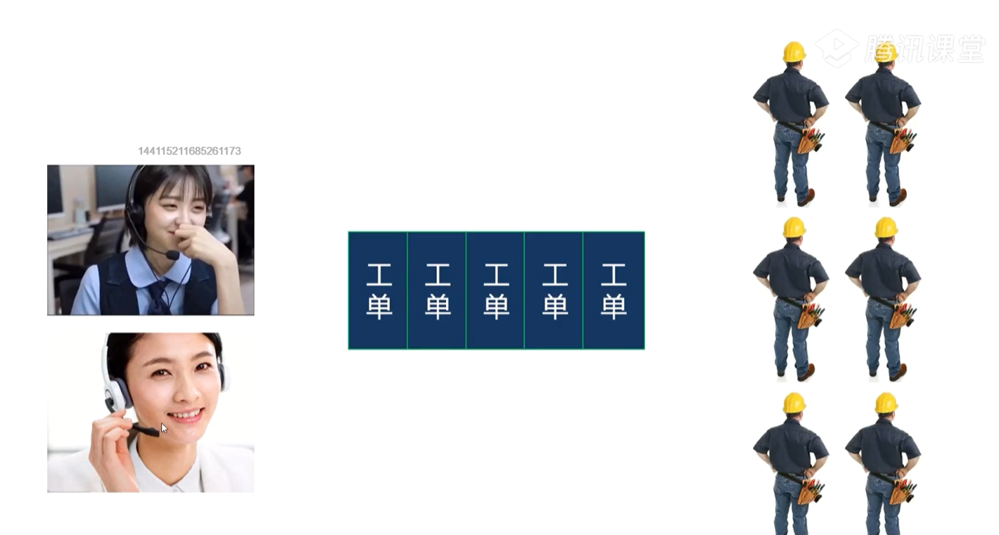

&#x20;                                          生产者                 缓存队列                消费者（线程池）

C++11的条件变量提供了两个类：

`condition_variable`：只支持与普通mutex搭配，效率更高。

`condition_variable_any`：是一种通用的条件变量，可以与任意mutex搭配（包括用户自定义的锁类型）。

`#include<condition_variable>`

只有一个默认构造函数，禁止赋值和拷贝，提供如下方法：

1\.  `notify_one()` 通知一个等待的线程。`notify_all() `通知全部等待的线程。
一般，生产一个数据用one，生产多个数据用all
2\. wait系列方法，包括`wait() ` `wait_for() `  `wait_until() `

```c++
wait(unique_lock<mutex> lock) 阻塞当前线程，直到通知到达。
wait(unique_lock<mutex> lock,Pred pred) 循环的阻塞当前线程，直到通知到达且谓词满足。
wait_for(unique_lock<mutex> lock,时间长度)
wait_for(unique_lock<mutex> lock,时间长度,Pred pred)
wait_until(unique_lock<mutex> lock,时间点)
wait_until(unique_lock<mutex> lock,时间点,Pred pred)

```

wait()做了如下操作：1 互斥锁解锁    2 阻塞，等待唤醒   3 互斥锁加锁
如果wait()返回了，则必然申请到了锁

防止虚假唤醒：消费者线程被唤醒后，缓存队列中没有数据

```c++
while (queue_.empty()) { m_cond_.wait(lock); } 
m_cond_.wait(lock, [this] { return !queue_.empty(); });  //wait重载方法
```

## 10.10 原子类型

\<atomic>提供了`atomic<T> `模版类（结构体）用于支持原子类型，原子类型只支持整数类型，包括bool,char,int........

```c++
void store(const T val) noexcept;   // 把val的值存入原子变量。
T load() noexcept;  // 读取原子变量的值。
T fetch_add(const T val) noexcept; // 把原子变量的值与val相加，返回原值。
T fetch_sub(const T val) noexcept; // 把原子变量的值减val，返回原值。
T exchange(const T val) noexcept; // 把val的值存入原子变量，返回原值。
// 比较原子变量的值和预期值expect，如果当两个值相等，把val存储到原子变量中，函数返回true；
//如果当两个值不相等，用原子变量的值更新预期值，函数返回false
T compare_exchange_strong(T &expect,const T val) noexcept; //CAS指令
bool is_lock_free();  // 查询某原子类型的操作是直接用CPU指令（返回true），还是编译器内部的锁（返回false）。
```

原子类型别名
atomic\_bool std:atomic\<bool>
atomic\_char std:atomic\<char>
atomic\_schar std:atomic\<signedchar>
atomic\_uchar std::atomic\<unsignedchar>
atomic\_int std::atomic\<int>
atomic\_uint std:atomic\<unsigned>
atomic\_short std:atomic\<short>
atomic\_ushort std::atomic\<unsigned short>
atomic\_long std::atomic\<long>
atomic\_ulong std::atomic\<unsignedlong>
atomic\_llong std::atomic\<longlong>
atomic\_ullong std:atomic\<unsignedlonglong>

l atomic\<T>模板类重载了整数操作的各种运算符。

l atomic\<T>模板类的模板参数支持指针，**但不表示它所指向的对象是原子类型**。

l 原子整型可以用作**计数器**，布尔型可以用作**开关**。

l CAS指令是实现无锁队列基础。（远超现阶段基础）

[^注释1]: **不可变类**
    一个不可变的对象只要构建正确， 其外部可见状态永远不会改变， 永远也不会看到它处于不一致的状态。Java 类库中大多数基本数值类如Integer、String 和BigInteger 都是原子性的， 是不可变的， 但Long 和Double 就不能保证其操作的原子性， 可在声明变量的时候用volatile 关键字。不可变对象上没有副作用， 并且缓存不可变对象的引用总是安全的。一个不可变的对象的一个引用可以自由共享，而不用担心被引用的对象要被修改。 \[1]
    **线程安全性类**
    线程安全性类的对象操作序列( 读或写其公有字段以及调用其公有方法) 都不会使该对象处于无效状态， 即任何操作都不会违反该类的任何不可变量、前置条件或者后置条件。 \[1]
    **有条件的线程安全类**
    有条件的线程安全类对于单独的操作可以是线程安全的， 但是某些操作序列可能需要外部同步。为了保证其它线程不会在遍历的时候改变集合， 进行迭代的线程应该确保它是独占性地访问集合以实现遍历的完整性。通常， 独占性的访问是由对锁的同步机制保证的。 \[1]
    **线程兼容类**
    线程兼容类不是线程安全的， 但可以通过正确使用同步从而在并发环境中安全地使用。或用一个synchronized 块包含每一个方法调用。 \[1]
    **线程对立类**
    线程对立类是那些不管是否调用了外部同步都不能在并发使用时保证其安全的类。线程对立类很少见， 当类修改静态数据，而静态数据会影响在其它线程中执行的其它类的行为时， 通常会出现线程对立。 \[1]
